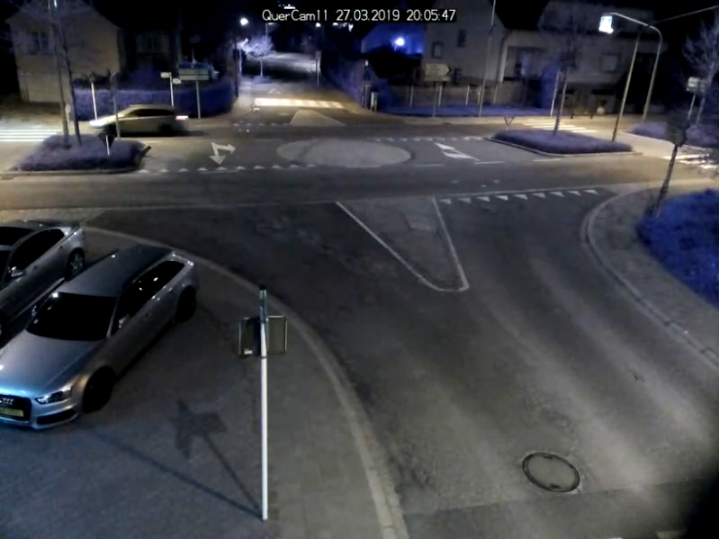

# Traffic counts

## Why is a high quality of the counts so important?

One of the main goals of OpenTrafficCam is automatic traffic counting at road sections and intersections.
However, the results of such counts are only suitable for mobility planning if they are of high quality.
In the worst case, traffic facilities planned based on inaccurate count data can waste public resources and even endanger the health of their users.

## How to measure the quality of the counts?

Precision and Recall, which are used to evaluate machine learning algorithms, can similarly be used as meaningful metrics to evaluate the quality of automated traffic counts.
The precision metric describes the ratio of vehicles counted correctly by OpenTrafficCam to all vehicles counted by OpenTrafficCam including incorrect ones.
Whereas the recall metric describes the ratio of vehicles correctly counted by OpenTrafficCam to all vehicles passed in reality including those not counted by OpenTrafficCam.

An Example:

- 100 vehicles pass through a junction
- 80 of them are correctly detected by the system (true positive)
- 20 are therefore not correctly detected (false negative)
- the system indicates that 110 vehicles passed the intersection
- the system has thus detected 30 vehicles that were not present in reality (false positive)

|                     |  110 got detected   | 20 got not detected |
| ------------------- | :-----------------: | :-----------------: |
| 100 vehicles passed | 80 (true positive)  | 20 (false negative) |
| 30 are not real     | 30 (false positive) | -- (true negative)  |

The prescision (or accuracy) is equal to true positive / (true positive + false positive). In this case the prescision would be 80 / (80 + 30) = 0.73.
The recall (or sensitivity) is equal to true positive / (true positive + false negative). In this case the recall would be 80 / (80 + 20) = 0.80.
The higher the two measurements are, the higher the quality of the results are.

## How accurate can you count using OpenTrafficCam?

In his diploma thesis OpenTrafficCam contributor Armin Kollascheck investigated the quality of counting motorized traffic that got generated by OpenTrafficCam using YOLOv5x6 (Ultralytics),
and a modified version of the IOU-Tracker (Bochinski et al.) for the following eight realistic traffic scenarios.

|     |        |
| :----------------------------------------: | :---------------------------------------------: |
|           Three-way intersection           |            Four-way intersection (1)            |
|   |  |
|         Four-way intersection (2)          |       Four-way intersection (2) at night        |
|  |                   |
|            Four-way roundabout             |                   Section (1)                   |
|              |             |
|                Section (2)                 |              Section (2) at night               |

Armin evaluated the count data automatically generated with OpenTrafficCam against a manually collected and verified ground truth.
The sample sizes for determining the precision and recall of the automated traffic counts are 200 vehicles for each scenario. The ground truth of 200 vehicles was always counted manually.
The results are shown in the table below.

| Traffic facility          |          Lighting           | Camera angle | Precision | Recall |
| ------------------------- | :-------------------------: | :----------: | :-------: | :----: |
| Three-way intersection    |             Day             |    Steep     |   0.95    |  0.85  |
| Four-way intersection (1) |             Day             |    Steep     |   1.00    |  0.94  |
| Four-way intersection (2) |             Day             |    Steep     |   0.99    |  0.95  |
| Four-way intersection (2) |  Night with street lights   |    Steep     |   0.98    |  0.95  |
| Four-way roundabout       |             Day             |     Flat     |   0.63    |  0.56  |
| Section (1)               |             Day             |    Steep     |   1.00    |  0.91  |
| Section (2)               |             Day             |    Steep     |   1.00    |  0.97  |
| Section (2)               | Night without street lights |    Steep     |   0.06    |  0.12  |

## Conclusion

The high values for precision and recall in many scenarios show that OpenTrafficCam already works quite well with the official YOLOv5x6 model and a rather simple tracker.
Thus, on different traffic facilities, counting qualities were achieved that probably exceed those of manual on-site counts.
And even video recordings at night with street-side lighting seem to be counted correct with OpenTrafficCam.

Unsatisfactory results, however, occurred with comparatively flat camera angles or night recordings without street lighting.
This shows that the current pipeline is not yet perfect.
We aim to further improve OpenTrafficCam to achieve satisfying counting results even under very difficult circumstances.
