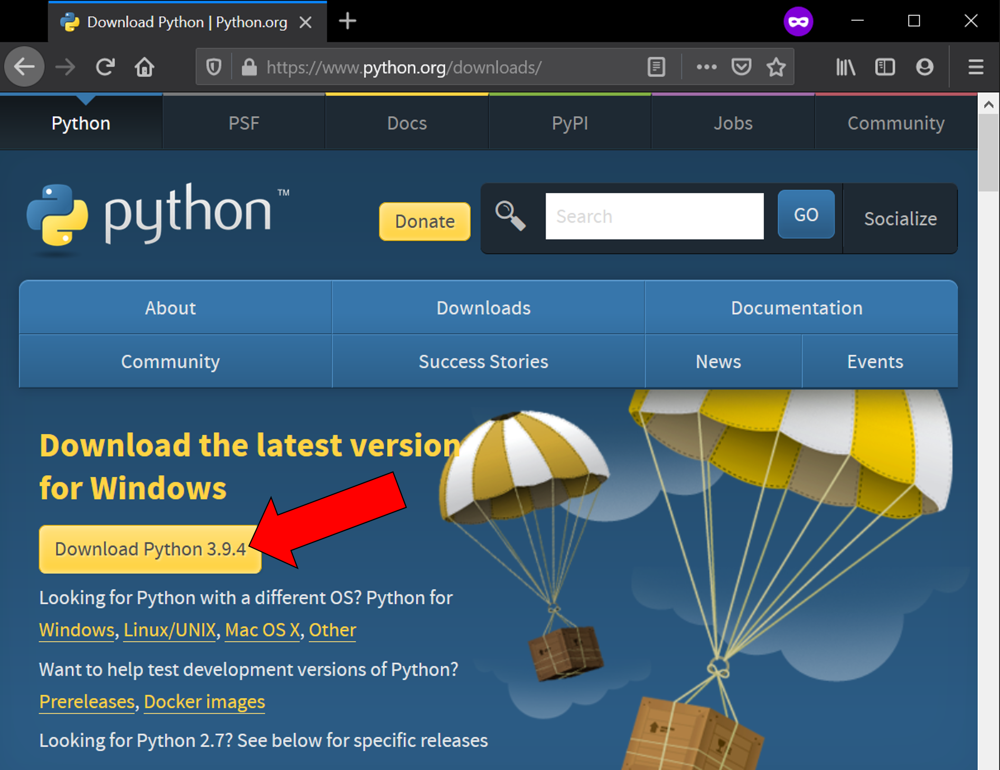
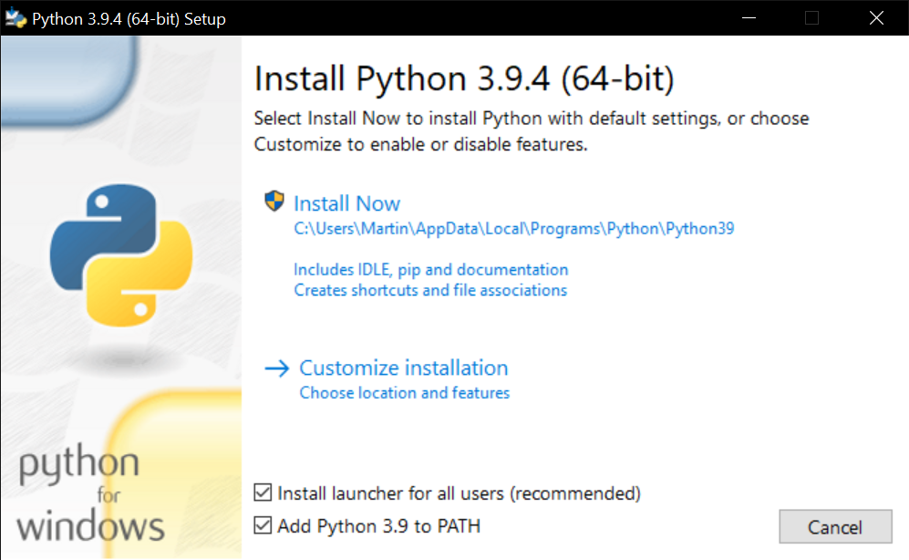
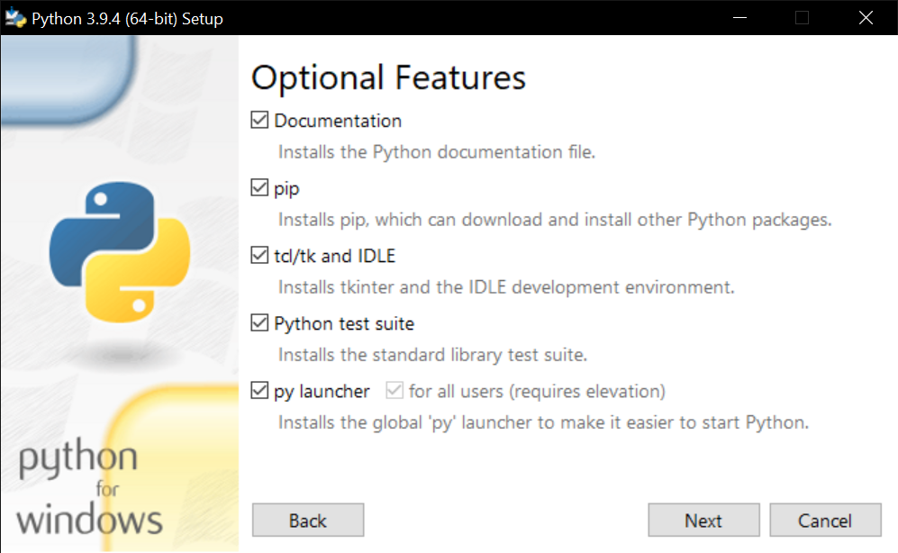
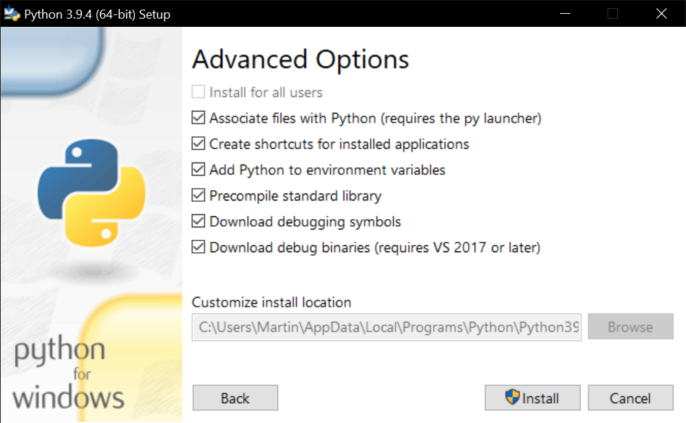

# Installation

## Install Python 3.9

If not done yet, install the 64-bit version Python 3.9.x via Windows installer from
[www.python.org/downloads/](https://www.python.org/downloads/) as follows:

??? help "What if I already have another Python version installed?"

    In addition, also install Python 3.9. The last installed Python will automatically
    be the default Python interpreter of your system.

    On Windows, it is also possible to change the default Python interpreter by changing
    the order of the system-wide environment variables
    (move Python39 and Python39\Scripts to the top, see animation below).

    This is necessary e.g. if you have already installed Python 3.9, but another
    Python version is your default because you installed it in the meantime (e.g. 3.10).

    

## Install OTAnalytics

1. Download and unzip the latest version of
   [OTAnalytics](
    https://github.com/OpenTrafficCam/OTAnalytics/archive/refs/heads/first-version.zip
    )
   from GitHub.

2. In the unzipped folder Double-click the "install.bat" and wait until
   the installation of the dependencies is complete.

## To run OTAnalytics

... double click the "OTAnalytics.bat" to run the Software via graphical user interface.

## If you encounter problems

... please [open an issue](https://github.com/OpenTrafficCam/OTAnalytics/issues/new)
in the OTAnalytics repository on GitHub.

We also welcome code contributions (e.g. fixing bugs or adding features) from other
programmers by forking the repository and creating a pull request.
Please check the [contribute section](https://opentrafficcam.org/contribute/)
of this documentation first.

!!! warning "Early prototype"

    The version of OTAnalytics described in this documentation is in early
    prototype stage. It is only tested on 64 bit Windows 10 machines.

    We are currently working on a stable release,
    which will also be tested Mac and Linux machines.
    
    Stay tuned :)
