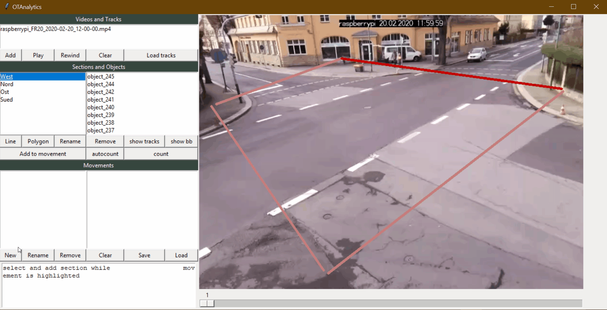

# Movements

Movements represent source destination relationships of traffic flow and single objects like cars, trucks or pedestrians.
The definition of movements play a big role if your analysis needs to be more detailed and specific.

## Create an delete Movements

Movements can be defined with a click on the "new movement"-button and adding pre defined Sections while being selected.
Therefore movements can consist of infinite sections where the first section is the source and the last section stands for the destination.
As sections, movements can be saved, renamed, deleted and imported.

