# Usage UI

After processing videos with OTVision´s tracking module ([OTVision track](../../OTVision/usage/track)), you can use OTAnalytics for analysing traffic data.
The OTAnalytics interface enables you to configure analyses, extract valuable insights from your data, and export the results efficiently.

## Terminology

Vehicles and pedestrians are detected in the individual frames of the video using [detect in OTVision](../../OTVision/usage/detect).
In a single frame of a video, each detected object (**Detection**) is represented by a **Bounding Box**,
 which is the rectangular area surrounding the detected vehicle or pedestrian together with its classification (e.g., car, bike, pedestrian).

The [tracker in OTVision](../../OTVision/usage/track) links consecutive detections, or bounding boxes, to form the **Track** of a **Road User**.

A track is therefore composed of a series of detections, each with its own bounding box and classification.
Ideally, all detections within a track share the same classification.
However, in practice, a track may include detections with varying classifications (e.g., truck and truck_with_trailer).
This typically occurs when a road user is poorly visible in some of the frames (far away, partially obscured).
OTAnalytics assigns a single **Track Classification** to each track, as a road user can have only one classification in the real world (e.g., a vehicle is either a car or a bus).

A track's trajectory is represented by a representative point from each bounding box associated with the track.
This point is called the **Track Point**.
The trajectory is formed by connecting the track points collected across successive frames.

!!! info inline end "Offset examples"
    === "0.1, 0.1"
        { align=left }

    === "0.8, 0.3"
        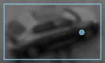{ align=left }

The position of the track point within the bounding box can be configured using the **Offset** attribute.
This offset is defined separately for the x- and y-axes, with values ranging from `0` to `1`.
Origin `(0, 0)` is the top left-hand corner of the bounding box.
These values determine the relative position of the track point within the bounding box, providing flexibility in track point placement.

To analyze the tracks, OTAnalytics provides **Sections** and **Flows**.
Imagine sections as the digital equivalent of physical detectors used for traffic measurement, sometimes, also called virtual inductive loops (not to be confused with the detection of bounding boxes in OTVision).
Each time a track's trajectory intersects a section, an **Event** is generated.
Each event contains detailed information, including the track's identifier, its position in the frame, and the timestamp of the intersection.

**Flows** define traffic flows to be analyzed.
As explained in [Flows](#flows), a flow is defined by two sections: a starting section and an ending section.
Tracks that intersect both sections of a flow in the defined order can be assigned to that flow.
To achieve this, the events belonging to a track are sorted chronologically based on their time of occurrence.
The assignment of a track to a flow is called **Track Assignment**.

!!! info
    The pair of events with the longest time interval between them is used to assign the track to the flow corresponding to the sections of both events.

## User Interface

The user interface is divided into four main areas: the **Configuration Bar**, **Workspace**, **Visualization Layers**, and **Visualization Filters**.

The **Configuration Bar** consists of four parts:

1. **Project**: Manage project metadata and save or load `.otconfig` or `.otflow` files.
2. **Tracks/Video**: Add input files, where only track files can be added, while video files can be both added and removed. An overview of loaded video files is also displayed.
3. **Sections/Flows**: Create, edit, and delete sections and flows. The flow names are shown with numbers indicating the number of assigned tracks per flow.
4. **Analysis**: Export of analyzed traffic data.

The **Workspace** consists of the **Canvas** and the **Track Statistics**.
The canvas displays the tracks and video frames.
It is also where the geometry of sections can be created or edited.
Below the workspace, the **Track Statistics** provides key statistics about the displayed tracks.

By choosing the **Visualization Layers**, that are located right to the workspace, one can customize *how* tracks are displayed.

With the **Visualization Filters** located below the workspace, one can adjust *which* tracks are displayed.

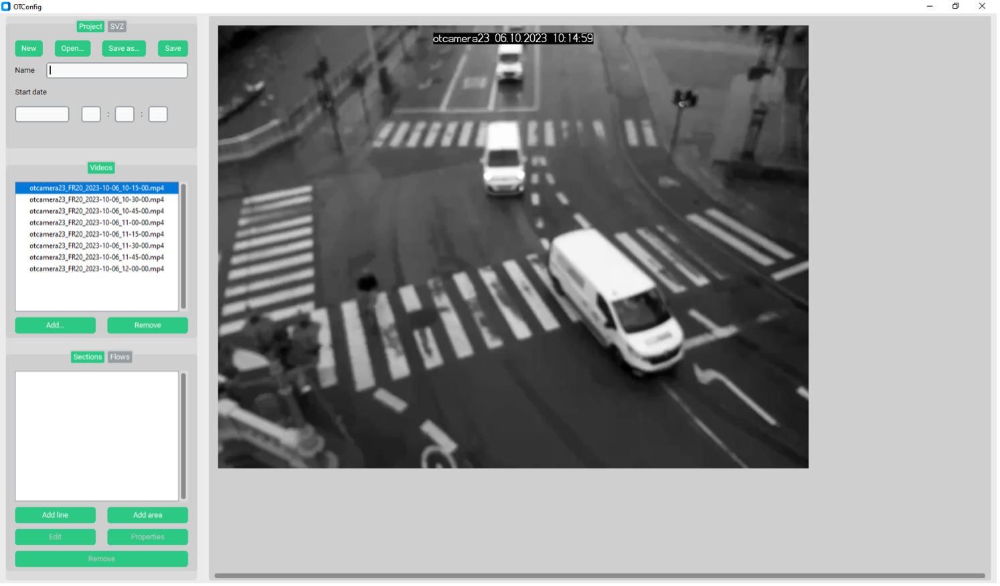

## Setup the project

To make the handling and reproducibility of analyses easier, all related data is organized within a project.
Setting up a project ensures that all necessary information, such as videos, tracks, and configurations, is stored in one centralized place.
This simplifies workflows and maintains consistency across analyses.

### Enter project information

The project must first be named.
The project name is entered in the corresponding Name field.

!!! info
    It is recommended to choose a unique name (e.g. name of the measuring point, camera number; or a combination of several unique details).

The start time (date and time) of the first video must then be entered in the corresponding Start date fields.
It is possible to enter in ISO 8601 format (YYYY-MM-DD) or German date format (DD.MM.YYYY).

!!! info
    OTAnalytics assumes that all selected videos are contiguous in time.
    If the videos to be processed have a time gap (e.g., videos from three days from 6:00 a.m. to 10:00 p.m.), several projects with chronologically contiguous videos must be created.

### Load track files

To analyze tracks in OTAnalytics, you must load the track files (.ottrk).
This can be done using the *Add tracks...* button, which opens a file browser to select the respective files.
Multiple track files can be added at once.
If a corresponding video file exists, OTAnalytics will automatically load it alongside the track file.
If no associated video is found, the track file cannot be loaded.

Alternatively, you can add videos only.
This is particularly useful for configuring an analysis handled by the platomo team.
To add videos, use the *Add...* button, and to remove them from the configuration, use the *Remove* button.

!!! tip
    Added videos are displayed in alphabetical order in the “Videos” overview panel and are later processed in this order.
    The videos should therefore be named in such a way that the chronological order matches the alphabetical order.
    Additional zero-padding (e.g., `01`, `02`) is helpful if you want to ensure correct alphabetical sorting.

When you click a video in the configuration bar, the first image of the video is displayed as the background image.
This allows you to check whether all videos have been selected correctly.

### Save and open the project

Once you added all required tracks and videos and created all sections and flows, the project can be saved.

1. Click on the *Save as...* button in the Project section of the configuration bar.
2. Select a suitable filename in the file browser and save it in the same folder as the videos.

You can save the project in two ways:

An `.otconfig` file stores all information necessary to reload the project in OTAnalytics.
This is the default option.

An `.otflow` file stores only information about sections and flows.
Hence, it can be reused / imported into another project with different videos of the same measurement site.

!!! tip
    We recommend regularly saving the progress of the project while it is still being processed.
    This prevents possible loss of data.
    The *Save* button automatically saves the file to the last selected location.
    If it is colored in orange, changes have been made.

    We also recomment to store all project related files (videos, `.otdet`, `.ottrk` and `.otconfig`) in the same folder.

When you return later, you can reopen the project using the *Open ...* button.

## Configure traffic analysis

To perform traffic analyses with OTAnalytics, sections and flows are needed.
A traffic flow depicts the directional travel relationship between two sections.
Each flow always consists of two sections: A start section and an end section.
Before defining flows, you must create the sections.
The flows can then be assigned to the sections.

### Sections

Sections can consist of two or more support points (shown as a circle).
They are drawn directly on the background image in OTAnalytics.
To do this, the *Sections* tab must first be selected in the Sections/Flows section.

!!! tip
    Both line sections and area sections can be created.
    If no occupancy durations (e.g., of parking areas) are analyzed, we recommend using line sections.

    The following example is limited to line sections.
    However, the procedure described can also be applied to area sections.
    The only difference is that the polygon is automatically closed when the add mode is exited.

#### Add sections

A new line section is added in the following steps:

1. Left-click on the *Add line* button, which starts the add mode.
1. Set the first point by left-clicking at the correct position in the video image. The point is now fixed. Further points can be added to the section by moving the mouse and left-clicking again.
   A section must consist of at least two points.
1. Once the desired length and shape of a section has been reached, right-click or press the *Enter* key to exit Add mode.
   (Pressing the *Escape* key cancels add mode without saving the previously created section.)
1. A pop-up window opens. Enter the name for the section in this window and confirm. The name is reused in the analysis.
1. The created section appears with the assigned name in the sections part in the configuration bar.
1. Repeat the process to add further sections.

!!! warning
    A name can only be assigned once, duplicate names of several sections are not possible.
    We recommend including the approximate compass direction of the geographical location (e.g. north, north-east) in the name of the section.

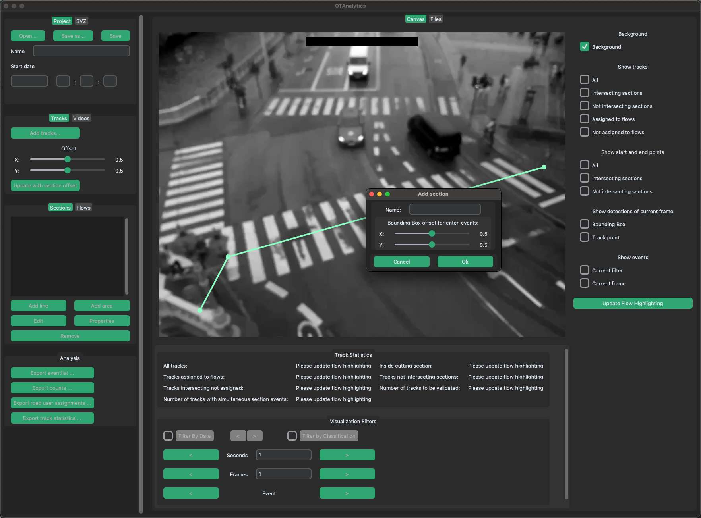

#### Select sections

To select a specific section, click on its name in the list of sections.
The selected section is now highlighted both in the list and on the canvas.

You can also select multiple sections with *left-click* + *ctrl* on Windows or *cmd* on macOS.
Deselect a single with *right-click* + *ctrl* on Windows or *cmd* on macOS or deselect all sections with *right-click* into a empty place in the list.

#### Change the geometry of a section

The geometry of sections that have already been created can be changed using the following procedure:

1. First select the section to be changed in the list.
1. Then start the change mode by left-clicking on the *Edit* button. The supporting points are now visible.
1. Support points can now be selected by left-clicking and reset as in add mode.
1. The + button can be used to add another support point.

The selected point “sticks” to the mouse pointer until the left mouse button is pressed.
The old geometry is displayed as a dashed reference.

1. Right-click to exit change mode and save the changes.
1. Pressing the Escape button exits the change mode without saving the changes to the geometry.

#### Change attributes of a section

The attributes (name and offset) of a section can be changed by clicking on the *Properties* button.
To do this, the desired section must first be selected from the list.

The bounding box offset defines, which reference point of the bounding boxes of the track is used to trigger an event.

!!! tip
    Since the bounding box offset can be individually configured for each section, tracks intersecting different sections can be finely tuned.
    This helps to increase the recording accuracy of the section or to fulfil special use cases (e.g. if the front of a road user is to be recorded).

#### Remove sections

A section can be removed by clicking on the *Remove* button.
To do this, the desired section **must be removed from any flows** and it must be selected in the list.
You can use multiselect to remove multiple sections at once.

### Flows

A flow always consists of exactly two sections: a start section and an end section.
To edit flows, the *Flows* tab must first be selected in the Sections/Flows section.

#### Add flows

A new flow is added in the following steps:

1. Left-click on the *Add* button. A pop-up window opens. The appropriate sections can be selected from the drop-down menu.
1. The start point of the flow is defined as the first section.
1. The endpoint of the flow is defined as the second section.
1. The name is automatically set in the *Name* field after selecting the two sections. This can be changed as required. The name is reused in the analysis.
1. If you plan to perform speed measurements, you can enter the distance between the sections (which must be measured independently of OTAnalytics)

!!! warning
    A name can only be assigned once, duplicate names of several flows are not possible.

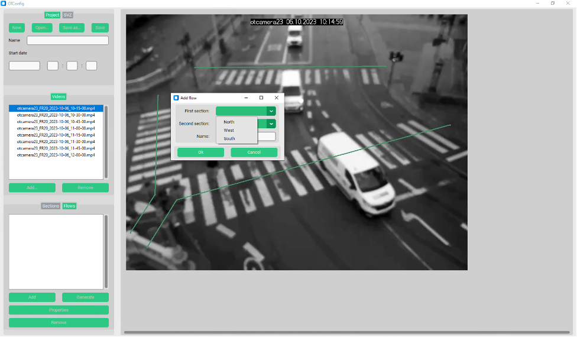

!!! tip
    Entering flows for many sections can be tedious.
    Fortunately, OTAnalytics can **automatically generate flows** for all possible combinations of start and end sections.
    Just hit the *Generate* button.
    The naming convention for the flows is `{Name of start section} --> {Name of end section}`.

#### Select flows

To select a specific flow, click on its name in the list of flows.
The selected flow is now highlighted both in the list and on the canvas (by an arrow indicating its direction).

You can also select multiple flows with *left-click* + *ctrl* on Windows or *cmd* on macOS.
Deselect a single with *right-click* + *ctrl* on Windows or *cmd* on macOS or deselect all sections with *right-click* into a empty place in the list.

#### Edit a flow

To edit a flow, it must first be selected in the list.
Then left-click on the *Properties* button to open the same pop-up window as when creating a flow.
The desired changes can now be made.

#### Remove flows

To remove a flow, it must first be selected in the list.
Left-click on the *Remove* button to remove the selected flow.
You can use multiselect to remove multiple flows at once.

## Visualization layers

Utilizing the different visualization layers helps you to explore the tracks and to refine traffic analysis by offering specific views of the data.
Tracks are consistently displayed in the same colors, which are determined by their classification.
The visualization layers are organized into groups.

!!! warning
    Some visualization layers are not updated automatically, when you change the configuration of the project or the sections/flows.

    If the visualization is **outdated**, just hit the *Update flow highlighting* button - calculations will be run and visulalization will be updated.

### Background

This layer shows a frame of the video as a background image.
The currently shown frame can be configured using the filter.
If a date/time filter is set, the frame at the end of the range is shown.
Otherwise, the first frame of the selected video is shown.

### Show tracks

This group of layers offers options to control which tracks are displayed based on their intersection with sections or their assignment to flows.

They enable you to check the position of the sections and the definition of the flows and to optimise them iteratively.
Checking, if the sections "catch" the correct tracks is a crucial step to ensure a good quality of each traffic analysis.

=== "All"
    All tracks are shown.

    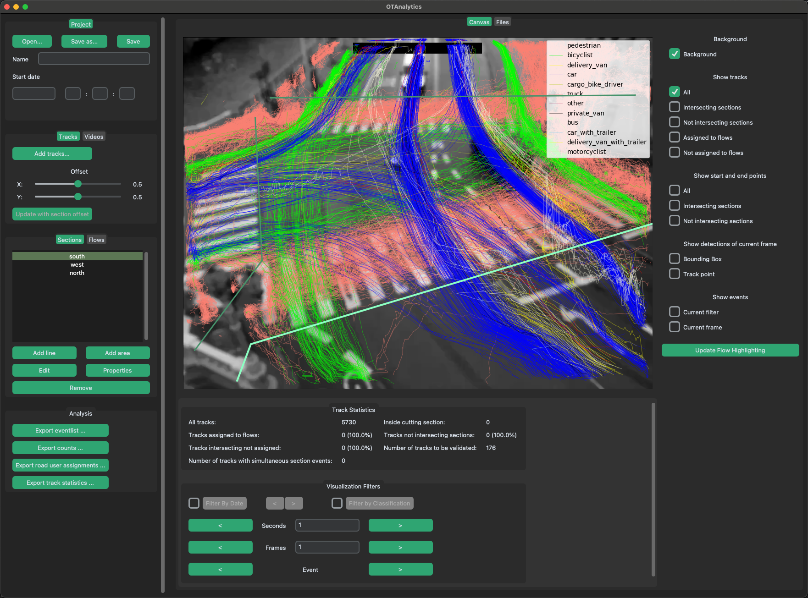

=== "Intersecting sections"
    Tracks intersecting at least one of the selected sections are shown.

    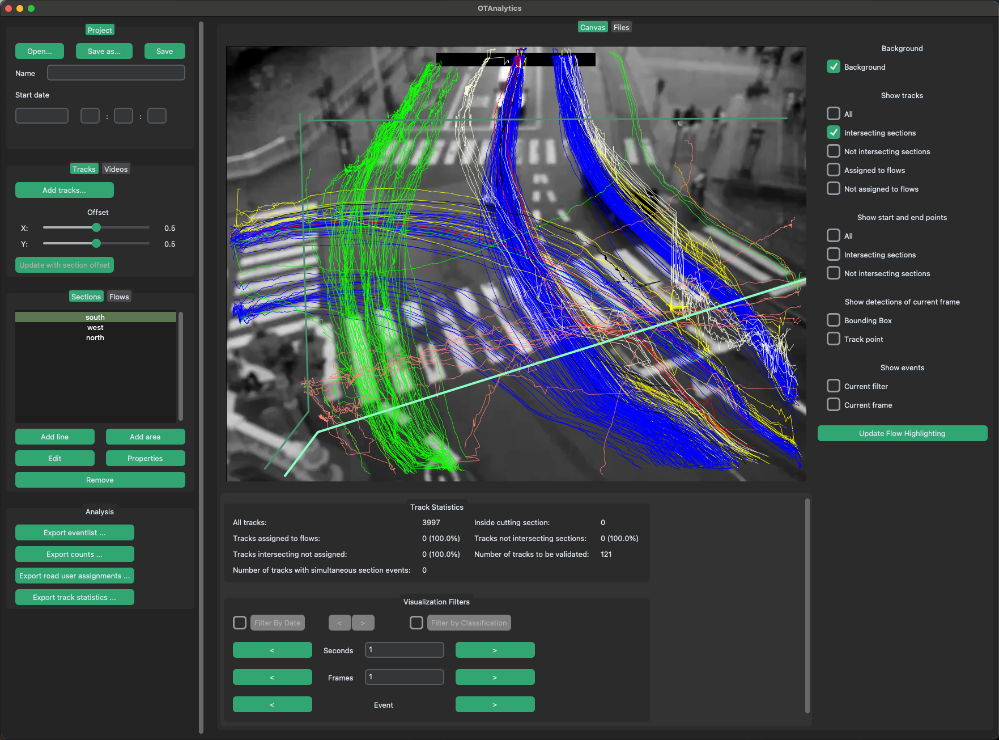

=== "Not intersecting sections"
    Tracks intersecting **none** of the selected sections are shown.

    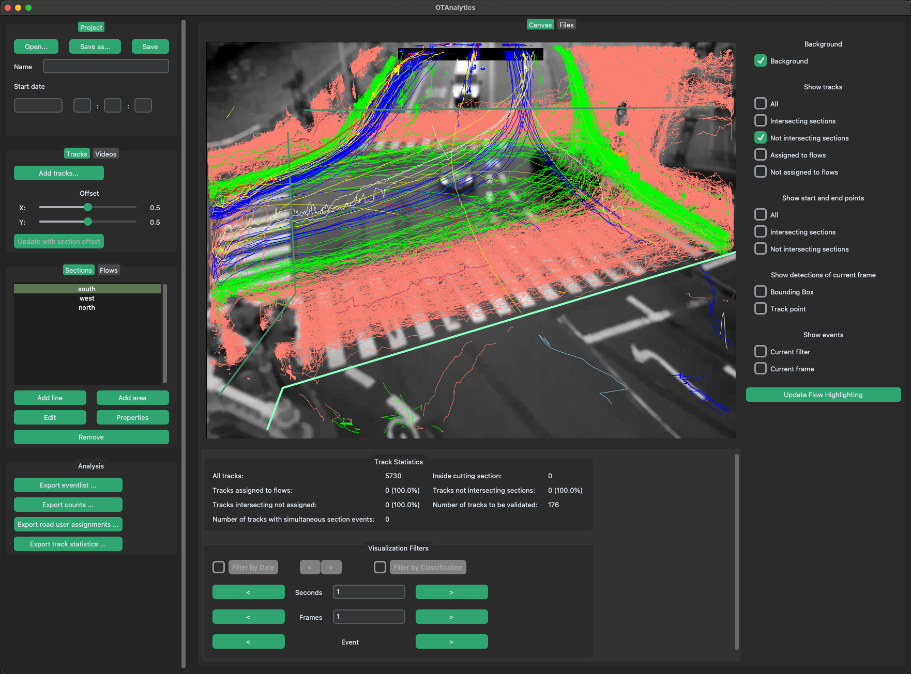

=== "Assigned to flows"
    Tracks assigned to at least one selected flow are shown.

    

=== "Not assigned to flows"
    Tracks assigned to **none** of the selected flows are shown.

    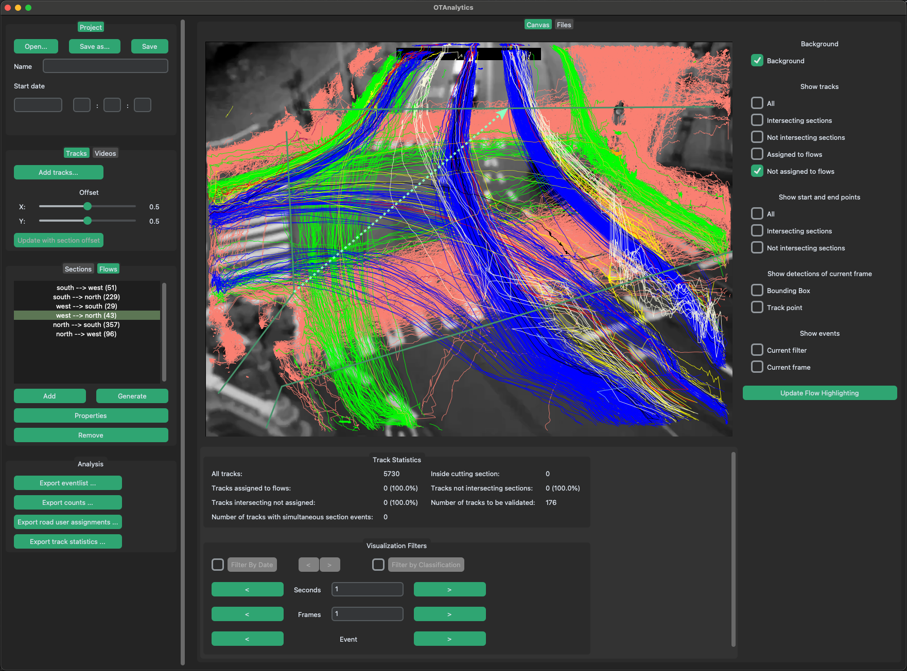

!!! tip
    When checking and optimising sections and flows, also have a look at the track statistics shown below the canvas.

### Show start- and endpoints

In this group of layers, you can decide if the start- and endpoints of tracks are highlighted.
Like in [Show tracks](#show-tracks), you can display the start- and endpoints based on their intersection with sections or their assignment to flows.

They enable you, for example, to check whether some tracks are interrupted and where this may be clustered.

=== "All"
    Start- and endpoints of all tracks are highlighted.

    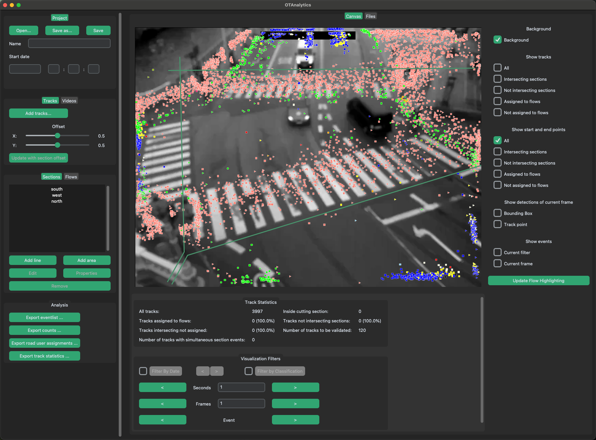

=== "Intersecting sections"
    Start- and endpoints of tracks intersecting at least one of the selected sections are highlighted.

    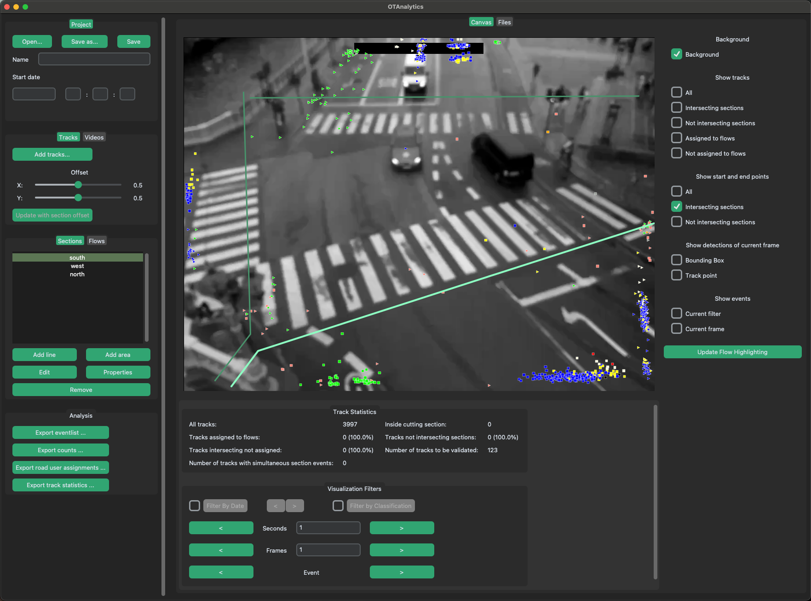

=== "Not intersecting sections"
    Start- and endpoints of tracks intersecting **none** of the selected sections are highlighted.

    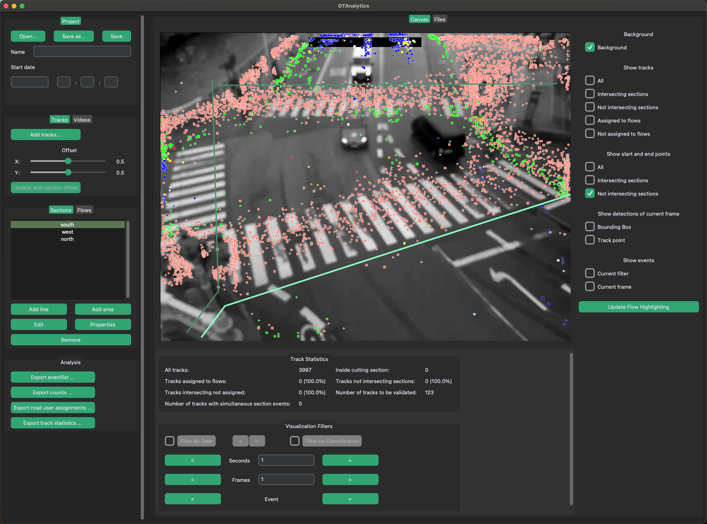

=== "Assigned to flows"
    Start- and endpoints of tracks assigned to at least one selected flow are highlighted.

    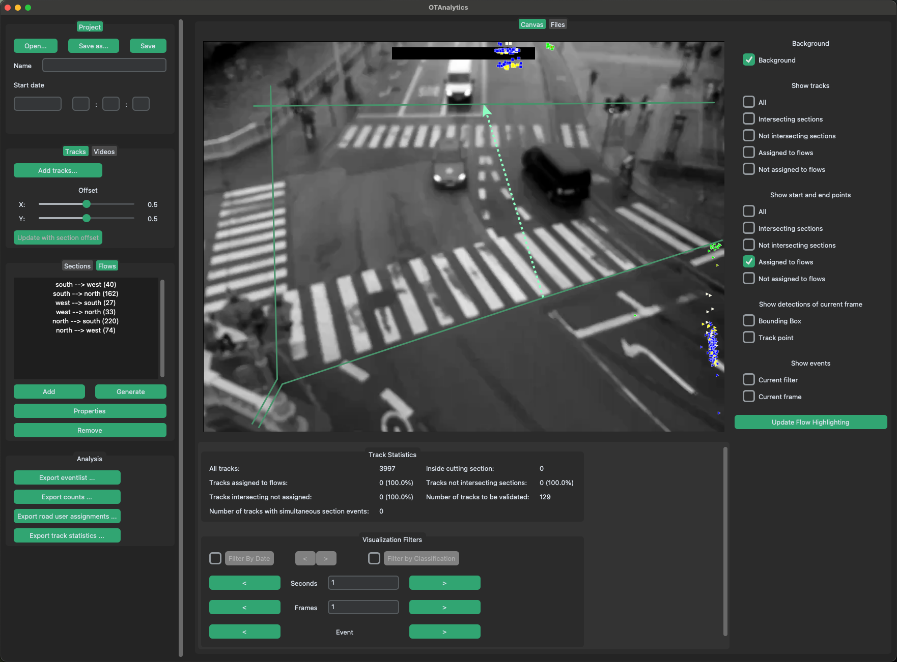

=== "Not assigned to flows"
    Start- and endpoints of tracks assigned to **none** of the selected flows are highlighted.

    

### Show detections of current frame

These layers visualize all detections of a single frame either using a bounding box or using the track point (with the current offset).

It can be helpful for an in-depth assessment of the quality of samples of detections and tracks.

=== "Bounding box"
    The bounding boxes of all detections in the currently visible frame are shown.

    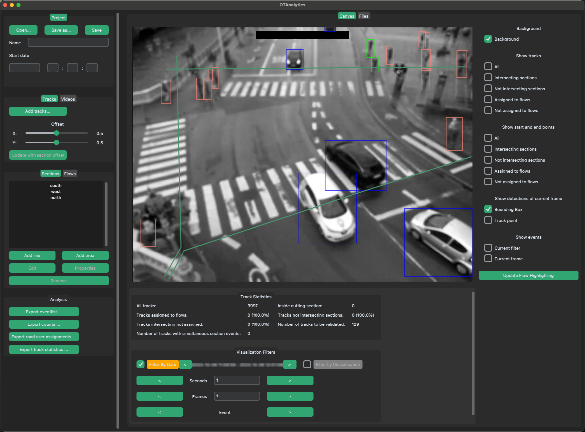

=== "Track point"
    The track points of all detections in the currently visible frame are shown.

    

### Show events

This group of layers highlights the locations of events triggered by the intersection of tracks with sections in a given period or at a given moment.

Like the other layers, they provide in-depth data validation.
Additionally, the event locations themselves can serve as an interesting focus for traffic analysis.

!!! info
    The locations of the events are determined based on the bounding box offset [configured locally for each individual section](#change-attributes-of-a-section).

    In contrast, a global offset can be set for visualising the tracks.

    As a result, the event locations may not align with the corresponding tracks.

    To align the tracks, select a specific section and hit the *Update with section offset* button.

=== "Current filter"
    The locations of all events within the date/time filter range are shown.

    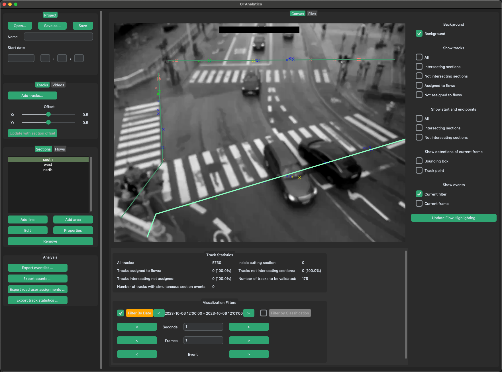

=== "Current frame"
    All events present at the moment of the current frame are shown.

    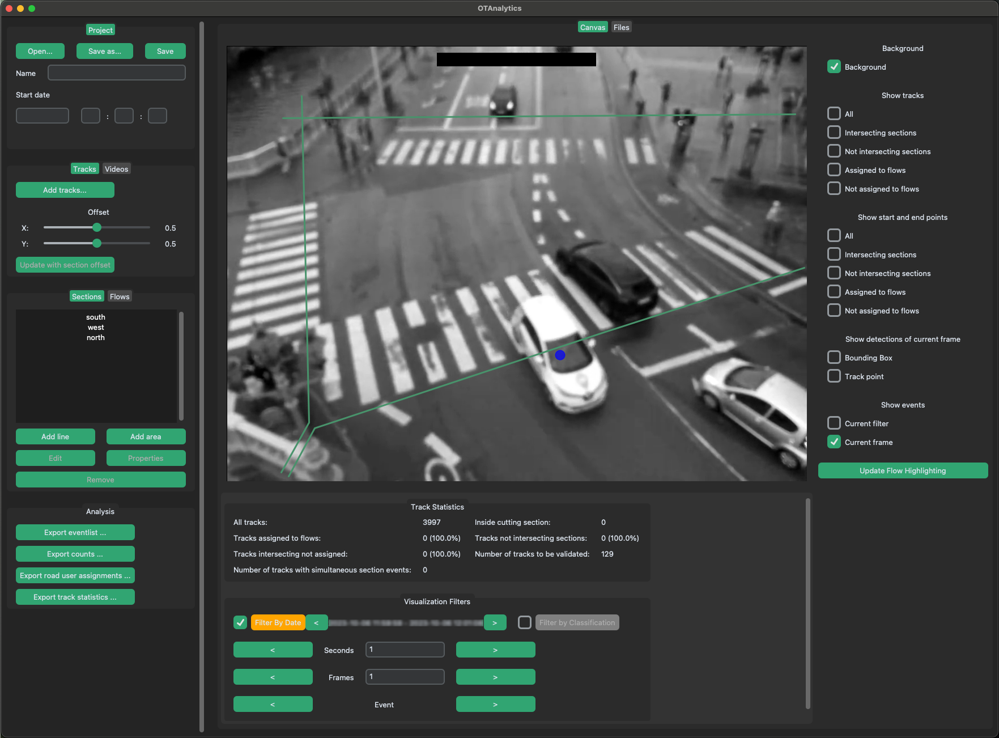

## Visualization filters

As the number of analyzed video hours grows, distinguishing individual tracks in the visualization becomes increasingly difficult.
Filters enable you to reduce the number of displayed track and the part of the track which is shown, making the visualization more focused and easier to manage.

!!! info
    Filters are applied only to the visualization in the workspace and to the calculation of track statistics displayed below.
    Analyses and data exports always include all loaded tracks, regardless of any applied filters.

### Filter by Time

Filter tracks based on time and date.
Only track points that are within the date/time range will be displayed.

You can toggle the filter by checking/unchecking the box left to the *Filter by date* button.
By clicking the *Filter by date* button, a popup appears where you can enter a custom date/time range.

The *<* and *>* buttons to the right of the *Filter by date* button allow you to shift the filter forward or backward by its current duration.
For more precise adjustments, use the *<* and *>* buttons below to fine-tune the filter's position (Seconds, Frames, Events).

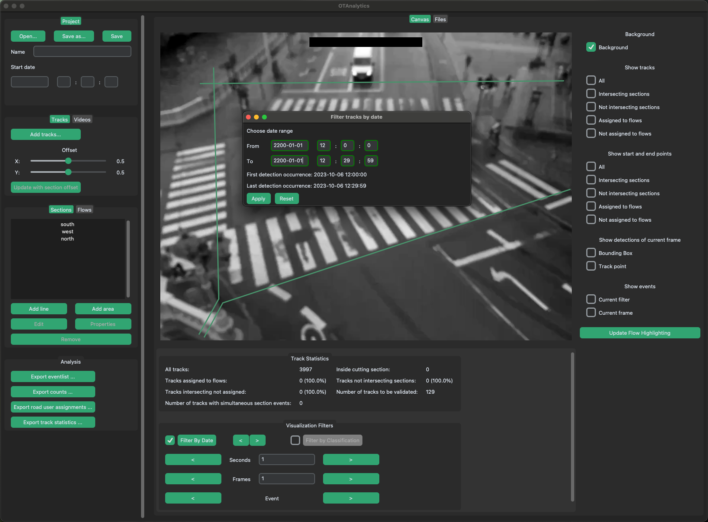

### Filter by Classification

Filter tracks based on their classification (e.g., car, bicyclist).

You can toggle the filter by checking/unchecking the box left to the *Filter by classification* button.
By clicking the *Filter by classification* button, a popup appears where you can select the track classes to be displayed.

## Analysis exports

After all sections and flows have been configured, you can choose an analysis for export.

!!! tip
    We highly recommend using the different [visualization layers](#visualization-layers) and the track statisics below the canvas before exporting analyses.
    This is how you gain detailed insights into the data and can optimize the configuration.
    It is important to ensure a good quality of your exports.

### Traffic counts

This is the most commonly used metric for analysing traffic, supporting various use cases such as planning, simulation, and safety analysis.

The traffic counts are derived from the assignment of tracks to flows.
They can be exported as a `.csv` file, which can be easily imported into your preferred software.
You can specify the start and end date and time, as well as the interval for aggregating traffic counts.

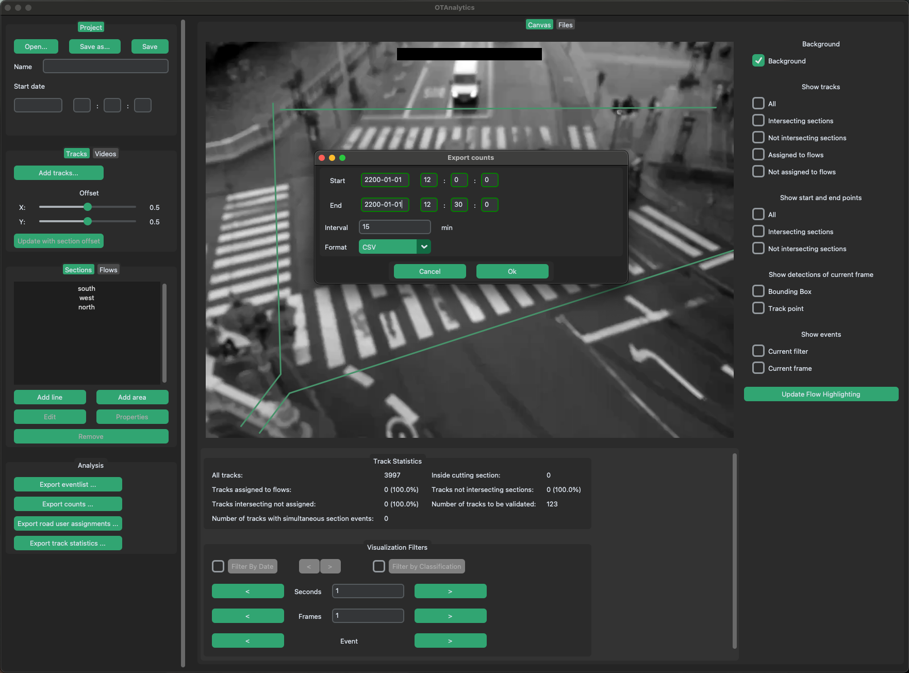

The `.csv` file includes the following values:

| Value                 | Datatype | Description                                                           | Example             |
| --------------------- | -------- | --------------------------------------------------------------------- | ------------------- |
| start time            | string   | Timestamp indicating the start of the interval                        | 2023-05-24 11:45:00 |
| start occurrence date | string   | Date at the start of the interval                                     | 2023-05-24          |
| start occurrence time | string   | Time at the start of the interval                                     | 11:45:00            |
| end time              | string   | Timestamp indicating the end of the interval                          | 2023-05-24 12:00:00 |
| end occurrence date   | string   | Date at the end of the interval                                       | 2023-05-24          |
| end occurrence time   | string   | Time at the end of the interval                                       | 12:00:00            |
| classification        | string   | The classification of the track / road user (e.g., car, bicyclist)    | bicyclist           |
| flow                  | string   | Direction of traffic flow, specifying origin and destination sections | south --> east      |
| from section          | string   | Name of the section where the track originated                        | south               |
| to section            | string   | Name of the section where the track was directed                      | east                |
| count                 | int      | Number of tracks / road users recorded during the interval            | 1                   |

### Event list

Traffic events provide a more granular data source for in-depth use cases, such as speed measurements, occupancy durations, or time gap analysis.

The events (tracks intersecting sections) can be exported into a single file in one of the following formats:

- **`.csv`** contains the event data in a format that can be read by many software products.
- **`.xslx`** includes the event data along with additional information about the sections used to generate the events for further analysis in MS Excel.
- **`.otevents`** is a bzip2-compressed JSON file that contains the event data, additional information about the sections used to generate the events, and metadata collected during processing.

The export includes the following values for each event:

| Value           | Datatype          | Description                                                                                                 | Example                                       |
| --------------- | ----------------- | ----------------------------------------------------------------------------------------------------------- | --------------------------------------------- |
| road_user_id    | string            | Unique identifier for the track / road user                                                                 | 5f8cd584-f490-4fec-afd0-b55ebf39ab4e#0#102341 |
| road_user_type  | string            | Track classification of the road user (e.g., car, pedestrian)                                               | car                                           |
| hostname        | string            | Name of the camera or device capturing the data                                                             | OTCamera19                                    |
| occurrence      | string            | Timestamp of the event in date and time format                                                              | 2023-05-24 11:45:00.000000                    |
| frame_number    | int               | Frame number of the video corresponding to the event                                                        | 1                                             |
| section_id      | string (optional) | Identifier for the section. Not available for the event types enter-scene and leave-scene                   | 1                                             |
| event_type      | string            | Type of event (enter-scene, leave-scene, enter-section, leave-section)                                      | enter-section                                 |
| video_name      | string            | Name of the video file where the event was recorded                                                         | OTCamera19_FR20_2023-05-24_11-45-00.mp4       |
| occurrence_sec  | timestamp         | Time of the event in seconds since the epoch                                                                | 1684928700.0                                  |
| coordinate_px_x | float             | X-coordinate of the road user in pixels                                                                     | 142.60128784179688                            |
| coordinate_px_y | float             | Y-coordinate of the road user in pixels                                                                     | 199.48948669433594                            |
| vector_px_x     | float             | X-component of the road user's movement vector                                                              | -0.2536773681640625                           |
| vector_px_y     | float             | Y-component of the road user's movement vector                                                              | 0.075958251953125                             |
| section_name    | string (optional) | Name of the section where the event occurred. Not available for the event types enter-scene and leave-scene | north                                         |
| occurrence_day  | string            | Day of the event in date format                                                                             | 2023-05-24                                    |
| occurrence_time | string            | Time of the event in time format                                                                            | 11:45:00.000000                               |

### Road User Assignments

Use this export in case no aggregation of tracks to traffic counts is wanted, but the assignment strategy of OTAnalytics should be used.

All tracks assigned to flows can be exported using the *Export road user assignments...* Button.
The tracks assigned to flows are exported into a `.csv` file with the following format:

| Value                 | Datatype  | Description                                                              | Example                                       |
| --------------------- | --------- | ------------------------------------------------------------------------ | --------------------------------------------- |
| flow_id               | int       | Unique identifier for the flow                                           | 16                                            |
| flow_name             | string    | Name of the flow                                                         | north --> east                                |
| road_user_id          | string    | Unique identifier for the track / road user                              | 5f8cd584-f490-4fec-afd0-b55ebf39ab4e#0#102708 |
| max_confidence        | float     | Maximum confidence score for the road user's track classification        | 0.9151925444602966                            |
| start_occurrence      | timestamp | Timestamp indicating the starting time of the track                      | 2023-05-24 11:45:07.600000                    |
| start_occurrence_day  | string    | Date indicating the start of the track                                   | 2023-05-24                                    |
| start_occurrence_time | string    | Time indicating the start of the track                                   | 11:45:07.600000                               |
| end_occurrence        | timestamp | Timestamp indicating the ending time of the track                        | 2023-05-24 11:45:09.600000                    |
| end_occurrence_day    | string    | Date indicating the end of the track                                     | 2023-05-24                                    |
| end_occurrence_time   | string    | Time indicating the end of the track                                     | 11:45:09.600000                               |
| start_frame_number    | int       | Frame number corresponding to the start of the track                     | 153                                           |
| end_frame_number      | int       | Frame number corresponding to the end of the track                       | 193                                           |
| start_video_name      | string    | Name of the video file where the start of the track was recorded         | OTCamera19_FR20_2023-05-24_11-45-00.mp4       |
| end_video_name        | string    | Name of the video file where the end of the track was recorded           | OTCamera19_FR20_2023-05-24_11-45-00.mp4       |
| start_section_id      | int       | Identifier for the section where the track originated                    | 3                                             |
| end_section_id        | int       | Identifier for the section where the track ended                         | 2                                             |
| start_section_name    | string    | Name of the section where the track started                              | north                                         |
| end_section_name      | string    | Name of the section where the track ended                                | east                                          |
| start_coordinate_px_x | float     | X-coordinate of the road user at the start of the track, in pixels       | 718.1949096679688                             |
| start_coordinate_px_y | float     | Y-coordinate of the road user at the start of the track, in pixels       | 301.2111328125                                |
| end_coordinate_px_x   | float     | X-coordinate of the road user at the end of the track, in pixels         | 775.1578369140625                             |
| end_coordinate_px_y   | float     | Y-coordinate of the road user at the end of the track, in pixels         | 326.5100158691406                             |
| start_vector_px_x     | float     | X-component of the road user's movement vector at the start of the track | -0.54376220703125                             |
| start_vector_px_y     | float     | Y-component of the road user's movement vector at the start of the track | 1.6538543701171875                            |
| end_vector_px_x       | float     | X-component of the road user's movement vector at the end of the track   | 0.179168701171875                             |
| end_vector_px_y       | float     | Y-component of the road user's movement vector at the end of the track   | 2.1141113281249773                            |
| hostname              | string    | Name of the camera or device capturing the road user                     | OTCamera19                                    |

### Track Statistics

This is a CSV export of the track statistics shown in the workspace below the camera image.

## What else?

If you encounter problems, have questions or like to request features, please [open an issue](https://github.com/OpenTrafficCam/OTAnalytics/issues/new) on GitHub.

We welcome code contributions (e.g. fixing bugs or adding features) by the community.
If you consider contributing, please check the [contribute section](https://opentrafficcam.org/contribute/) of this documentation first.

If you like to receive professional support, please have a look at our [services](https://opentrafficcam.org/pricing/) or [contact us](mailto:team@opentrafficcam.org) for more information.
