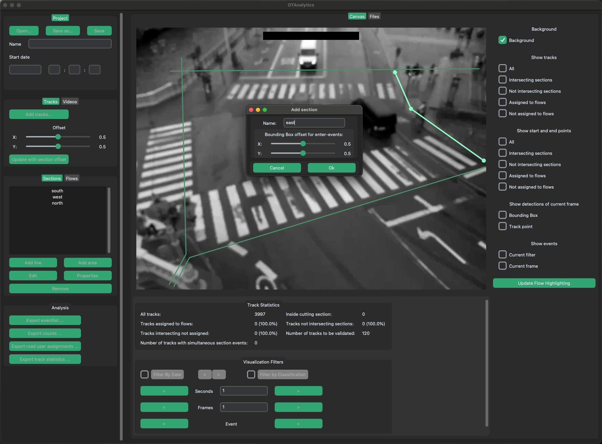

# Usage UI

## Einleitung

OTConfig ist ein Programm zur Konfiguration von videobasierten Verkehrsanalysen (z. B. Zählungen, Geschwindigkeitsmessungen) mit der OpenTrafficCam-Pipeline (OTVision und OTAnalytics). Die Kon-figuration umfasst dabei drei Schritte:

1. Projektsetup
1. Definition der zu analysierenden Verkehrsströme (Flows)
1. Export der Konfigurationsdatei

Die Ergebnisse der OpenTrafficCam-Pipeline sind Rohdaten zu den einzelnen Verkehrsbewegungen sowie Zählwerte für die einzelnen Verkehrsströme. Weitere Auswertungen, wie z. B. Geschwindig-keits- oder Zeitbedarfsanalysen, werden in nachgelagerten Prozessen auf Kundenwunsch durchge-führt. Die dafür relevanten Angaben werden individuell übermittelt sowie eventuell gewünschte Ag-gregationen von Fahrzeugklassen individuell vereinbart und von uns im Nachgang umgesetzt.

Die Definition der Verkehrsströme (Flows) erfolgt mittels Detektoren (Sections). Jeder Flow besteht aus genau einer Start- und einer Endsection (Von-Nach-Beziehung). Es können sowohl Sections in Form von Linien mit beliebig vielen Stützpunkten als auch Flächen definiert werden.

!!! info
    Für jede Kameraansicht muss eine eigene Konfiguration angelegt werden. Aufgrund der unterschiedlichen Lagen der Sections und Flows können keine Videos mit unterschiedlichen Ansichten gleichzeitig konfigurieren werden.

## Warum OTConfig?

Soll die Konfiguration und die Ausführung der OpenTrafficCam-Pipeline (Prozessierung bzw. die Aus-wertung) nicht im selben Schritt oder derselben Institution durchgeführt werden, muss sichergestellt werden, dass die konfigurierte Pipeline später auch wie gewünscht ausgeführt wird. Hierfür haben wir für unsere Kunden das Tool OTConfig entwickelt, um die Fremdprozessierung von Videos durch unsere Infrastruktur so effizient und reibungslos wie möglich zu gestalten.

Mit OTConfig kann der Kunde alle für die Ausführung benötigten Informationen angeben und die OpenTrafficCam-Pipeline entsprechend vorkonfigurieren. Diese Informationen werden abschließend in einer otconfig-Datei gespeichert. Es wird so sichergestellt, dass alle relevanten Informationen strukturiert an uns übergeben und in der OpenTrafficCam-Pipeline korrekt angewendet werden.

!!! info
    Die übermittelten Informationen werden vor jeder Ausführung der Pipeline nochmals durch ge-schultes Personal validiert und ggfs. plausibilisiert. Insbesondere die Lage der Sections wird optimiert, um das bestmögliche Ergebnis sicherzustellen.

## Benutzeroberfläche

Die Benutzeroberfläche gliedert sich in zwei Bereiche. In der Konfigurationsleiste können Angaben zum Projekt/zur SVZ gemacht sowie die Sections und Flows definiert werden. Im Arbeitsbereich wer-den Beispielansichten aus dem jeweils ausgewählten Video gezeigt. In diese werden die entspre-chenden Elemente zur Definition der Verkehrsströme eingezeichnet.

Die Konfigurationsleiste ist in drei Abschnitte unterteilt. Im obersten Abschnitt Project/SVZ werden die Metadaten das Projekt und für die Messstelle der SVZ angegeben sowie otconfig-Dateien gespeichert oder geladen. Im Abschnitt Video werden Videodateien geladen und entfernt sowie eine Übersicht der geladenen Videodateien angezeigt. Im Abschnitt Sections/Flows werden Sec-tions und Flows erstellt bzw. bearbeitet.
 

!!! info
    Sind in einem Abschnitt mehrere Teilabschnitte (z. B. Sections, Flows) vorhanden, kann zwi-schen diesen (wie bei Tabs) durch Anklicken hin- und hergewechselt werden. Der aktive Teilab-schnitt ist entsprechend grün hinterlegt.

Im Arbeitsbereich wird das erste Bild des gerade aktiven (bzw. markierten) Videos dargestellt. In dieses können die Sections gezeichnet werden. 

# Projektsetup

Zunächst muss das Projekt benannt werden. Der Projektname wird in das zugehörige Feld Name eingegeben. Anschließend muss die Startzeit (Datum und Uhrzeit) des ersten Videos in die entspre-chenden Felder Start date eingegeben werden. Es ist die Eingabe im ISO 8601-Format (YYYY-MM-DD) oder deutschem Datumsformat (DD.MM.YYYY) möglich.

!!! info
    OTConfig setzt voraus, dass alle ausgewählten Videos zeitlich aneinandergrenzen. Sollten die zu prozessierenden Videos eine zeitliche Lücke aufweisen (z. B. Videos von drei Tagen jeweils von 6:00 – 22:00 Uhr), müssen mehrere Projekte mit zeitlich zusammenhängenden Vi-deos angelegt werden.
    
    Es wird empfohlen, einen eindeutigen Namen (z. B. Bezeichnung der Messstelle, Kameranummer; oder Kombination aus mehreren eindeutigen Angaben) zu wählen. 

Anschließend müssen die zu prozessierenden Videos ausgewählt und in OTConfig geladen werden. Über den Button Add können die jeweiligen Videos hinzugefügt werden. Nach dem Anklicken öffnet sich der Dateibrowser und die Videos können ausgewählt werden. Es können auch mehrere Videos gleichzeitig ausgewählt werden. Über den Button Remove wird das selektierte Video gelöscht.

!!! info
    Hinzugefügte Videos werden in alphabetischer Reihenfolge im Übersichtsfenster „Videos“ ange-zeigt und später in dieser Reihenfolge prozessiert. Die Videos sollten also so benannt sein, dass die zeitliche Reihenfolge mit der alphabetischen Reihenfolge überein-stimmt. 

Wenn ein Video in der Übersicht in der Konfigurationsleiste angeklickt wird, wird das erste Bild des Videos als Hintergrundbild angezeigt. So kann abschließend kontrolliert werden, ob alle Videos kor-rekt ausgewählt wurden.

# Definition der zu analysierenden Verkehrsströme

Ein Verkehrsstrom (Flow) bildet die richtungsbezogene Fahrtbeziehung zwischen zwei Bereichen im Videobild ab. Die Bereiche werden mit sogenannten Sections definiert. Ein Flow besteht immer aus zwei Sections (einer Start- und einer Endsection). Um Flows definieren zu können, müssen somit zu-nächst die Sections angelegt oder bearbeitet werden. Anschließend können die Flows den angeleg-ten oder bearbeiteten Sections zugeordnet werden.

## Sections

Sections können aus beliebig vielen Stützpunkten (als Kreis dargestellt) bestehen. Sie werden in OTConfig direkt in das Hintergrundbild gezeichnet. Dafür muss im Abschnitt Sections/Flows zu-nächst der Tab Sections ausgewählt werden.

!!! info
    Es können in OTConfig Liniensections (line section) und Flächensections (area section) ange-legt werden. Sofern keine Belegungsdauern (z. B. von Parkflächen), sondern lediglich Überfahrten detektiert werden, sollten stets Liniensections gewählt werden. 
    
    Das weitere Beispiel beschränkt sich auf Liniensections. Das beschriebene Vorgehen lässt sich je-doch ebenso auf Flächensections übertragen. Einziger Unterschied ist, dass beim Beenden des Hinzufügen-Modus das Polygon automatisch geschlossen wird.

### Hinzufügen von Sections

Das Hinzufügen einer neuen Liniensection erfolgt in folgenden Schritten:

1. Linksklick auf den Button Add line, der den Hinzufügen-Modus startet. 
1. Setzen des ersten Punktes durch Linksklick an der richtigen Stelle im Videobild. Der Punkt ist nun fixiert. Durch Bewegen der Maus und weitere Linksklicks können weitere Punkte der Section angelegt werden. Eine Section muss mindestens aus zwei Punkten bestehen.
1. Ist die gewünschte Länge und Form einer Section erreicht, wird durch einen Rechtsklick oder Drücken der Enter-Taste der Hinzufügen-Modus beendet.
1. Ein Druck auf die Escape-Taste bricht den Hinzufügen-Modus ohne Speichern der bis-her erstellten Section ab.
1. Es öffnet sich ein Pop-up Fenster. In dieses den Namen für die Section eintragen und bestä-tigen. Der Name wird in der Auswertung wiederverwendet. 

%TODO%: Infobox innerhalb der Aufzählung?
!!! info
   Ein Name kann nur einmal vergeben werden, Namensduplikate mehrerer Sections sind nicht möglich. Wir empfehlen, als Name der Section die ungefähre Himmelsrichtung der geo-grafischen Lage (z. B. Nord, Nordost) zu verwenden.

1. Die erstellte Section erscheint mit dem vergebenen Namen im Teilabschnitt Sections.
1. Um weitere Sections hinzuzufügen, den Vorgang wiederholen.
 

### Ändern der Section Geometrie

Die Geometrie bereits erstellter Sections kann mit dem folgenden Vorgehen geändert werden:

1. Zunächst wird die zu ändernde Section in der Liste ausgewählt. 
1. Anschließend wird der Änderungs-Modus durch Linksklick auf den Button Edit gestar-tet. Es werden nun die Stützpunkte sichtbar. 
1. Durch Linksklick können Stützpunkte nun ausgewählt und wie im Hinzufügen-Modus neu gesetzt werden. Mit der +-Taste kann ein weiterer Stützpunkt hinzugefügt werden.

Der ausgewählte Punkt „klebt“ am Mauszeiger, bis die linke Maustaste gedrückt wird. Die alte Ge-ometrie wird dabei als Referenz gestrichelt dargestellt.

1. Durch einen Rechtsklick wird der Änderungs-Modus beendet und die Änderungen ge-speichert.
1. Ein Druck auf die Escape-Taste beendet den Änderungs-Modus, ohne die Änderungen der Geometrie zu speichern. 

### Ändern des Section-Namens

Durch Klicken auf den Button Properties kann der Name einer Section geändert werden. Dafür muss die gewünschte Section vorher aus der Liste ausgewählt werden.

### Section löschen

Eine Section kann durch Klicken auf den Button Remove gelöscht werden. Dafür muss die ge-wünschte Section vorher in der Liste ausgewählt werden und darf keinem Flow zugeordnet sein.

## Flows

Ein Flow besteht immer aus genau zwei Sections: einer Start- und einer Endsection. Zur Bearbeitung von Flows muss im Abschnitt Sections/Flows zunächst der Tab Flows ausgewählt werden.

### Hinzufügen von Flows

Das Hinzufügen eines neuen Flows erfolgt in folgenden Schritten:

1. Linksklick auf Button Add. Es öffnet sich ein Pop-Up Fenster. In diesem können per Drop-Down-Menü die passenden Sections ausgewählt werden. 
1. Als First section wird der Anfangspunkt des Flows festgelegt.
1. Als Second section wird der Endpunkt des Flows festgelegt.
1. Im Feld Name wird der Name nach Auswahl der beiden Sections automatisch gesetzt. Dieser kann nach eigenen Vorstellungen geändert werden. Der Name wird in der Auswertung wie-derverwendet.

!!! info
    Ein Name kann nur einmal vergeben werden, Namensduplikate mehrerer Flows sind nicht möglich.

    Alternativ können Flows auch automatisch über den Button Generate erzeugt werden. Es wer-den dann für alle möglichen Kombinationen aus Start- und Endsection Flows erzeugt. Die Namensgebung erfolgt standardmäßig in der Konvention Name_Startsection --> Na-me_Endsection.

### Bearbeiten von Flows

Um einen Flow zu bearbeiten, muss dieser zunächst in der Liste ausgewählt werden. Anschließend öffnet sich mit einem Linksklick auf den Button Properties das gleiche Pop-up-Fenster wie beim Erstellen eines Flows. Es können nun die gewünschten Änderungen vorgenommen werden. 

### Entfernen von Flows

Um einen Flow zu entfernen, muss dieser zunächst in der Liste ausgewählt werden. Ein Linksklick auf den Button Remove entfernt nun den ausgewählten Flow.

## Speichern der Konfigurationsdatei 

Sind alle benötigten Videos hinzugefügt und alle Flows angelegt, wird das Projekt gespeichert.

1. Im Abschnitt Project der Konfigurationsleiste auf den Button Save as… klicken.
1. Im Dateibrowser einen passenden Dateinamen wählen und im gleichen Ordner wie die Videos speichern. 

!!! info
    Wir empfehlen, den Fortschritt des Projekts auch schon bereits während der Bearbeitung regelmäßig zu speichern. So kann möglichen Datenverlusten vorgebeugt werden. Der Save Button speichert die Datei automatisch am zuletzt gewählten Speicherort. Ist dieser orange gefärbt, sind Änderungen vorhanden.
