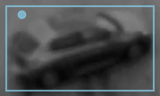
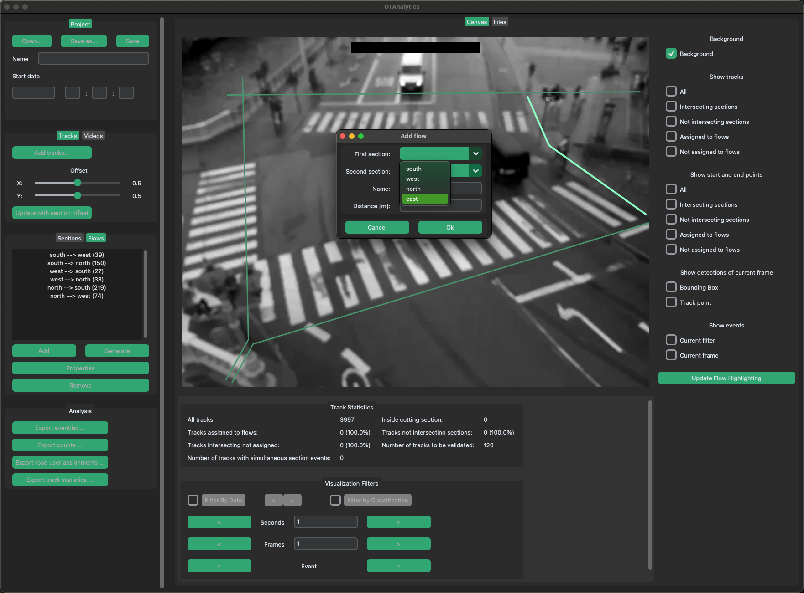
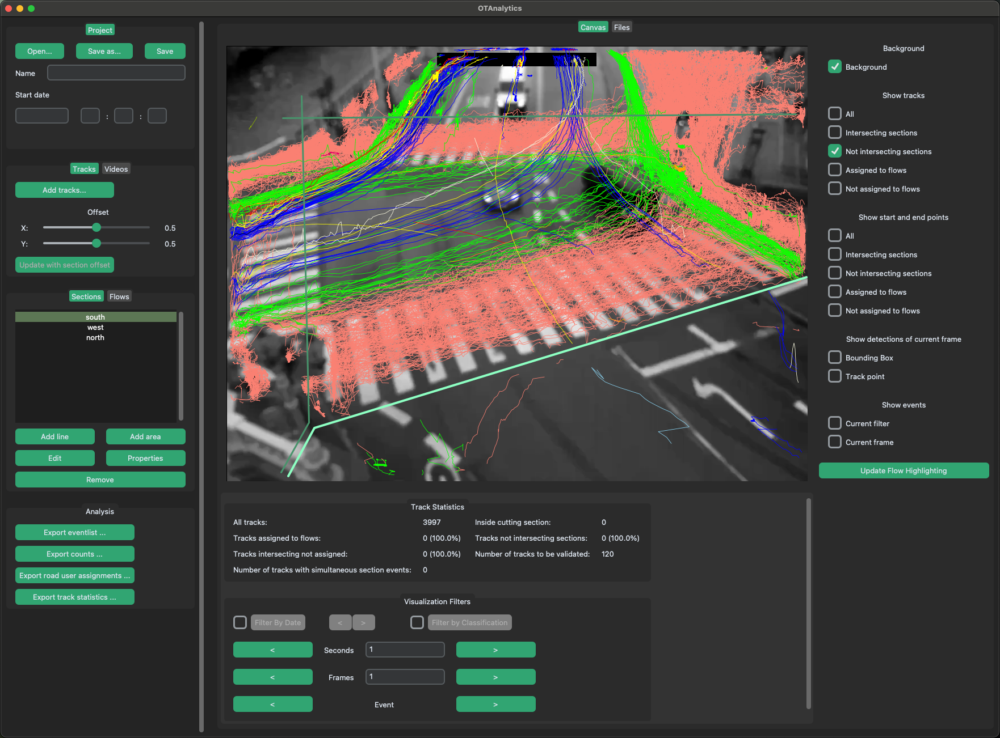
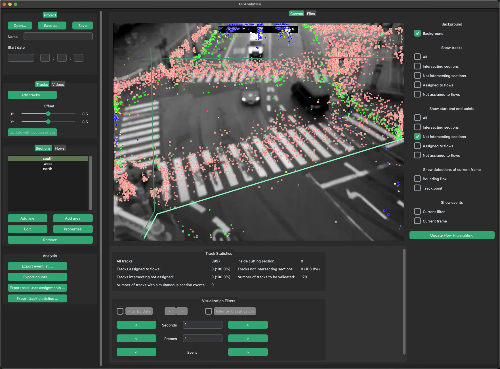
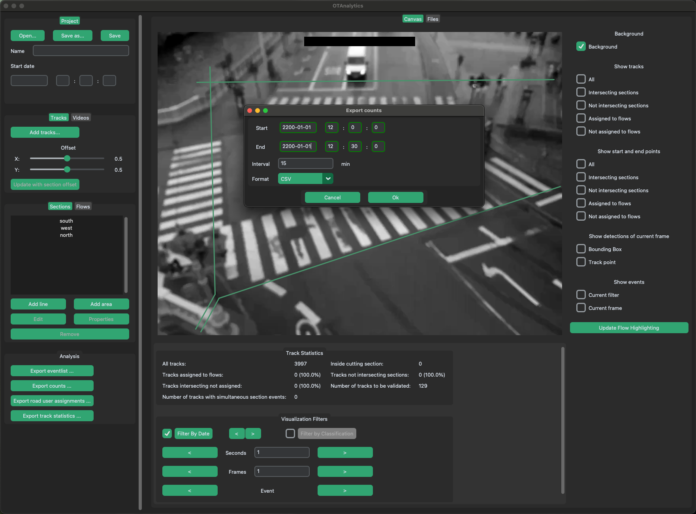

# Usage UI

After processing videos with OTVisionÄS tracking module ([OTVision track](../../OTVision/usage/track)), you can use OTAnalytics for data analysis.
The OTAnalytics interface enables you to configure analyses, extract valuable insights from your data, and export the results efficiently.

## Terminology

Vehicles and pedestrians are detected in the individual frames of the video using [detect in OTVision](../../OTVision/usage/detect).
Each detected object (**Detection**) is represented in a frame by a **Bounding Box**, which is the rectangular area surrounding the detected vehicle or pedestrian together with its classification (e.g., car, bike, pedestrian).

The [tracker in OTVision](../../OTVision/usage/track) links consecutive detections, or bounding boxes, to form a **Track** or **Road User**.
A track is therefore composed of a series of detections, each with its own classification.
Ideally, all detections within a track share the same classification.
However, in practice, a track may include detections with varying classifications (e.g., truck and truck_with_trailer).
This typically occurs when only a portion of the road user is visible in one frame, while in subsequent frames more of the road user or the entire road user appears within the frame.

OTAnalytics assigns a single **Track Classification** to each track, as a road user can have only one classification in the real world (e.g., a vehicle is either a car or a bus).

To analyze the tracks, OTAnalytics provides sections and flows. **Sections** are detectors.
Each time a track's trajectory intersects a section, an **Event** is generated.
Each event contains detailed information, including the track's identifier, its position in the frame, and the timestamp of the intersection.

A track's trajectory is created by selecting a single representative point from each bounding box associated with the track.
This point is called the **Track Point**.
The trajectory is formed by connecting the track points collected across successive frames.

!!! info inline end "Track Point examples"
    === "0.1, 0.1"
        { align=left }
    
    === "0.8, 0.3"
        { align=left }

The position of the track point within the bounding box can be configured using the **Offset** attribute of sections.
This offset is defined separately for the x- and y-axes, with values ranging from `0` to `1`.
These values determine the relative position of the track point within the bounding box, providing flexibility in track point placement.

Since the offset can be individually configured for each section, tracks intersecting different sections can be finely tuned.
This allows precise customization of the trajectory data based on the requirements of each section.

**Flows** define traffic flows to be analyzed.
As explained in [Flows](#flows), a flow is defined by two sections: a starting section and an ending section.
Tracks that intersect both sections of a flow can be assigned to that flow.
To achieve this, the events belonging to a track are sorted chronologically based on their time of occurrence.
The pair of events with the longest time interval between them is used to assign the track to the flow corresponding to the sections of both events.
The assignment of a track to a flow is called **Track Assignment**.

## User Interface

The user interface is divided into four main areas: the configuration bar, workspace, visualization layers, and filter area.

The **Configuration Bar** consists of four sections:

1. **Project**: Manage project metadata and save or load `.otconfig` files.
2. **Tracks/Video**: Add input files, where only track files can be added, while video files can be both added and removed. An overview of loaded video files is also displayed.
3. **Sections/Flows**: Create, edit, and delete sections and flows. The flow names are shown with numbers indicating the number of assigned tracks per flow.
4. **Analysis**: Start the export of analyzed data.

The **Workspace** displays the tracks and video frames.
It is also where the geometry of sections can be created or edited.
Below the workspace, the **Track Statistics** section provides key statistics about the displayed tracks.

Tracks can be customized using different **Visualization Layers**, while the number of displayed tracks can be adjusted through the **Visualization Filters** located below the workspace.

## Project Setup

The project must first be named.
The project name is entered in the corresponding Name field.
The start time (date and time) of the first video must then be entered in the corresponding Start date fields.
It is possible to enter in ISO 8601 format (YYYY-MM-DD) or German date format (DD.MM.YYYY).

!!! info
    OTAnalytics assumes that all selected videos are contiguous in time.
    If the videos to be processed have a time gap (e.g., videos from three days from 6:00 a.m. to 10:00 p.m.), several projects with chronologically contiguous videos must be created.
    
    It is recommended to choose a unique name (e.g. name of the measuring point, camera number; or a combination of several unique details).

To analyze tracks in OTAnalytics, you must load the track files (.ottrk).
This can be done using the *Add tracks...* button, which opens a file browser to select the respective files.
Multiple track files can be added at once.
If a corresponding video file exists, OTAnalytics will automatically load it alongside the track file.
If no associated video is found, the track file cannot be loaded.

Alternatively, you can add videos only.
This is particularly useful for configuring an analysis handled by the platomo team.
To add videos, use the *Add...* button, and to remove them from the configuration, use the *Remove* button.

!!! tip
    Added videos are displayed in alphabetical order in the “Videos” overview panel and are later processed in this order.
    The videos should therefore be named in such a way that the chronological order matches the alphabetical order.
    Additional zero-padding (e.g., `01`, `02`) is helpful if you want to ensure correct alphabetical sorting.

When you click a video in the configuration bar, the first image of the video is displayed as the background image.
This allows you to check whether all videos have been selected correctly.

### Save to configuration file (otconfig file)

Once all the required videos have been added and all the flows have been created, the project is saved.

1. Click on the *Save as...* button in the Project section of the configuration bar.
1. Select a suitable filename in the file browser and save it in the same folder as the videos.

!!! tip
    We recommend regularly saving the progress of the project while it is still being processed.
    This prevents possible loss of data.
    The *Save* button automatically saves the file to the last selected location.
    If it is colored in orange, changes have been made.

    We also recomment to store all project related files (videos, otdet, ottrk and otconfig) in the same folder.

## Definition of the traffic flows to be analyzed

A traffic flow depicts the directional travel relationship between two sections.
A flow always consists of two sections (a start section and an end section).
In order to define flows, the sections must first be created.
The flows can then be assigned to the created or edited sections.

### Sections

Sections can consist of any number of support points (shown as a circle).
They are drawn directly in the background image in OTAnalytics.
To do this, the *Sections* tab must first be selected in the Sections/Flows section.

!!! tip
    Line sections and area sections can be created.
    If no occupancy durations (e.g., of parking areas) are analyzed, but only crossings, line sections should always be used.
    
    The following example is limited to line sections.
    However, the procedure described can also be applied to area sections.
    The only difference is that the polygon is automatically closed when the add mode is exited.

#### Add Sections

A new line section is added in the following steps:

1. Left-click on the *Add line* button, which starts the add mode.
1. Set the first point by left-clicking at the correct position in the video image. The point is now fixed. Further points can be added to the section by moving the mouse and left-clicking again. A section must consist of at least two points.
1. Once the desired length and shape of a section has been reached, right-click or press the *Enter* key to exit Add mode.
1. Pressing the *Escape* key cancels add mode without saving the previously created section.
1. A pop-up window opens. Enter the name for the section in this window and confirm. The name is reused in the analysis.
1. The created section appears with the assigned name in the sections subsection.
1. Repeat the process to add further sections.

!!! warning
    A name can only be assigned once, duplicate names of several sections are not possible.
    We recommend using the approximate compass direction of the geographical location (e.g. north, north-east) as the name of the section.

#### Change the geometry of a section

The geometry of sections that have already been created can be changed using the following procedure:

1. First select the section to be changed in the list.
1. Then start the change mode by left-clicking on the *Edit* button. The supporting points are now visible.
1. Support points can now be selected by left-clicking and reset as in add mode. The + button can be used to add another support point.

The selected point “sticks” to the mouse pointer until the left mouse button is pressed.
The old geometry is displayed as a dashed reference.

1. Right-click to exit change mode and save the changes.
1. Pressing the Escape button exits the change mode without saving the changes to the geometry.

#### Change attributes of a section

The attributes (name and offset) of a section can be changed by clicking on the *Properties* button.
To do this, the desired section must first be selected from the list.

#### Remove a section

A section can be removed by clicking on the *Remove* button.
To do this, the desired section must first be selected in the list and must not be assigned to a flow.

### Flows

A flow always consists of exactly two sections: a start section and an end section.
To edit flows, the *Flows* tab must first be selected in the Sections/Flows section.

#### Add Flows

A new flow is added in the following steps:

1. Left-click on the *Add* button. A pop-up window opens. The appropriate sections can be selected from the drop-down menu.
1. The start point of the flow is defined as the first section.
1. The endpoint of the flow is defined as the second section.
1. The name is automatically set in the *Name* field after selecting the two sections. This can be changed as required. The name is reused in the analysis.

!!! warning
    A name can only be assigned once, duplicate names of several flows are not possible.

    Alternatively, flows can also be generated automatically using the *Generate* button.
    Flows are then generated for all possible combinations of start and end sections.
    The standard naming convention is `Name_Startsection --> Name_Endsection`.

#### Edit Flows

To edit a flow, it must first be selected in the list.
Then left-click on the *Properties* button to open the same pop-up window as when creating a flow.
The desired changes can now be made.

#### Remove Flows

To remove a flow, it must first be selected in the list.
Left-click on the *Remove* button to remove the selected flow.

## Visualization layers

Visualization layers are used to refine traffic analysis by offering specific views of the data.
Tracks are consistently displayed in the same color, which is determined by the track classification.
The visualization layers are organized into groups.

### Background

This layer shows a frame of the video as a background image.
The currently shown frame can be configured using the filter.
If a filter is set, the frame at the end of the filter is shown.
Otherwise, the first frame of the selected video is shown.

### Show tracks

This group shows the trajectory of tracks.
The tracks to be shown can vary in different flavors.

=== "All"
    All tracks are shown.

    

=== "Intersecting sections"
    Tracks intersecting at least one of the selected sections are shown.

    

=== "Not intersecting sections"
    Tracks intersecting none of the selected sections are shown.

    

=== "Assigned to flows"
    Tracks assigned to at least one selected flow are shown.

    

=== "Not assigned to flows"
    Tracks not assigned to one of the selected flows are shown.

    

### Show start- and endpoints

This group shows the start- and endpoints of tracks.
The tracks to be shown can vary in the same flavors as described in [Show tracks](#show-tracks).

=== "All"
    Start- and endpoints of all tracks are shown.

    

=== "Intersecting sections"
    Start- and endpoints of tracks intersecting at least one of the selected sections are shown.

    

=== "Not intersecting sections"
    Start- and endpoints of tracks intersecting none of the selected sections are shown.

    

=== "Assigned to flows"
    Start- and endpoints of tracks assigned to at least one selected flow are shown.

    

=== "Not assigned to flows"
    Start- and endpoints of tracks not assigned to one of the selected flows are shown.

    

### Show detections of current frame

This group visualizes the detections of a single frame in different flavors.

=== "Bounding Box"
    The bounding boxes of all detections in the currently visible frame are shown.

    

=== "Track point"
    The track points of all detections in the currently visible frame are shown.

    

### Show events

=== "Current filter"
    The track points of all events within the filter range are shown.
    
    

=== "Current frame"
    All events within the range of the current frame are shown.

    

## Filter

As the number of hours analyzed increases, distinguishing individual tracks in the visualization becomes increasingly difficult.
Filters enable you to limit the number of displayed tracks, making the visualization more manageable and focused.

!!! info
    Filters are applied exclusively to the visualization in the workspace and to the calculation of the track statistics displayed below the visualization.
    The analysis and data export always include all loaded tracks, regardless of any applied filters.

### Filter by Time

Filter tracks based on time and date.
All tracks with a start time on or after the start date and an end time on or before the end date will remain in the dataset.
The *<* and *>* buttons located to the right of the filter button allow you to shift the filter forward or backward by the filter's duration.
For more precise adjustments, the *<* and *>* buttons below enable finer control over the filter's position.

### Filter by Classification

Filter tracks based on the track classification.

## Analysis and Export

After all sections and flows have been configured, the analysis can be exported.

!!! tip
    We recommend using the various layers described in [Visualization layers](#visualization-layers) to gain detailed insights into the data before exporting it.

### Export Eventlist

Events can be exported into a single file in one of the following formats: CSV, Excel, or otevents.

- **CSV**: Contains the event data in a format that can be read by many software products.
- **Excel**: Includes the event data along with additional information about the sections used to generate the events.
- **otevents**: A bzip2-compressed JSON file that contains the event data, additional information about the sections used to generate the events, and metadata collected during processing.

The export includes the following values for each event:

| Value           | Datatype          | Description                                                                                                 | Example                                       |
|-----------------|-------------------|-------------------------------------------------------------------------------------------------------------|-----------------------------------------------|
| road_user_id    | string            | Unique identifier for the track / road user                                                                 | 5f8cd584-f490-4fec-afd0-b55ebf39ab4e#0#102341 |
| road_user_type  | string            | Track classification of the road user (e.g., car, pedestrian)                                               | car                                           |
| hostname        | string            | Name of the camera or device capturing the data                                                             | OTCamera19                                    |
| occurrence      | string            | Timestamp of the event in date and time format                                                              | 2023-05-24 11:45:00.000000                    |
| frame_number    | int               | Frame number of the video corresponding to the event                                                        | 1                                             |
| section_id      | string (optional) | Identifier for the section. Not available for the event types enter-scene and leave-scene                   | 1                                             |
| event_type      | string            | Type of event (enter-scene, leave-scene, enter-section, leave-section)                                      | enter-section                                 |
| video_name      | string            | Name of the video file where the event was recorded                                                         | OTCamera19_FR20_2023-05-24_11-45-00.mp4       |
| occurrence_sec  | timestamp         | Time of the event in seconds since the epoch                                                                | 1684928700.0                                  |
| coordinate_px_x | float             | X-coordinate of the road user in pixels                                                                     | 142.60128784179688                            |
| coordinate_px_y | float             | Y-coordinate of the road user in pixels                                                                     | 199.48948669433594                            |
| vector_px_x     | float             | X-component of the road user's movement vector                                                              | -0.2536773681640625                           |
| vector_px_y     | float             | Y-component of the road user's movement vector                                                              | 0.075958251953125                             |
| section_name    | string (optional) | Name of the section where the event occurred. Not available for the event types enter-scene and leave-scene | north                                         |
| occurrence_day  | string            | Day of the event in date format                                                                             | 2023-05-24                                    |
| occurrence_time | string            | Time of the event in time format                                                                            | 11:45:00.000000                               |

### Export Traffic Count

Traffic count is based on the assignment of tracks to flows.
It can be exported as a CSV file, which can be easily imported into your preferred program.
You can specify the start and end date and time, as well as the interval for grouping road users.

The CSV file includes the following values:

| Value                 | Datatype | Description                                                              | Example             |
|-----------------------|----------|--------------------------------------------------------------------------|---------------------|
| start time            | string   | Timestamp indicating the start of the interval                           | 2023-05-24 11:45:00 |
| start occurrence date | string   | Date at the start of the interval                                        | 2023-05-24          |
| start occurrence time | string   | Time at the start of the interval                                        | 11:45:00            |
| end time              | string   | Timestamp indicating the end of the interval                             | 2023-05-24 12:00:00 |
| end occurrence date   | string   | Date at the end of the interval                                          | 2023-05-24          |
| end occurrence time   | string   | Time at the end of the interval                                          | 12:00:00            |
| classification        | string   | The track classification of the track / road user (e.g., car, bicyclist) | bicyclist           |
| flow                  | string   | Direction of traffic flow, specifying origin and destination sections    | south --> east      |
| from section          | string   | Name of the section where the traffic originated                         | south               |
| to section            | string   | Name of the section where the traffic was directed                       | east                |
| count                 | int      | Number of tracks / road users recorded during the interval               | 1                   |

### Export Road User Assignments

In case no aggregation of tracks to traffic volumes is required, but the assignment strategy of OTAnalytics should be used.
All tracks assigned to flows can be exported using the *Export road user assignments...* Button.
The tracks assigned to flows are exported into a CSV file with the following format:

| Value                 | Datatype  | Description                                                              | Example                                       |
|-----------------------|-----------|--------------------------------------------------------------------------|-----------------------------------------------|
| flow_id               | int       | Unique identifier for the flow                                           | 16                                            |
| flow_name             | string    | Name of the flow                                                         | north --> east                                |
| road_user_id          | string    | Unique identifier for the track / road user                              | 5f8cd584-f490-4fec-afd0-b55ebf39ab4e#0#102708 |
| max_confidence        | float     | Maximum confidence score for the road user's track classification        | 0.9151925444602966                            |
| start_occurrence      | timestamp | Timestamp indicating the starting time of the track                      | 2023-05-24 11:45:07.600000                    |
| start_occurrence_day  | string    | Date indicating the start of the track                                   | 2023-05-24                                    |
| start_occurrence_time | string    | Time indicating the start of the track                                   | 11:45:07.600000                               |
| end_occurrence        | timestamp | Timestamp indicating the ending time of the track                        | 2023-05-24 11:45:09.600000                    |
| end_occurrence_day    | string    | Date indicating the end of the track                                     | 2023-05-24                                    |
| end_occurrence_time   | string    | Time indicating the end of the track                                     | 11:45:09.600000                               |
| start_frame_number    | int       | Frame number corresponding to the start of the track                     | 153                                           |
| end_frame_number      | int       | Frame number corresponding to the end of the track                       | 193                                           |
| start_video_name      | string    | Name of the video file where the start of the track was recorded         | OTCamera19_FR20_2023-05-24_11-45-00.mp4       |
| end_video_name        | string    | Name of the video file where the end of the track was recorded           | OTCamera19_FR20_2023-05-24_11-45-00.mp4       |
| start_section_id      | int       | Identifier for the section where the track originated                    | 3                                             |
| end_section_id        | int       | Identifier for the section where the track ended                         | 2                                             |
| start_section_name    | string    | Name of the section where the track started                              | north                                         |
| end_section_name      | string    | Name of the section where the track ended                                | east                                          |
| start_coordinate_px_x | float     | X-coordinate of the road user at the start of the track, in pixels       | 718.1949096679688                             |
| start_coordinate_px_y | float     | Y-coordinate of the road user at the start of the track, in pixels       | 301.2111328125                                |
| end_coordinate_px_x   | float     | X-coordinate of the road user at the end of the track, in pixels         | 775.1578369140625                             |
| end_coordinate_px_y   | float     | Y-coordinate of the road user at the end of the track, in pixels         | 326.5100158691406                             |
| start_vector_px_x     | float     | X-component of the road user's movement vector at the start of the track | -0.54376220703125                             |
| start_vector_px_y     | float     | Y-component of the road user's movement vector at the start of the track | 1.6538543701171875                            |
| end_vector_px_x       | float     | X-component of the road user's movement vector at the end of the track   | 0.179168701171875                             |
| end_vector_px_y       | float     | Y-component of the road user's movement vector at the end of the track   | 2.1141113281249773                            |
| hostname              | string    | Name of the camera or device capturing the road user                     | OTCamera19                                    |

### Track Statistics

This is a CSV export of the track statistics shown in the workspace below the camera image.