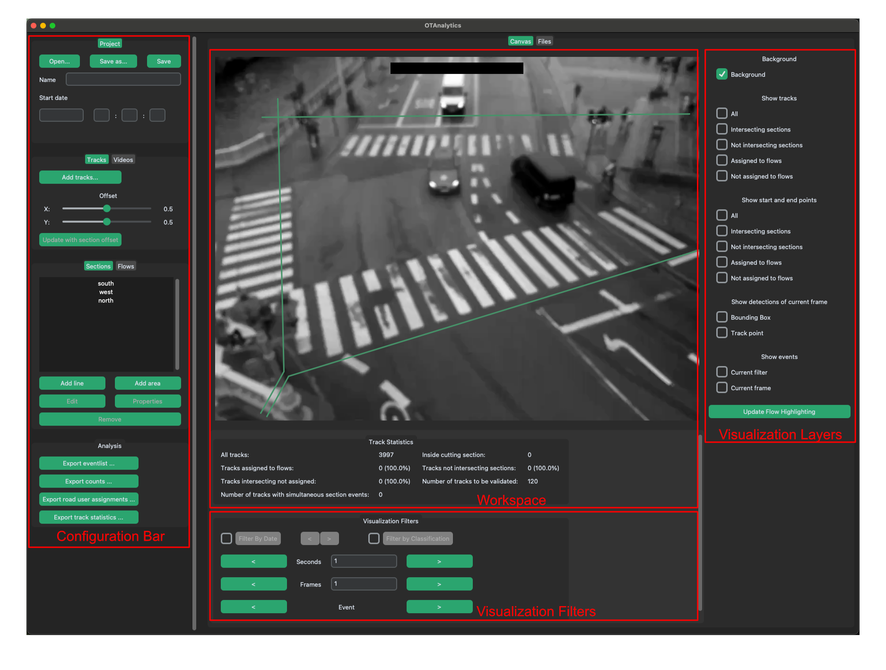

# Usage UI

## Introduction

OTConfig is a program for configuring video-based traffic analyses (e.g. counts, speed measurements) with the OpenTrafficCam pipeline (OTVision and OTAnalytics). The configuration consists of three steps:

1. Project setup
1. Definition of the traffic flows to be analyzed
1. Export of the configuration file

The results of the OpenTrafficCam pipeline are raw data on the individual traffic movements as well as count values for the individual traffic flows. Further evaluations, such as speed or time requirement analyses, are carried out in downstream processes upon customer request. The relevant information is transmitted individually and any desired aggregations of vehicle classes are agreed individually and subsequently implemented by us.

Traffic flows are defined by using detectors (sections). Each flow consists of exactly one start and one end section (from-to relationship). Sections can be defined in the form of lines with any number of support points as well as areas.

!!! info
    A separate configuration must be created for each camera view. Due to the different positions of the sections and flows, videos with different views cannot be configured at the same time.

## Why OTConfig?

If the configuration and execution of the OpenTrafficCam pipeline (processing or analysis) are not to be carried out in the same step or in the same institution, it must be ensured that the configured pipeline is also executed later as desired. For this purpose, we have developed the OTConfig tool for our customers to make the external processing of videos through our infrastructure as efficient and smooth as possible.

With OTConfig, the customer can specify all the information required for execution and preconfigure the OpenTrafficCam pipeline accordingly. This information is then saved in an otconfig file. This ensures that all relevant information is transferred to us in a structured manner and applied correctly in the OpenTrafficCam pipeline.

!!! info
    The transmitted information is validated again by trained personnel before each execution of the pipeline and, if necessary, checked for plausibility. In particular, the position of the sections is optimized to ensure the best possible result.

## User Interface

The user interface is divided into two areas. In the configuration bar, information on the project can be entered and the sections and flows can be defined. Example views from the selected video are shown in the workspace. The corresponding elements for defining the traffic flows are drawn into these.

The configuration bar is divided into three sections. In the top section Project, the metadata for the project are specified and otconfig files are saved or loaded. In the Video section, video files are loaded and removed and an overview of the loaded video files is displayed. Sections and flows are created or edited in the Sections/Flows section.
 

!!! info
    If there are several tabs (e.g. Sections, Flows) in a section, you can switch between them by clicking on them. The active tab is highlighted in green.

The first image of the currently active (or selected) video is displayed in the workspace. The sections can be drawn in this image.

## Project Setup

The project must first be named. The project name is entered in the corresponding Name field. The start time (date and time) of the first video must then be entered in the corresponding Start date fields. It is possible to enter in ISO 8601 format (YYYY-MM-DD) or German date format (DD.MM.YYYY).

!!! info
    OTConfig assumes that all selected videos are contiguous in time. If the videos to be processed have a time gap (e.g. videos from three days from 6:00 a.m. to 10:00 p.m.), several projects with chronologically contiguous videos must be created.
    
    It is recommended to choose a unique name (e.g. name of the measuring point, camera number; or a combination of several unique details).

The videos to be processed must then be selected and loaded into OTConfig. The respective videos can be added using the Add button. After clicking, the file browser opens and the videos can be selected. Several videos can be selected at the same time. The selected video is removed from the configuration using the Remove button.

!!! info
    Added videos are displayed in alphabetical order in the “Videos” overview panel and are later processed in this order. The videos should therefore be named in such a way that the chronological order matches the alphabetical order.

When a video is clicked in the overview in the configuration bar, the first image of the video is displayed as the background image. This allows you to check whether all videos have been selected correctly.

### Save to configuration file (otconfig file) 

Once all the required videos have been added and all the flows have been created, the project is saved.

1. Click on the Save as... button in the Project section of the configuration bar.
1. Select a suitable file name in the file browser and save it in the same folder as the videos. 

!!! info
    We recommend regularly saving the progress of the project while it is still being processed. This prevents possible loss of data. The Save button automatically saves the file to the last selected location. If it is colored orange, changes have been made.

## Definition of the traffic flows to be analyzed

A traffic flow depicts the directional travel relationship between two areas in the video image. The areas are defined with so-called sections. A flow always consists of two sections (a start section and an end section). In order to define flows, the sections must first be created. The flows can then be assigned to the created or edited sections.

### Sections

Sections can consist of any number of support points (shown as a circle). They are drawn directly in the background image in OTConfig. To do this, the Sections tab must first be selected in the Sections/Flows section.

!!! info
    Line sections and area sections can be created in OTConfig. If no occupancy durations (e.g. of parking areas) are detected, but only crossings, line sections should always be selected. 
    
    The following example is limited to line sections. However, the procedure described can also be applied to area sections. The only difference is that the polygon is automatically closed when the add mode is exited.

#### Add Sections

A new line section is added in the following steps:

1. Left-click on the Add line button, which starts the add mode. 
1. Set the first point by left-clicking at the correct position in the video image. The point is now fixed. Further points can be added to the section by moving the mouse and left-clicking again. A section must consist of at least two points.
1. Once the desired length and shape of a section has been reached, right-click or press the Enter key to exit Add mode.
1. Pressing the Escape key cancels Add mode without saving the previously created section.
1. A pop-up window opens. Enter the name for the section in this window and confirm. The name is reused in the analysis.

%TODO%: Infobox innerhalb der Aufzählung?
!!! failure
    A name can only be assigned once, duplicate names of several sections are not possible. We recommend using the approximate compass direction of the geographical location (e.g. north, north-east) as the name of the section.

1. The created section appears with the assigned name in the Sections subsection.
1. Repeat the process to add further sections.
 

#### Change the geometry of a section

The geometry of sections that have already been created can be changed using the following procedure:

1. First select the section to be changed in the list. 
1. Then start the change mode by left-clicking on the Edit button. The breakpoints are now visible. 
1. Support points can now be selected by left-clicking and reset as in add mode. The + button can be used to add another support point.

The selected point “sticks” to the mouse pointer until the left mouse button is pressed. The old geometry is displayed as a dashed reference.

1. Right-click to exit change mode and save the changes.
1. Pressing the Escape button exits the change mode without saving the changes to the geometry. 

#### Change the name of a section

The name of a section can be changed by clicking on the Properties button. To do this, the desired section must first be selected from the list.

#### Remove a section

A section can be removed by clicking on the Remove button. To do this, the desired section must first be selected in the list and must not be assigned to a flow.

### Flows

A flow always consists of exactly two sections: a start section and an end section. To edit flows, the Flows tab must first be selected in the Sections/Flows section.

#### Add Flows

A new flow is added in the following steps:

1. Left-click on the Add button. A pop-up window opens. The appropriate sections can be selected from the drop-down menu. 
1. The start point of the flow is defined as the First section.
1. The end point of the flow is defined as the second section.
1. The name is automatically set in the Name field after selecting the two sections. This can be changed as required. The name is reused in the analysis.

!!! info
    A name can only be assigned once, duplicate names of several flows are not possible.

    Alternatively, flows can also be generated automatically using the Generate button. Flows are then generated for all possible combinations of start and end sections. The standard naming convention is Name_Startsection --> Name_Endsection.

#### Edit Flows

To edit a flow, it must first be selected in the list. Then left-click on the Properties button to open the same pop-up window as when creating a flow. The desired changes can now be made. 

#### Remove Flows

To remove a flow, it must first be selected in the list. Left-click on the Remove button to remove the selected flow.

## Save to configuration file (otconfig file) 

: Show the points of all detections used to build up the trajectory. The point used can be configured using the offset attribute of sections.

### Show events

`Current filter`

`Current frame`

## Filter

### Filter by Time

- Filtersteuerung über vorwärts- und rückwärtsspringen

### Filter by Classification

## Analysis / Export

### Export Eventlist

### Traffic Volume

### Track Statistik