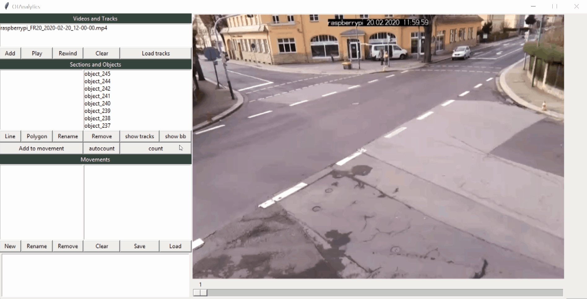

# Define Sections

OTAnalytics provides functions to define sections for analyzing traffic flows at
specific locations in your video.
Sections work as sensors which can detect road user´s crossing events
and their associated time.

## Create and Delete Sections

To create a section, click the "New" button, then click and drag your mouse over the
canvas.
Press enter to define a section name and finish the creation process.

Created sections will appear in the middle left listbox.
The selected section will be highlighted on canvas and can be deleted or renamed.

You can also save and load a section configuration.
They are saved as file type `.otflow` in `JSON` format.

!!! warning "Early prototype"

    The version of OTAnalytics described in this documentation is in early
    prototype stage. It is only tested on 64 bit Windows 10 machines.

    We are currently working on a stable release,
    which will also be tested Mac and Linux machines.
    
    Stay tuned :)
