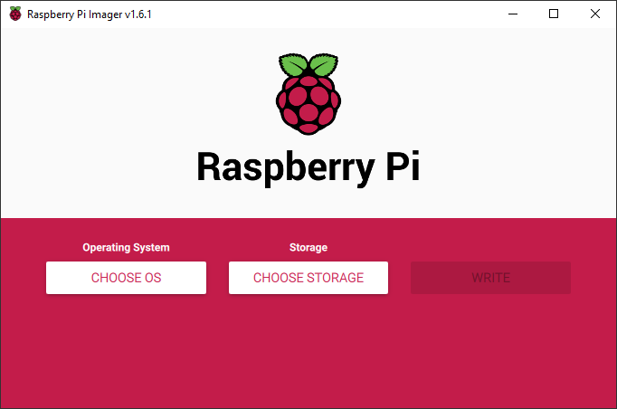
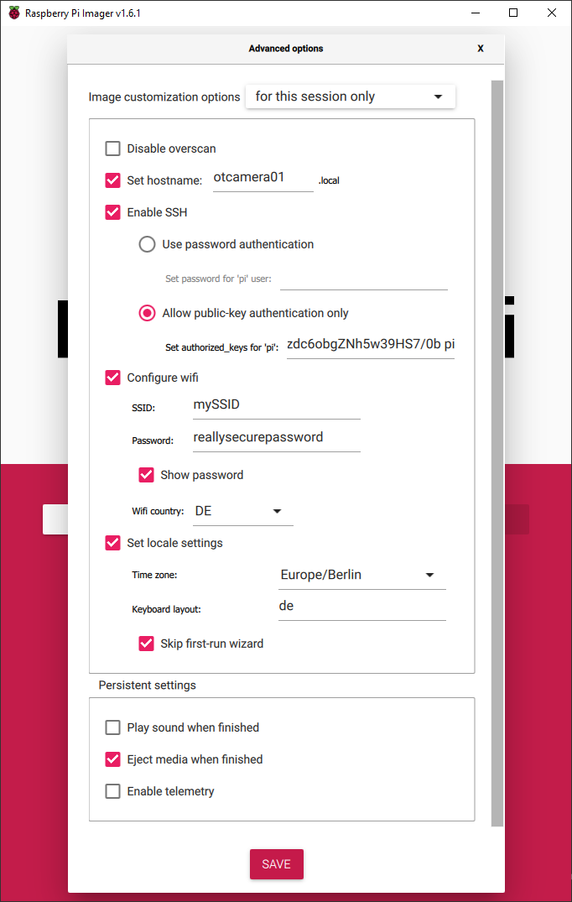
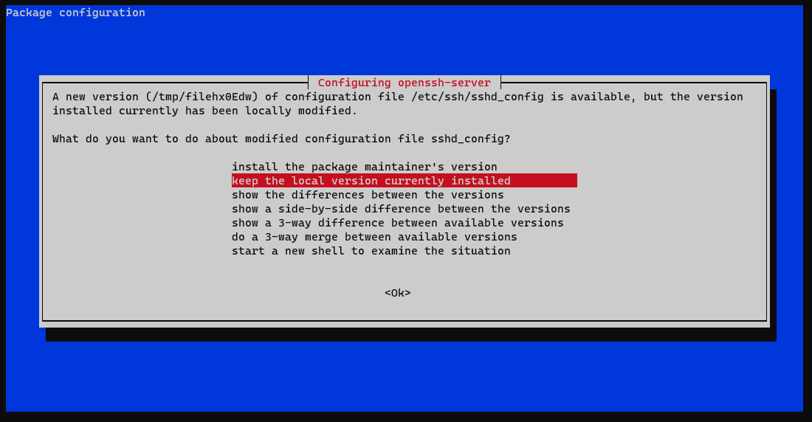

# Installation

No matter which version you want to install, you will always use a Raspberry Pi as a base.

You will need:

* Raspberry Pi 2B / 3B(+) / 4 / Zero W / Zero 2W and power supply
* We recommend a Zero W or Zero 2W because they draw substantially less power.
* Micro SD card (a High Endurance version is recommended)
* SD Card Reader
* [Raspberry Pi Imager](https://www.raspberrypi.org/software/).

!!! warning

    Even though we have completed the guide ourselves, every PC is different and Raspberry OS can change as well.
    There are steps described with which you can break your Windows, macOS or Linux on your PC.
    You should know what you are doing.
    We are not responsible for any damage that may occur.

## Prepare the SD Card

Download and install the [Raspberry Pi Imager](https://www.raspberrypi.org/software/), insert the SD-Card and start the Imager.



It's recommended to use the Raspberry Pi Imager [Advanced Options](https://www.raspberrypi.org/blog/raspberry-pi-imager-update-to-v1-6/) to do some basic setup.
Just press ++ctrl+shift+x++ on startscreen to access advanced options.
In newer Raspberry Pi Imager versions you just need to press the gear symbol.

Setup a hostname, enable SSH, either password based or using public-key authentication (recommended!),
configure your Wifi credentials and choose the correct locale for Wifi, timezone and keyboard layout.
You can also skip the first-run wizard.

If you set the default username to anything different than "pi" (which is recommended) you'll need to replace "pi" in the following documentation with your username.
For example: instead of connecting to `ssh pi@hostname` you'll need `ssh username@hostname`.

??? help "How to generate a public key"

    Generate SSH-Keys for password-less connection. On your desktop computer open a command line terminal (CMD or Powershell on Windows or a bash on Linux) and run

    ```powershell
    ssh-keygen
    ```

    to generate a public private key combination. Add the private key to your ssh-agent
    (you may need to [update OpenSSH on Windows](https://superuser.com/questions/1395962/is-it-possible-to-update-the-built-in-openssh-client-in-windows-10/1555453#1555453)).
    
    <!-- TODO #26 add information where to put the ssh private key -->



Now insert the SD card into your PC. Select Raspberry Pi OS Lite (32-bit) as operating system under "Raspberry Pi (Other)". Then select the SD card on which the operating system will be installed.

!!! warning

    It is possible to select not only the SD card, but also the hard drive or SSD where your operating system or other PC data is stored. Make sure that you really select the right SD card. Most of the time, you can tell by the size.

Press the Write button and wait until the Raspberry Pi Imager has completely written and verified your SD card.

!!! tip
    Sometimes the verification may fail. Try another USB port on your PC or another card reader. If this does not help, maybe the SD card is broken.

??? help "Setup without Raspberry Pi Imager"

    1. Add an empty file named `ssh` to the boot partition to [enable ssh on first boot](https://www.raspberrypi.org/documentation/remote-access/ssh/README.md).

    2. Add your Wifi credentials as described in the [Raspberry Pi Documentation](https://www.raspberrypi.org/documentation/configuration/wireless/headless.md)

    3. Connect to the pi using ssh (`ssh pi@raspberry`)to the Pi using password authentication.

        Create and edit the needed `authorized_keys` file.

        ```bash
        mkdir -p ~/.ssh
        nano ~/.ssh/authorized_keys
        ```

        Copy your public key on the host and paste it on the pi, save&close using Ctrl+X - Enter - Y.

## Setup the Raspberry

Now, take the SD-Card and insert it in the Raspberry.
You can now boot the Pi on LAN or within your Wifi by connecting it to the power supply.
Try to connect to the Pi using a command line or PowerShell:

```powershell
ssh pi@otcamera01
```

If everything is setup correctly, you will be asked to add the host key to the list of known hosts (answer: yes) and you should be connected to your Raspberry Pi.

??? help "warning: agent returned different signature type ssh-rsa (expected rsa-sha2-512)"

    If you are on Windows you may need to update OpenSSH if you ar getting this error:

    ```powershell
    warning: agent returned different signature type ssh-rsa (expected rsa-sha2-512)
    ```

    !!! warning
        This guide should run on Windows 10 but you are modifying your system files.
        Please do not do anything you do not understand! Read the [source](https://superuser.com/a/1609071) for more information.
        We are not liable for any damage you may cause to your system. But we followed the steps ourselves and everything went well.

    1. Download the latest OpenSSH for Windows release [here](https://github.com/PowerShell/Win32-OpenSSH/releases). Depending on your Windows version it is probably `OpenSSH-Win64.zip`.

    2. Open Windows Explorer and navigate to your Download folder. You should see the `OpenSSH-Win64.zip`. Open an elevated PowerShell via File &rightarrow; Open Windows PowerShell &rightarrow; Open Windows PowerShell as administrator.

    3. If you copy and paste the following code, you will unzip OpenSSH and overwrite the system's default OpenSSH version.

        ```powershell
        # Overwrite windows installed bins
        $openSshBins = (Get-ChildItem 'C:\WINDOWS\System32\OpenSSH\').Name
        Expand-Archive -Path .\OpenSSH-Win64.zip -DestinationPath .
        takeown.exe /a /r /f C:\Windows\System32\OpenSSH\
        icacls.exe 'C:\Windows\System32\OpenSSH' /grant 'BUILTIN\Administrators:(OI)(CI)F'
        icacls.exe 'C:\Windows\System32\OpenSSH' /grant 'BUILTIN\Administrators:F' /t
        Stop-Service ssh-agent
        $openSshBins | %{ Copy-Item -Path .\OpenSSH-Win64\$_ -Destination C:\Windows\System32\OpenSSH\ }
        Start-Service ssh-agent
        ```

    <!-- TODO: #24 Add how to activate ssh agent -->


If you have successfully logged in now, we can configure the Raspberry Pi for the OpenTrafficCam.

Update the pi by running apt and reboot.

```bash
sudo apt update && sudo apt upgrade -y && sudo reboot
```

??? help "A new version of configuration file is available"

    

    If you get this message, don't worry.
    Keep the local version currently installed, since we changed the ssh server configuration using the RPi Imager.

Reconnect to your pi (open PowerShell and run `ssh pi@otcamera01`) and run the raspberry configuration tool.

```bash
sudo raspi-config
```

Change the following settings to appropriate values:

* System Options &rightarrow; Password (if not already done with Raspi Imager choose a new password for security reasons)
* Interface Options &rightarrow; I1 Legacy Camera &rightarrow; yes (since the new camera api is not supported by picamerax)
* Advanced options &rightarrow; GL driver &rightarrow; G1 Legacy (This may take a while, but saves a lot of energy.)

??? help "Setup without Raspberry Pi Imager"

    If you did not use the Raspberry Pi Imager, you will need to setup a few more things.

    * System Options
        * Hostname
    * Localization Options
        * Timezone (Europe/Berlin)
        * WLAN Country (DE)

Exit the raspi-config selecting "Finish" and reboot the Pi afterwards.

After a reboot we also want to disable the HDMI output for additional power saving. [CNX Software](https://www.cnx-software.com/2021/12/09/raspberry-pi-zero-2-w-power-consumption/) made some great power measurements for some Raspberry Pis. We'll need to add a specific line to the file `/etc/rc.local` in order to deactivate HDMI on every boot.

```bash
sudo nano /etc/rc.local
```

This opens the texteditor nano. We need to insert `/usr/bin/tvservice -o` in this file as highlighted below.
Additionally we'll insert `sbin/iw dev wlan0 set power_save off` to disable automatic wifi power saving since we'll deactivate it anyways as soon as we don't need wifi.

```sh hl_lines="20-21" linenums="1" title="/etc/rc.local"
#!/bin/sh -e
#
# rc.local
#
# This script is executed at the end of each multiuser runlevel.
# Make sure that the script will "exit 0" on success or any other
# value on error.
#
# In order to enable or disable this script just change the execution
# bits.
#
# By default this script does nothing.

# Print the IP address
_IP=$(hostname -I) || true
if [ "$_IP" ]; then
  printf "My IP address is %s\n" "$_IP"
fi

/usr/bin/tvservice -o
/sbin/iw dev wlan0 set power_save off

exit 0
```

Press ++ctrl+x++ and ++y++ and ++enter++ to save the file and exit nano.

Additionally we will disable bluetooth and the camera and onboard LED's.
Edit `/boot/config.txt`to do so.

```sh
sudo nano /boot/config.txt
```

The config is quite long. We will add some lines (highlighted) at the end of the file:

```txt hl_lines="15-19" linenums="1" title="/boot/config.txt (end of file)"
...
# (e.g. for USB device mode) or if USB support is not required.
otg_mode=1

[all]

[pi4]
dtoverlay=vc4-fkms-v3d
# Run as fast as firmware / board allows
arm_boost=1

[all]
gpu_mem=128

# OTCamera
dtoverlay=disable-bt
disable_camera_led=1
dtparam=act_led_trigger=none
dtparam=act_led_activelow=on
```

Rebooting the Pi activates the new settings.

```sh
sudo reboot
```

## Setup Python and Dependencies

By default, Raspberry OS light doesn't come with PIP and git installed. We will need it to install required packages.

```bash
sudo apt install python3-pip git -y
```

??? help "If you are using RaspberryPi OS legacy"

    Since the latest RaspberryPi OS python3 is the default python version.
    If you are using (not recommended) an older version of RaspberryPi OS, you need to make python3 your default version.

    Raspberry OS legacy ships with python 2 and python 3. By default python 2 is used. We want to change that to python 3 by adding two single lines to ```.bashrc```.

    ```bash
    echo "alias python='/usr/bin/python3'" >> ~/.bashrc
    echo "alias pip=pip3" >> ~/.bashrc

    source ~/.bashrc

    python --version
    pip --version
    ```

    Both commands should state, that they are (using) python 3.(x).

!!! note
    We are planning to offer a ready-to-use image for the Raspberry Pi, which can be easily installed.
    The setup will then be much easier.
    Stay tuned :)

## Clone and Install OTCamera

We'll need to download OTCamera using git to get all the code we'll need to run OTCamera.

```bash
git clone --depth 1 https://github.com/OpenTrafficCam/OTCamera.git

```

OTCamera requires additional python packages, which need to be installed.

```bash
cd OTCamera
pip install -r requirements.txt --upgrade
```

## Setup Webserver for Preview

We are currently using nginx (a small webserver) to serve a small html file including a preview of the camera view.

To install nginx:

```bash
sudo apt install nginx -y
```

We need to configure nginx to serve the OTCamera GUI.
Open the nginx config file `/etc/nginx/sites-available/default` and edit the webserver root.

```bash
sudo nano /etc/nginx/sites-available/default
```

You should see something like this (there may be some comment lines starting with # which you can ignore).

```py title="/etc/nginx/sites-available/default" linenums="1" hl_lines="5"
server {
        listen 80 default_server;
        listen [::]:80 default_server;

        root /var/www/html;

        index index.html index.htm index.nginx-debian.html;

        server_name _;

        location / {
                try_files $uri $uri/ =404;
        }

}

```

The important line we need to change is highlighted.
Replace `/var/www/html` with the full path to the `OTCamera/gui/webfiles` folder.
If your username is `pi` it should be `/home/pi/OTCamera/webfiles`.

Restart nginx afterwards to let it know about the new directory:

```sh
sudo systemctl restart nginx.service
```

## Setup Wifi Accesspoint

In order to access the OTCamera Raspberry Pi in field, we will let the Raspberry create it's own wifi.
First, we'll need to install some packages:

```sh
sudo apt install hostapd dnsmasq dhcpcd -y
```

Now we'll need to configure all three of the newly installed packages.
Let's start with hostap.

```sh
sudo nano /etc/default/hostapd
```

We need to modify line 13 to specify a valid `hostapd.conf`. To do so, insert `"/etc/hostapd/hostapd.conf"` right after `DAEMON_CONF=` in line 13:

```sh hl_lines="13" linenums="1" title="/etc/default/hostapd"
# Defaults for hostapd initscript
#
# WARNING: The DAEMON_CONF setting has been deprecated and will be removed
#          in future package releases.
#
# See /usr/share/doc/hostapd/README.Debian for information about alternative
# methods of managing hostapd.
#
# Uncomment and set DAEMON_CONF to the absolute path of a hostapd configuration
# file and hostapd will be started during system boot. An example configuration
# file can be found at /usr/share/doc/hostapd/examples/hostapd.conf.gz
#
DAEMON_CONF="/etc/hostapd/hostapd.conf"

# Additional daemon options to be appended to hostapd command:-
#       -d   show more debug messages (-dd for even more)
#       -K   include key data in debug messages
#       -t   include timestamps in some debug messages
#
# Note that -B (daemon mode) and -P (pidfile) options are automatically
# configured by the init.d script and must not be added to DAEMON_OPTS.
#
#DAEMON_OPTS=""
```

Now let's edit this hostapd.conf file to configure our access point:

```conf linenums="1" title="/etc/hostapd/hostapd.conf"
channel=11
ssid=MyOTCameraWifiNetwork
wpa_passphrase=reallysafepassword
interface=uap0
hw_mode=g
macaddr_acl=0
auth_algs=1
wpa=2
wpa_key_mgmt=WPA-PSK
wpa_pairwise=TKIP
rsn_pairwise=CCMP
country_code=DE
```

If you are planning to connect OTCamera to your own wifi
(e.g. to transfer files in office or to get internet access to update etc.)
you must use the same wifi channel as your office wifi network
(since the Raspberry has just one antanna).
You should edit your office wifi to always use the same channel to avoid automatic channel selection.

The name of the wifi is specified just after `ssid=` and the password in line 3.

Depending on where you will use OTCamera you should set the according [contry code](https://en.wikipedia.org/wiki/ISO_3166-1#Current_codes) in the last line (for us it's Germany --> DE).

Save and exit the file.

If you will connect to the OTCamera's wifi your device will need a valid ip address.
dhcpcd and dnsmasq will help us doing by adding some lines (12-14) to the end of `/etc/dhcpcd.conf`:

```sh hl_lines="12-14" linenums="1" title="/etc/dhcpcd.conf"
...
# It is possible to fall back to a static IP if DHCP fails:
# define static profile
#profile static_eth0
#static ip_address=192.168.1.23/24
#static routers=192.168.1.1
#static domain_name_servers=192.168.1.1

# fallback to static profile on eth0
#interface eth0
#fallback static_eth0
interface uap0
        static ip_address=10.10.50.1/24
        nohook wpa_supplicant
```

If your office wifi uses the same address range you should use another one by, for example, using 51 instead of 50. But you need to remember that address to connect to your OTCamera later on.

Finally, let's configure dnsmasq's config (`/etc/dnsmasq.conf`).
It's a quite long file with a lot of explaining comments.
We will backup this template and afterwards create a new, empty config:

```sh
sudo mv /etc/dnsmasq.conf /etc/dnsmasq.conf.backup
sudo nano /etc/dnsmasq.conf
```

Now add the necessary config:

```txt linenums="1" title="/etc/dnsmasq.conf"
interface=lo,uap0
no-dhcp-interface=lo,wlan0
bind-interfaces
server=10.10.50.1
domain-needed
bogus-priv
dhcp-range=10.10.50.10,10.10.50.250,2h
```

If you chose a different ip address range in `/etc/dhcpcd.conf` you'll need to adjust ip addresses here as well.

Puh, this was quite a lot configuration edit stuff... But we are almost ready :)

We don't want the services to start uncoordinated at bootup.
So let's unmask hostapd first and then disable all three services to not start up at boot:

```sh
systemctl unmask hostapd.service
systemctl disable hostapd.service
systemctl disable dhcpcd.service
systemctl disable dnsmasq.service
```

We'll use a script instead to start up services.
Make sure you are still inside the OTCamera directory.

```sh
sudo cp ./raspi-files/usr/local/bin/wifistart /usr/local/bin/wifistart
```

Last but not least, let's and this script to `/etc/rc.local` to start at boot.

```sh hl_lines="23" linenums="1" title="/etc/rc.local"
#!/bin/sh -e
#
# rc.local
#
# This script is executed at the end of each multiuser runlevel.
# Make sure that the script will "exit 0" on success or any other
# value on error.
#
# In order to enable or disable this script just change the execution
# bits.
#
# By default this script does nothing.

# Print the IP address
_IP=$(hostname -I) || true
if [ "$_IP" ]; then
  printf "My IP address is %s\n" "$_IP"
fi

/usr/bin/tvservice -o
/sbin/iw dev wlan0 set power_save off

/bin/bash /usr/local/bin/wifistart"

exit 0
```

Yeah, we're done! If you carfully followed this steps and we maintained this manual (...) the Raspberry should still connect to your wifi and will also create it's own wifi. It could take a minute or two, so don't worry to early. Let's try:

```sh
sudo reboot
```

All good? We hope so!

## Start OTCamera on startup

Now we want to start OTCamera every time the Raspberry starts.
To do so, we will setup and enable a service.
Edit `otcamera.service` inside the OTCamera repository according to your username and path.

```sh hl_lines="5-6" linenums="1" title="./raspi-files/otcamera.service"
[Unit]
Description=This service starts OTCamera and keeps it running

[Service]
User=pi
WorkingDirectory=/home/pi/OTCamera
Restart=always
RestartSec=3
ExecStart=/usr/bin/python3 run.py


[Install]
WantedBy=multi-user.target
```

Now copy the file to `/lib/systemd/system` and enable it:

```sh
sudo cp ./raspi-files/otcamera.service /lib/systemd/system
sudo systemctl daemon-reload
systemctl enable otcamera.service
```

After rebooting the Raspberry you should be able to access it's wifi ap and to open the OTCamera status website using the Raspberry's ip address: <http://10.10.50.1>
