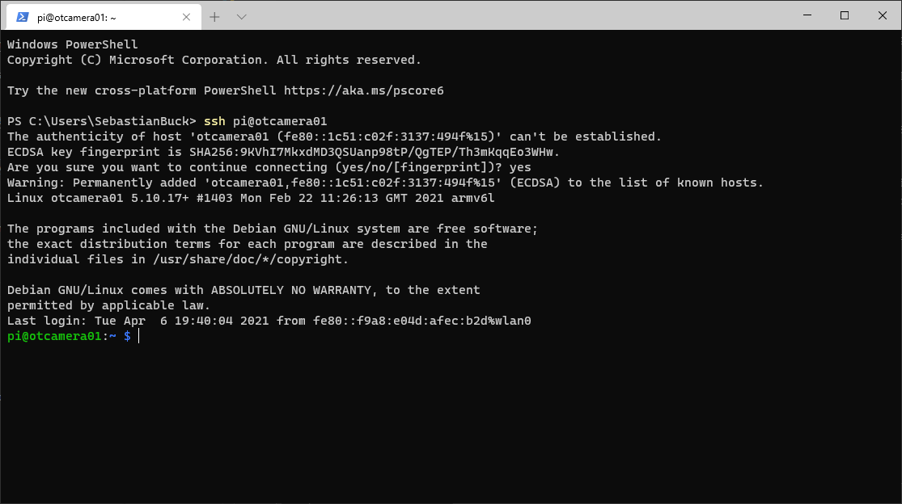

# Setup the Raspberry

Now, take the SD-Card and insert it in the Raspberry.
You can now boot the Pi on LAN or within your Wi-Fi by connecting it to the power supply.
Try to connect to the Pi using a command-line or PowerShell:

```powershell
ssh pi@otcamera01
```

If everything is setup correctly, you will be asked to add the host key to the list of known hosts (answer: yes) and you should be connected to your Raspberry Pi.

??? help "warning: agent returned different signature type ssh-rsa (expected rsa-sha2-512)"

    If you are on Windows you may need to update OpenSSH if you ar getting this error:

    ```powershell
    warning: agent returned different signature type ssh-rsa (expected rsa-sha2-512)
    ```

    !!! warning

        This guide should run on Windows 10 but you are modifying your system files.
        Please do not do anything you do not understand! Read the [source](https://superuser.com/a/1609071) for more information.
        We are not liable for any damage you may cause to your system. But we followed the steps ourselves and everything went well.

    1. Download the latest OpenSSH for Windows release [here](https://github.com/PowerShell/Win32-OpenSSH/releases). Depending on your Windows version it is probably `OpenSSH-Win64.zip`.

    2. Open Windows Explorer and navigate to your Download folder. You should see the `OpenSSH-Win64.zip`. Open an elevated PowerShell via File &rightarrow; Open Windows PowerShell &rightarrow; Open Windows PowerShell as administrator.

    3. If you copy and paste the following code, you will unzip OpenSSH and overwrite the system's default OpenSSH version.

        ```powershell
        # Overwrite windows installed bins
        $openSshBins = (Get-ChildItem 'C:\WINDOWS\System32\OpenSSH\').Name
        Expand-Archive -Path .\OpenSSH-Win64.zip -DestinationPath .
        takeown.exe /a /r /f C:\Windows\System32\OpenSSH\
        icacls.exe 'C:\Windows\System32\OpenSSH' /grant 'BUILTIN\Administrators:(OI)(CI)F'
        icacls.exe 'C:\Windows\System32\OpenSSH' /grant 'BUILTIN\Administrators:F' /t
        Stop-Service ssh-agent
        $openSshBins | %{ Copy-Item -Path .\OpenSSH-Win64\$_ -Destination C:\Windows\System32\OpenSSH\ }
        Start-Service ssh-agent
        ```

    <!-- TODO: #24 Add how to activate ssh agent -->



If you have successfully logged in now, we can configure the Raspberry Pi for OTCamera.

## Update

Update the pi by running apt and reboot.

```bash
sudo apt update && sudo apt upgrade -y && sudo reboot
```

??? help "A new version of configuration file is available"

    

    If you get this message, don't worry.
    Keep the local version currently installed, since we changed the ssh server configuration using the RPi Imager.

## Raspi Config

Reconnect to your pi (open PowerShell and run `ssh pi@otcamera01`) and run the raspberry configuration tool.

```bash
sudo raspi-config
```

Change the following settings to appropriate values:

* System Options &rightarrow; Password (if not already done with Raspi Imager choose a new password for security reasons)
* Interface Options &rightarrow; I1 Legacy Camera &rightarrow; yes (since the new camera API is not supported by picamerax)
* Advanced options &rightarrow; GL driver &rightarrow; G1 Legacy (This may take a while, but saves a lot of energy.)

??? help "Setup without Raspberry Pi Imager"

    If you did not use the Raspberry Pi Imager, you will need to setup a few more things.

    * System Options
        * Hostname
    * Localization Options
        * Timezone (Europe/Berlin)
        * WLAN Country (DE)

Exit the raspi-config selecting "Finish" and reboot the Pi afterwards.

## Power Saving Options

After a reboot we also want to disable the HDMI output for additional power saving. [CNX Software](https://www.cnx-software.com/2021/12/09/raspberry-pi-zero-2-w-power-consumption/) made some great power
measurements for some Raspberry Pis.
We'll need to add a specific line to the file `/etc/rc.local` in order to deactivate HDMI on every boot.

```bash
sudo nano /etc/rc.local
```

This opens the texteditor nano. We need to insert `/usr/bin/tvservice -o` in this file as highlighted below.
Additionally we'll insert `sbin/iw dev wlan0 set power_save off` to disable automatic Wi-Fi power saving since we'll deactivate it anyways as soon as we don't need Wi-Fi.

```sh hl_lines="20-21" linenums="1" title="/etc/rc.local"
#!/bin/sh -e
#
# rc.local
#
# This script is executed at the end of each multiuser runlevel.
# Make sure that the script will "exit 0" on success or any other
# value on error.
#
# In order to enable or disable this script just change the execution
# bits.
#
# By default this script does nothing.

# Print the IP address
_IP=$(hostname -I) || true
if [ "$_IP" ]; then
  printf "My IP address is %s\n" "$_IP"
fi

/usr/bin/tvservice -o
/sbin/iw dev wlan0 set power_save off

exit 0
```

Press ++ctrl+x++ and ++y++ and ++enter++ to save the file and exit nano.

Additionally we will disable bluetooth and the camera and onboard LED's.
Edit `/boot/config.txt`to do so.

```sh
sudo nano /boot/config.txt
```

The config is quite long. We will add some lines (highlighted) at the end of the file:

```txt hl_lines="15-27" linenums="1" title="/boot/config.txt (end of file)"
...
# (e.g. for USB device mode) or if USB support is not required.
otg_mode=1

[all]

[pi4]
dtoverlay=vc4-fkms-v3d
# Run as fast as firmware / board allows
arm_boost=1

[all]
gpu_mem=128

# OTCamera
dtoverlay=disable-bt
disable_camera_led=1
dtparam=act_led_trigger=none
dtparam=act_led_activelow=on
dtparam=audio=off
display_auto_detect=0
gpio=6,16,18,19=ip
gpio=16,18,19=pu
gpio=6=pd
gpio=5,12,13=op
gpio=5,12=dl
gpio=13=dh
```

Lines 22 to 27 define the default state of the GPIO pins.
If you are using the OTCamera PCB, you want to add those lines.
If you are not using it, you may want to adjust settings to your specific setup.

Rebooting the Pi activates the new settings.

```sh
sudo reboot
```
