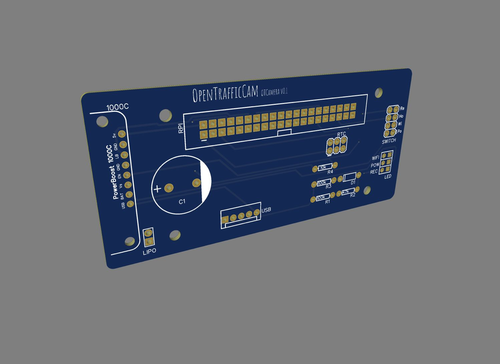

# Requirements

You will need some special hardware to build your own OTCamera to record videos.

OTCamera is based on a Raspberry Pi Zero W and the official Rapberry Pi Camera Module V2.

A specially designed PCB (printed circuit board) is needed to connect all additional parts to the Raspberry Pi.
The single parts for the PCB as well as basic soldering skills are required to assemble a OTCamera.

As case a common waterproof explorer case is used in addition to a 3d printed inlay which carries all OTCamera parts.

To power everthing up, its best to use an external USB-battery

All in all you need:

- Raspberry Pi Zero W
- Raspbrry Pi Camera Module V2
- Ribbon cable to connect Camera to Raspberry
- micro SD card
- [OTCamera PCB](https://aisler.net/querplaner/opentrafficcam/otcamera-v0-1)
- [Adafruit PowerBoost 1000C](https://www.adafruit.com/product/2465)
- 1x8 header female and male
- 1x5 header female
- two 2x3 male header
- 2x4 male header
- 40 Pin GPIO female header
- 2x1 male header
- 7.5 mm 4700 µF capacitor
- two 100 kΩ resitors
- 10 kΩ resistor
- 47 kΩ resistor
- Si-diode
- 1 cell LiPo battery
- four switches (3d print is optimized for Marquardt 1801)
- three LEDs (for example Barthelme 6V DC, 9.5mm)
- some cables and cable shoes

To assemble everything, you will need a drill, a soldering iron and some basics tools as well.

