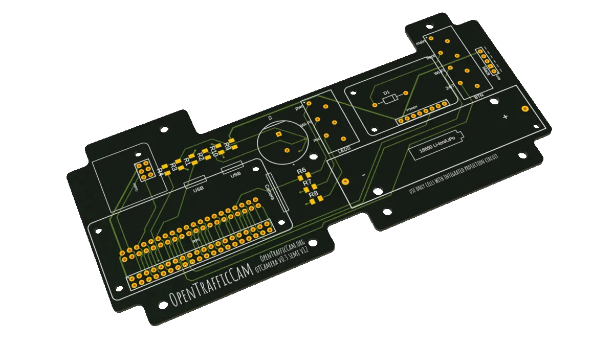

# Requirements

You will need some special hardware to build your own OTCamera to record videos.

OTCamera is based on a Raspberry Pi Zero W and the official Rapberry Pi Camera Module V2 (we are considering V3 modules as soon as picamera2 is stable).

A specially designed PCB (printed circuit board) is needed to connect all additional parts to the Raspberry Pi.
The single parts for the PCB as well as basic soldering skills are required to assemble a OTCamera.

As case a common waterproof explorer case is used in addition to a 3D printed inlay which carries all OTCamera parts.

To power everthing up, its best to use an external USB-battery.

All in all you need:

- Raspberry Pi Zero W
- Raspberry Pi Camera Module V2
- Ribbon cable to connect Camera to Raspberry
- Micro SD card
- Explorer Cases 2209 (or another waterproof case)
- OTCamera PCB (+ components) (released soon)
- OTCamera 3D printed parts (released soon)
- [Adafruit PowerBoost 1000C](https://www.adafruit.com/product/2465)
- [Adafruit PiRTC - Precise DS3231 Real Time Clock](https://www.adafruit.com/product/4282)
- 1 cell LiPo battery
- Four switches
- Three LEDs (for example Barthelme 6V DC, 9.5mm)
- Some cables and cable shoes

To assemble everything, you will need a drill, a soldering iron and some basics tools as well.
