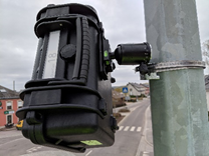

# Features

> The **eye** of OpenTrafficCam.

[**OTCamera**](https://github.com/OpenTrafficCam/OTCamera) is a mobile camera system for capturing traffic videos.

It is not for sale, but for DIY.
You don't want to build the camera yourself and preferably don't want to have anything to do with the measurement?
Well, just [write us](mailto:team@opentrafficcam.org).

<!-- TODO: #54 Higher resolution image -->

## Key features

* Based on Raspberry Pi Zero W
* Waterproof case
* Operation with buttons and/or smartphone
* Continuous recording for about one week
* Privacy compliant recording
* Under 400 € per camera system

## Content of this documentation

* List of [hardware components](https://opentrafficcam.org/OTCamera/Components/hardware/) (and where to purchase them)
* Software needed for [video capturing](https://opentrafficcam.org/OTCamera/Components/capture/) and [camera calibration](https://opentrafficcam.org/OTCamera/Howto/calibrate/)
* Instructions for [assembling the hardware](https://opentrafficcam.org/OTCamera/Howto/assemble/) and [installing the software](https://opentrafficcam.org/OTCamera/Howto/install/)
* Recommendations for [mounting, alignment](https://opentrafficcam.org/OTCamera/Howto/mount_camera/) and [settings of the camera](https://opentrafficcam.org/OTCamera/Howto/settings/)

<!-- TODO #55 reduce number of prototypes -->

We are providing this information for three different prototypes.

The [Development Version](install/development.md) is intended to actively participate in the development of OTCamera.
It is also recommended to set up a development version to adapt the software and hardware to your own requirements.
In addition, getting started with this prototype is very easy and can easily be done directly at your desk without the need for additional hardware.

The [Soft Version](install/soft.md) is designed for use in the real, hard world.
Most functions can be controlled via the web interface and it does not require any soldering skills.
All parts can be purchased from various dealers and are then easily plugged together.

For the [Hard Version](install/hard.md) you need the ability to solder (simple) components to a blank circuit board.
For this you get the most buttons (yay buttons) and the easiest operation in the field.
Also, the power consumption is the lowest (and the battery life the longest) and you can fully customize the hardware to your own needs.
