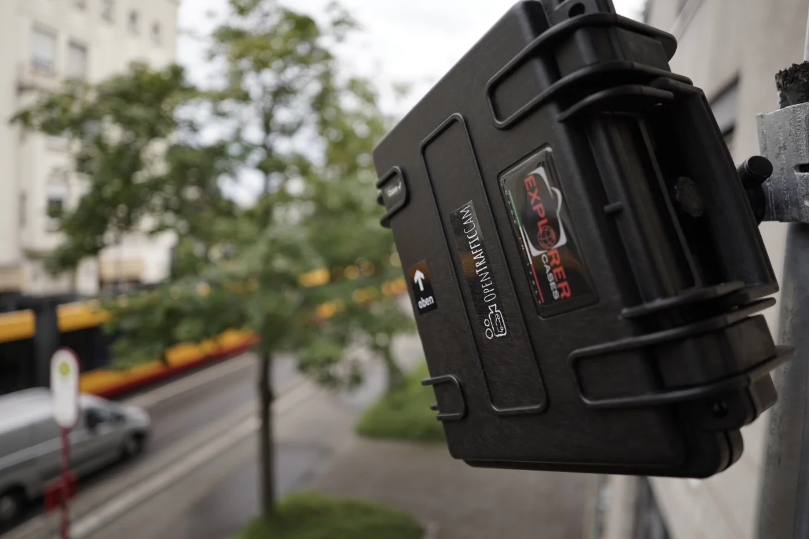

# Features

> The **eye** of OpenTrafficCam.

!!! warning "Major revision in progress"

    We are currently developing a completely new PCB featuring a more robust power supply, GPS, LTE connectivity
    and intrusion detection. The software is also being refactored to support the new PCB and modules.

    The current documentation is based on the **legacy** Raspberry Pi Zero W, Raspberry Pi OS and camera stack.
    We are moving to the **Raspberry Pi Zero 2W**, **Raspberry Pi OS Trixie** and the **new camera stack**.

[OTCamera](https://github.com/OpenTrafficCam/OTCamera) is a mobile camera system for capturing traffic videos.

It is intended for DIY enthusiasts.
You don't want to build OTCamera yourself or are looking for someone to conduct the entire traffic survey for you?
Just [drop us a message](mailto:team@opentrafficcam.org).

## Key features

- Based on Raspberry Pi Zero W
- Waterproof case
- Operation with buttons and/or web ui
- Continuous recording for up to one week (depending on the external battery)
- Privacy compliant recording
- Low hardware costs per camera system (DIY)
