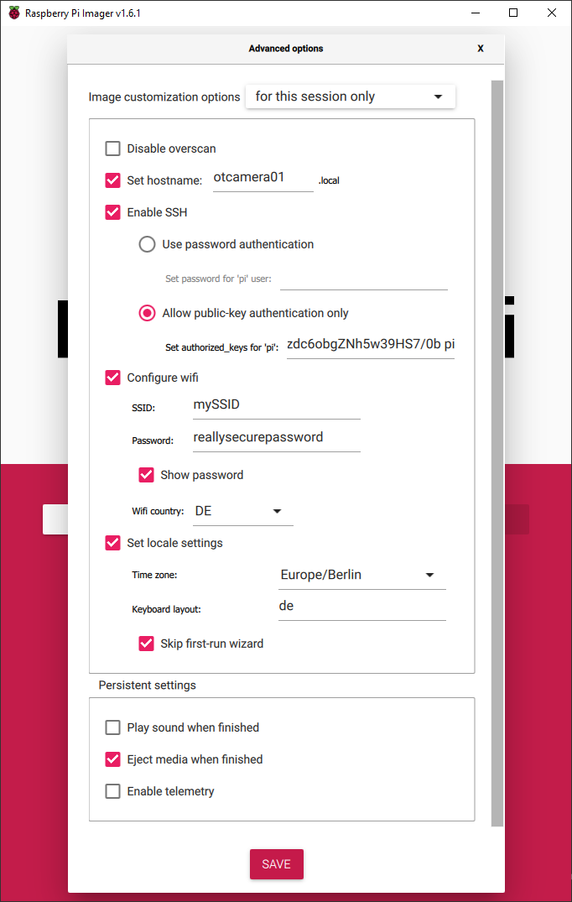
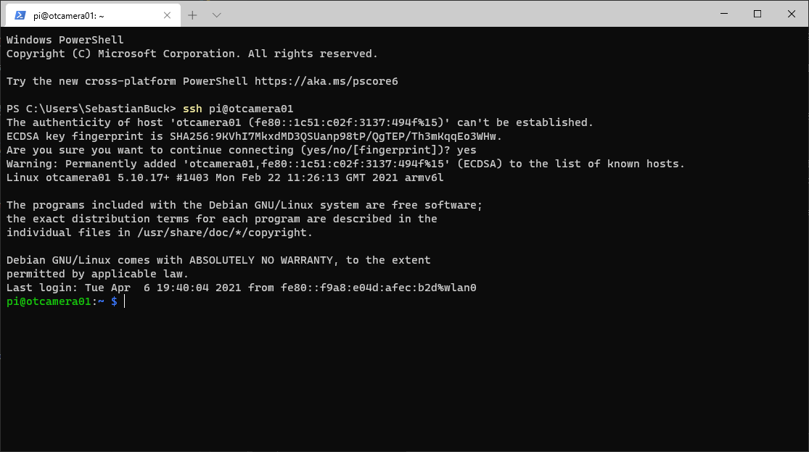

# Development Version

The Raspberry Pi Zero is wonderful to use outside (it consumes little power, is cheap, ...).
But the development of OTCamera is more fun on a big Pi. Everything is much faster.

You will need

* Raspberry Pi 2B/3B(+)/4 (the 2 GB works well)
* Camera module (no USB webcam)
* Micro SD card
* SD Card Reader
* [Raspberry Pi Imager](https://www.raspberrypi.org/software/).

Download and install the [Raspberry Pi Imager](https://www.raspberrypi.org/software/), insert the SD-Card and start the Imager.


It's recommended to use the Raspberry Pi Imager [Advanced Options](https://www.raspberrypi.org/blog/raspberry-pi-imager-update-to-v1-6/) to do some basic setup.
Just press ++ctrl+shift+x++ on startscreen to access advanced options.

Setup a hostname, enable SSH, either password based or using public-key authentication (recommended!), configure your Wifi credentials and choose the correct locale for Wifi, timezone and keyboard layout. You can also skip the first-run wizard.

??? info "How to generate a public key"

    Generate SSH-Keys for password-less connection. On your desktop computer open a command line terminal (CMD or Powershell on Windows or a bash on Linux) and run

    ```bash
    ssh-keygen
    ```

    to generate a public private key combination. Add the private key to your ssh-agent (you may need to [update OpenSSH on Windows](https://superuser.com/questions/1395962/is-it-possible-to-update-the-built-in-openssh-client-in-windows-10/1555453#1555453)).

    You should now be able to connect to the Pi without password.



??? info "Setup without Raspberry Pi Imager"
    1. Add an empty file named ```ssh``` to the boot partition to [enable ssh on first boot](https://www.raspberrypi.org/documentation/remote-access/ssh/README.md).

    1. Add your Wifi credentials as described in the [Raspberry Pi Documentation](https://www.raspberrypi.org/documentation/configuration/wireless/headless.md)

    1. Connect to the pi using ssh (```ssh pi@raspberry```)to the Pi using password authentication.

        Create and edit the needed ```authorized_keys``` file.

        ```bash
        mkdir -p ~/.ssh
        nano ~/.ssh/authorized_keys
        ```

        Copy your public key on the host and paste it on the pi, save&close using Ctrl+X - Enter - Y.

You can now boot the Pi on LAN or within your Wifi.
Try to connect to the Pi using a command line:

```bash
ssh pi@otcamera01
```

If everything is setup correctly, you should be connected to your Raspberry Pi.



## Setup the Raspberry

Update the pi by running apt and reboot.

    ```bash
    sudo apt update && sudo apt upgrade -y
    sudo reboot
    ```

Reconnect to your pi and run the raspberry configuration tool.

    ```bash
    sudo raspi-config
    ```

Change the following settings to appropriate values:

* System Options &rightarrow; Password
* Interface Options &rightarrow; Camera &rightarrow; enable

??? info "Setup without Raspberry Pi Imager"
    If you did not use the Raspberry Pi Imager, you will need to setup a few more things.

    * System Options
        * Hostname
    * Interface Options
        * Camera (enable)
    * Localization Options
        * Timezone (Europe/Berlin)
        * WLAN Country (DE)

Reboot the Pi afterwards.

## Setup VS Code Remote Development Extension

Install the [Remote-SSH](https://marketplace.visualstudio.com/items?itemName=ms-vscode-remote.vscode-remote-extensionpack) extension on your desktop using the marketplace.

Add the Pi as [remote host](https://code.visualstudio.com/docs/remote/ssh#_connect-to-a-remote-host).
Connect to the Pi using the Remote-SSH extension (rightclick on the ne host - "Connect to Host in New Window"). When asked for the operating system of the host, choose "Linux". VS code will download and install the necessary dependencies on the Pi.

Open the extension manager in the new windows an install all nessacery extensions.

## Setup Git and GitHub

Install git using apt.

    ```bash
    sudo apt install git
    ```

To setup your git commit name and email, login to your github account and copy your [private commit email](https://docs.github.com/en/free-pro-team@latest/github/setting-up-and-managing-your-github-user-account/setting-your-commit-email-address).

On the pi run

    ```bash
    git config --global user.name "Your Name"
    git config --global user.email "123456+username@users.noreply.github.com"
    ```

The easiest way to setup your GitHub credentials is to use vs code. In the file explorer panel click "Clone Repository" and choose "Clone from GitHub". Depending on your desktop computer settings, a browser tab will open to login into your GitHub account. Afterwards, you can search for "OpenTrafficCam/OTCamera" inside the vs code command prompt and select a folder to pull (choose /home/pi by default).

## Setup Python and Dependencies

By default, Raspberry OS light doesn't come with PIP installed. We will need it, to install required packages.

    ```bash
    sudo apt-get install python3-pip
    ```

Raspberry OS ships with python 2 and python 3. By default python 2 is used. You may want to change that to python 3 by adding two single lines to ```.bashrc```.

    ```bash
    nano ~/.bashrc

    # add the following two lines at the end of the file (without #)

    # alias python='/usr/bin/python3'
    # alias pip=pip3

    # save & exit (Ctrl+X - Y)

    source ~/.bashrc

    python --version
    pip --version
    ```

Both commands should state, that they are (using) python 3.(x).

## Install Screen to Run OTCamera in Background

!!! note
    [Screen](https://www.gnu.org/software/screen/) is a full-screen window manager that multiplexes a physical terminal between several processes, typically interactive shells.

To install screen on the developer pi just run

    ```bash
    sudo apt-get install screen
    ```

You can now start ```screen``` and use it as an usual terminal. You can run the ```python OTCamera``` to start the camera in an active screen session. Hit ++ctrl+a++ and then ++d++ to detach the current session. Screen will still run in background including the OTCamera. If you start screen including the ```-r``` option you can reconnect to this terminal session:

    ```bash
    screen -r
    ```

You can safely disconnect you ssh connection to the pi, while the screen session is still running.

## Ready to Develop

You should now be ready to pull the [OTCamera repository](https://github.com/OpenTrafficCam/OTCamera) and start developing.
