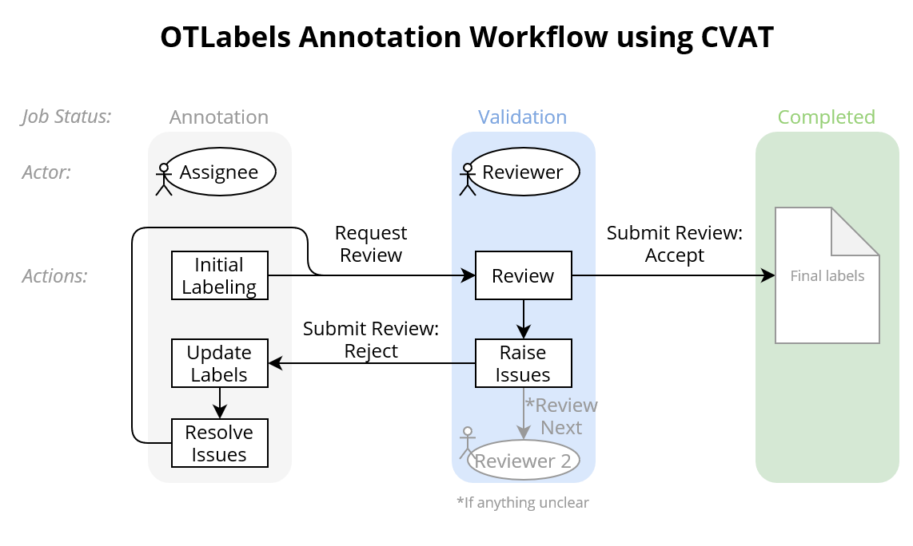

# CVAT

CVAT is a free video and image annotation tool for computer vision.  
We recommend the developers guides for [Installation](https://github.com/openvinotoolkit/cvat/blob/develop/cvat/apps/documentation/installation.md) as well as the [user's guide](https://github.com/openvinotoolkit/cvat/blob/develop/cvat/apps/documentation/user_guide.md).

If you want to label your own dataset to retrain models, keep in mind that the format of your new labels needs to be the same as the format of the original dataset. On this page we define our intended organizational and technical annotation workflow using CVAT.

Since YOLOv5 is based on the the MS COCO dataset of 2D bounding boxes, you need to apply your own labels in the frames from your sample videos in the same format. We therefore recommend the following steps:

1. Install and setup an instance of CVAT either on your local computer or on a server (recommended when working in a team).
2. Import the videos in CVAT and select the frames you want to use for labelling.
3. Download the dataset from CVAT using the YOLO v1.1 format.
4. Pre-annotate your frames with the standard YOLOv5x model. The results do probably not meet the desired quality. However, the pre-annotated labels will save you some time since it not necessary to draw all labels from scratch.
5. Upload the pre-annotated frames to CVAT and revise the detected labels.
6. Download the final labels from CVAT and convert them to COCO format (using our cvat_to_coco.py script).

The COCO dataset and consequently the YOLOv5 models can detect 80 classes. However, for the detection of traffic, only six classes are relevant.

## Target classes

Target classes are all road user classes from the initial COCO data set that are relevant for our sample videos:

- Person
- Bicycle
- Motorcycle
- Car
- Bus
- Truck

All vehicles or combinations of vehicles are labeled as "truck" if they have

- twin tires (except for regular service buses or coaches),
- a superstructure or a loading area or
- a trailer (also cars with trailer, the 2D box includes vehicle and trailer).

Here, as in the COCO dataset, both the "person" and the "bicycle" are labeled separately for bicyclists.

## Object dimensions

The 2D box boundaries are defined by the outermost parts of the objects visible in that frame of the video.

Even if only a part of an object is visible and the class of the object is recognizable for the annotator, it should be labeled.

## Projects, Tasks and Jobs

We define certain set of videos as a **project**.
Every project has multiple **tasks** (each consists of one video to annotate). Each task has a status ("Pending", "In Progress" and "Completed") and a progress bar showing the number of completed jobs. Open the task with klick on "Open".  
For each task (or video) multiple **jobs** with a certain amounts of frames from the video are defined. Each job has a status ("annotation", "validation" and "completed"), an "assignee" (responsible for annotation) and a "reviewer" (responsible for reviewing the assignees annotation). Open the job with klick on "Job #...".

## Import datafix

<!-- TODO Add description for importing datafix -->

!!! info "Coming soon"
    Unfortunately, there is no content here yet. But we are currently working on completing this website.

## Workflow

For each job, the project coordinator assigns the roles of the "assignee" (= annotator) and the "reviewer".
The reviewer then starts working on a job by initial labeling of the video frames.
The assignee should save his labeling work from time to time and can also stop and later repeat working on a job.
After finishing the initial labeling, the assignee requests a review (menu - request review, the assigned reviewer should already be named there) and thus sets status of the job to "validation".
Then the reviewer checks the initial labeling done by the assignee and raises issues when there is a problem or question.
After reviewing all video frames of the job, the reviewer submits the review by either accepting and completing the job or rejecting it (which sets the status of the job bach to "Annotation").
Now the assignee has to check the issues, update the labels, resolve the issues and again request a review. The review process starts again and if necessary also next annotations, until the reviewer accepts the job and it is marked as "Completed".  

We recommend the following procedure for annotation in CVAT:

- Go through all pre-labeled objects on the right
  - Check and delete false positive labels (if there is no object)
  - Check and delete duplicate labels for the same object
  - Check and correct object class for target classes
  - Check and delete objects from other classes if they are classified wrong
- Zoom in on one quadrant of the image at a time:
  - Check and correct position of object´s 2D boxes
  - Check if there are objects from the target classes not already pre-labeled, draw new 2D box and annotate object class

## Download data

<!-- TODO Add description for downloading annotation data -->

!!! info "Coming soon"
    Unfortunately, there is no content here yet. But we are currently working on completing this website.
