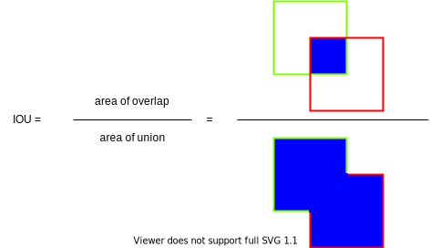
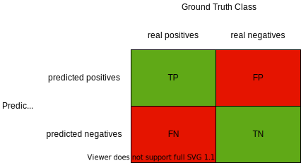

# Performance Metrics

In this section we briefly go over the different metrics to evaluate our models on how they fare in the tasks of object detection and object tracking.
Furthermore, we will look into the different metrics used to evaluate the results in terms of traffic analysis.

## Object Detection

In the task of object detection a model is considered to be good if it is able to detect and classify an object correctly.
In this section we are going to have a look in the different object detection performance metrics.

### Intersection Over Union (IOU)

We can tell if a predicted bounding box matches a ground truth bounding box by calculating and looking at the IOU of the two bounding boxes.
As Padilla et al. explained in the paper[^1], "a perfect match is considered when the area and location of the predicted and ground-truth boxes are the same".
Therefore, the IOU is calculated by determining the area of the intersection of the two bounding boxes and dividing it by the area of the union of the two bounding boxes as shown in:

Illustration adapted from the paper <a href="https://doi.org/10.3390/electronics10030279">"Analysis of Object Detection Metrics with a Companion Open-Source Toolkit"</a>

Thus, two bounding boxes are considered a perfect match if the **IOU = 1**.
Meaning the predicted and ground truth bounding boxes share the same location and the same size.

On the other hand, the **IOU = 0** when there is no intersection between the predicted and the ground truth bounding box.

Usually an IOU threshold is defined in order to decide whether a predicted and ground truth bounding box are considered a match.

### True Positives, False Positives, False Negatives

This section will explain what true positives, false positives, false negatives and true negatives are in the task of object detection.
Thus, we will look at their definitions as defined by Padilla et al. [^1]:

A **True Positive** is a correct detection of a ground-truth bounding box.
An incorrect detection of a non-existing object or a misplaced detection of an existing object is a **False Positive**.
An undetected ground-truth bounding box is named **False Negative**.

### Precision

Padilla et al. [^1] explain precision as "the ability of a model to identify only relevant objects. It is the percentage of correct positive predictions."

Precision is calculated as:

$$
Precision = \frac{TP}{TP + FP}
$$

### Recall

Padilla et al. [^1] explain recall as "the ability of a model to find all relevant cases (all ground-truth bounding boxes). It is the percentage of correct positive predictions among all given ground truths."

Recall is calculated as:

$$
Recall = \frac{TP}{TP + FN}
$$

### Average Precision (AP)

As Padilla et al. explained that an object detection model "can be considered good if, when the confidence threshold decreases, its precision remains high as its recall increases"[ [^1] ].
Taking this into account a model with a large area under a precision-recall curve indicates a high precision and a high recall.
Therefore, the **average precision** "is a metric based on the area under a [precision-recall curve]" [^1] with a selected IOU threshold.
Thus the following notation for example, AP@50 denotes the average precision with IOU threshold at 50%.

### Mean Average Precision (mAP)

We need to keep in mind that the average precision needs to be calculated for each class individually.
Hence, the **mean average precision** "is a metric that is able to represent the exactness of the detections among all classes" [^1].

The mAP is calculated as follows:

$$
mAP = \frac{1}{C} \sum_{i=1}^{C} AP_i
$$

where C is the total number of classes and $AP_i$ is the average precision of class $i$ [^1].

### TIDE Metrics

Bolya et al. created **[TIDE](https://dbolya.github.io/tide/)** a _General Toolbox for Identifying Object Detection Errors_[^2].
As Bolya et al. explain in their paper[^2] "mAP succinctly summarizes the performance of a model in one number".
Thus, the mAP performance metric does not give us any insight on what and how the different error types influence its score, that is the mAP score.
The aim of TIDE is exactly that, to give us this insight on how the different error types affect the mAP score and as Bolya et al. [^2] stated giving us "a comprehensive analysis of each model's strengths and weaknesses".

[TIDE](https://dbolya.github.io/tide/) defines six main error types as follows:

!!! info
    The following descriptions of the error types are directly taken from the [TIDE source code](https://github.com/dbolya/tide/blob/master/tidecv/errors/main_errors.py)

1. **Classification Error**: Error caused when a prediction would have been marked positive if it had the correct class.

2. **Localization Error**: Error caused when a prediction would have been marked positive if it was localized better.

3. **Both Cls and Loc Error**: This detection didn't fall into any of the other error categories.

4. **Duplicate Detection Error**: Error caused when a prediction would have been marked positive if the GT wasn't already in use by another detection.

5. **Background Error**: Error caused when this detection should have been classified as background (IoU < 0.1).

6. **Missed Ground Truth Error**: Represents GT missed by the model. Doesn't include GT corrected elsewhere in the model.

#### Confusion Matrix

The confusion matrix gives us a visual insight on how our object detection model performs in the classification task.

Let us have a look first at the confusion matrix of a **binary classification problem**:

Illustration adapted from the paper <a href="https://arxiv.org/abs/2010.16061">"Evaluation: from precision, recall and F-measure to ROC, informedness, markedness and correlation"</a> by David M. W. Powers[^3]

The rows of the above confusion matrix represent the predicted class whereas the columns represent the ground truth class. Thus a prediction can be categorized as follows:

1. A prediction that has been predicted as positive class and that is found to be an actual/real positive class in the ground truth, is counted as a **true positive**.

1. A prediction that has been predicted as negative class and is found to be an actual/real negative class is counted as a **true negative**.

1. A prediction that has been predicted as positive and is found to be **not** an actual/real positive class is counted as a **false positive**.

1. A prediction that has been predicted as negative and is found to be **not** an actual/real negative class is counted as a **false negative**.

Hence, the confusion matrix gives us a clear visualization of how many of our predictions were classified correctly or incorrectly.

The confusion matrix of multi classification problem looks a little bit different:

As the image above implies, we now have multiple classes.
For this example we want to classify the class `car`, `person` and `truck`.
The green color coded tiles denote the true positive predictions.

Let's take for example the row denoted with the class `car`.
Here is how it is to be interpreted:
Out of the 8 cars that have been predicted:

- three were correctly classified as a `car`,
- none were incorrectly classified as a `person` and
- 5 were incorrectly classified as `truck`

## Object Tracking

!!! info "Coming soon"
    Unfortunately, there is no content here yet. But we are currently working on completing this website.

## Traffic Measures

To see, how well OpenTrafficCam performs see [OTAnalytics](/OTAnalytics/Accuracy/counts/).

## References

[^1]: Padilla, R., Passos, W. L., Dias, T. L., Netto, S. L., & da Silva, E. A. (2021). A comparative analysis of object detection metrics with a companion open-source toolkit. Electronics, 10(3), 279. [https://doi.org/10.3390/electronics10030279](https://doi.org/10.3390/electronics10030279)
[^2]: Bolya, D., Foley, S., Hays, J., & Hoffman, J. (2020). Tide: A general toolbox for identifying object detection errors. In Computer Vision–ECCV 2020: 16th European Conference, Glasgow, UK, August 23–28, 2020, Proceedings, Part III 16 (pp. 558-573). Springer International Publishing. [https://dbolya.github.io/tide/paper.pdf](https://dbolya.github.io/tide/paper.pdf)
[^3]: Powers, D. M. (2020). Evaluation: from precision, recall and F-measure to ROC, informedness, markedness and correlation. arXiv preprint arXiv:2010.16061.
