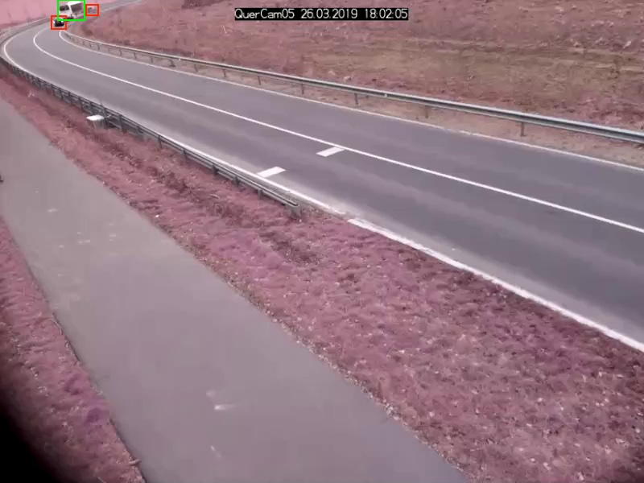

# Model Validation

In this section we will compare the different YOLO models on how good they fare in the object detection task.
The YOLO models to be evaluated are YOLOv5s, YOLOv5m, YOLOv5l and YOLOv5x.
The models are evaluated on a custom dataset consisting of custom video recordings.
Thus, we want to investigate which of the four YOLO models might be best suited in the detection of traffic objects.

## Dataset

As mentioned above, the dataset consists of different video recordings capturing different traffic scenes.
Thus, the video recordings are turned into datasets that will be used to evaluate the object detection models.
It is important to note that not every single frame is selected, but only every $n$-th frame where $n \in \mathbb{N}$ and $n$ is arbitrarily chosen by the user.

Here is how the scenes are looking like:

| Scenes                                |                                       |                                       |                                                   |
| ------------------------------------- | ------------------------------------- | ------------------------------------------------- | ------------------------------------- |
|  |  |  |  |
|  |  |                                       |                                                   |

As seen above, there are two instances where scenes were also recorded at night.
This makes it interesting to see how the YOLO models perform in detecting traffic objects in low light conditions.

The class labels to be considered for our evaluation of the YOLO models are:

- person
- bicycle
- car
- motorcycle
- bus
- truck

## Evaluation Procedure

The YOLO models are evaluated with the help of [OTValidate](overview.md).
As a prerequisite, what OTValidate needs in order to start the evaluation are the YOLO models and the labeled ground truth data.
In our case the ground truth labeled data is our custom dataset, which needs to be in the [CVAT YOLO format](https://openvinotoolkit.github.io/cvat/docs/manual/advanced/downloading-annotations/
).
As for the YOLO model, a custom trained or an existing model can be loaded into OTValidate.

OTValidate then uses each model to predict the ground truth images.
Afterwards, the prediction results and ground truth data are used to calculate the different object detection [metrics](metrics.md) for model comparison.
In our case, we will use the mAP and the [TIDE metrics](https://github.com/dbolya/tide).

!!! info

    OTValidate takes a list of class labels as a parameter.
    All predictions and ground truth data are then filtered according to that list of class labels.
    Meaning, all predictions or ground truth data, whose predicted or labeled class are not contained in the list, are discarded and therefore not regarded in the evaluation process.
    This is especially useful if the ground truth data contains class labels that the model can't predict. 

## Evaluation

In this section we will discuss the evaluation results of each model and put them under comparison.
Specifically, we will evaluate the models on each dataset depicted by the scenes as shown above in the table and on all the ground truth data.
The models confidence and IOU threshold are set to 0.25 and 0.5 respectively.
Meaning, all detections that have an IOU lower than 0.5 are not regarded as possible detections and all detections with a confidence lower than 0.25 are discarded.

### Evaluation on all data

This diagram depicts each models mAP at different IOU thresholds:

We can clearly see that the YOLOv5s model's mAP is the lowest compared to the other models.
Meaning, by only looking at the mAP metric the YOLOv5s, YOLOv5m, and the YOLOv5x models are to be considered.

Nevertheless, let us also have a look at the TIDE metrics to get an insight on the types of errors made by the models:

| TIDE Metrics                                                      |                                                                        |
| ----------------------------------------------------------------- | ---------------------------------------------------------------------- |
|          |      |

What immediately stands out are the **Missed Ground Truth Error**(Miss) and the **Classification Error**(Cls).
Meaning, the models were not able to detect many ground truth bounding boxes or be able to classify them correctly.
Thus, the models were able to detect the majority of the bounding boxes, but had problems predicting the correct classes.

The YOLOv5s model had the highest classification error rate out of the four models.
Although, the missed ground truth error rate is also the highest, it does not differ much from the other three models.

It becomes apparent that the bigger models perform better at detecting bounding boxes than the smaller ones.
But there is also a point where the models' performance, namely the YOLOv5m, YOLOv5l and YOLOv5x, don't differ much at all.
Implying that there is not much of a trade-off in choosing the YOLOv5m or YOLOv5l over the YOLOv5x.

Still, let us try to find out why the  **Missed Ground Truth Error** appears to be a problem for all four models by evaluating them on the data of each scene.

### Evaluation on each dataset of a scene

#### Scene 1 & 2

| Scene 1                                                                        | Scene 2                                                                        |
|--------------------------------------------------------------------------------|--------------------------------------------------------------------------------|
|                                           |                                           |
|                    |                    |
|           |           |
|  |  |

**Scene 1** captures a three way junction.
Compared to the combined dataset, the models' mAP value doesn't differ that much.
The missed ground truth error of all four models is above 20%.
Our assumption as to why the missed ground truth error is so high might be due to moving objects appearing in the distance.
The models might not be able to detect these objects as they appear to be very small in the picture, as marked in red bounding boxes in the following image:

It is also possible that the timestamp covers up parts of objects making the models not be able to detect them.

**Scene 2** is similar to scene 1 in respect to the metrics calculated on all four models.
The models' mAP evaluated on the dataset of scene 2 is higher than those of scene 1 when looking at the YOLOv5's `m`, `l` and `x` models.
Scene 2's TIDE errors behave also very similar to those of scene 1.
Also, small objects that have been annotated with small bounding boxes appear in images of the dataset of Scene 2.
This could also be related to the high **Missed Ground Truth Error**.

#### Scene 3

Scene 3 captures a four-way junction.
There are two datasets capturing scene 2 at daylight and nighttime respectively.

| Scene 3                                                                        | At Night                                                                                   |
| ------------------------------------------------------------------------------ | ------------------------------------------------------------------------------------------ |
|                                   |                                           |
|                    |                    |
|   |           |
|   |  |

Comparing these two datasets, it is not surprising that the models' mAP evaluated on the dataset taken at daylight fares much better to the one evaluated at nighttime.
The low light condition makes it really hard for the models to detect any of the objects.
The biggest drop in performance in terms of the mAP metric is seen from the YOLOv5s model.

But then, why is the **Missed Ground Truth Error** (Miss) much lower and the **Classification Error** (Cls) that much higher of the nighttime dataset of Scene 3 compared to the one taken at daylight?
Let's have a closer look at the two datasets first:

| Scene 3 at daylight                                                      | Scene 3 at nighttime                                       |
|--------------------------------------------------------------------------|------------------------------------------------------------|
|  | |

Overall, the amount of ground truth bounding boxes in scene 3 taken at daylight is more than twice as big as the one taken at nighttime.
This implies that there is less traffic at nighttime, which makes sense.
Thus, there is not much to detect at night resulting in a lower **Missed Ground Truth Error**.
On the other hand, the classification error for all models is above 40% with the exception of the YOLOv5l model whose classification error is at approximately 24%.
In addition to that the **Localization Error** (Loc) is very low.
Meaning, the model is able to detect objects very well, but has trouble assigning them to the correct class in badly lit areas.
Here is an example where a car is barely recognizable:

Speaking of scene 3 at daylight, the **MissedGround Truth Error** is relatively high across all models which is due to the same reason as explained in **Scene 1**.
Traffic objects whose bounding boxes are really small might be detected by the models resulting in misses.

But it is also important to take into account that there is the possibility of not moving objects appearing in every image at the same spot in the dataset.
Such case can be seen in scene 3 at nighttime where cars have been parked on the sidewalk in the following image:

Thus, such case could influence the values of the calculated metrics for better or worse.

#### Scene 4

Scene 4 captures a rural road.

| Scene 4                                                                        |                                                                                |
| ------------------------------------------------------------------------------ | ------------------------------------------------------------------------------ |
|                                           |                    |
|           |  |

The **Missed Ground Truth Error** (Miss) is pretty high for the YOLOv5s and the YOLOv5x models with an error value over 50% compared to the YOLOv5m and YOLOv5l models.
At this moment, we could not come up with an explanation of why the YOLOv5x model's missed ground truth error is that much higher than its `m` and `l` counterpart.
But there is an explanation why the missed ground truth error is high across all models.
The reason lies in the dataset of scene 4 itself:

| Scene 4 - images with cut off objects                                  |                                                                            |
| ---------------------------------------------------------------------- | -------------------------------------------------------------------------- |
|  |      |
|  |           |
|       |            |

The images above contain objects, which are surrounded by red bounding boxes, that are only partly in their respective image.
Therefore, a model might not have been able to detect these objects due to a low confidence score and thus resulting in misses.
These type of images appear often in the dataset.
Another thing to keep in mind is that there is not much traffic on this rural road.
Most images in the dataset do not contain bounding box annotations.

There are a total of 110 labeled objects in a dataset consisting of 401 images.
As a result, even a small number of cut off objects could have a great impact on the metrics.

### Scene 5

Scene 5 captures a rural road.

| Scene 5                                                                        | At Night                                                                                   |
| ------------------------------------------------------------------------------ | ------------------------------------------------------------------------------------------ |
|                                           |                                           |
|                    |                    |
|           |           |
|  |  |

Scene 5 is captured at two different times, namely at day and night.
The only difference to scene 3 is that scene 5 captures a rural road instead of a four way junction.
Unsurprisingly, the models performed tremendously better on the dataset taken during the day compared to the one taken at night when looking at the mAP diagram.

It is not surprising that all models evaluated on the nighttime dataset have a high **Missed Ground Truth Error** (Miss) which is due to the worse light conditions.
What is standing out is the fact that the models evaluated on the day dataset also have a high miss error rate.
To get behind the a possible reason for this we should have quick peek in the ground truth dataset:

|                                                                    |                                                                      |
| ------------------------------------------------------------------ | -------------------------------------------------------------------- |
|  |  |

Objects or vehicles emerging from the road in the upper left corner of the image make it harder for the models to detect and assign them to the correct class.
This is reflected in the missed ground truth error and the localization error.
Thus the further the objects move to the right area of the image, the better they are detected by the models.

## Conclusion and Future Work

We have evaluated the `YOLOv5s`, `YOLOv5m`, `YOLOv5x`, and the `YOLOv5l` object detection models on a custom dataset consisting of videos capturing different scenes of traffic junctions and roads.
Looking at mAP and TIDE metrics gave us insight to how the YOLOv5 models performed on our custom dataset and we can come to the conclusion that a `YOLOv5m`, `YOLOv5l` and `YOLOv5x` models performed far better than the `YOLOv5s`.
But there is not a big increase in performance in terms of object detection upon choosing the `YOLOv5x` over the `YOLOv5m` or `YOLOv5l` model.

Another important aspect to look into in the future is how much time the models under discussion take to detect the images.
Depending on the use case and resources at hand, choosing the `YOLOv5x` model which might need much more time to finish the detection might not be suitable and thus taking the `YOLOv5m` or `YOLOv5l` model might be the better choice.

We also learned that how and where a camera is set up to capture a scene also influences the ability of the models to detect objects.
Therefore, it might be interesting to see if other camera views would improve the models performance.
In addition to that the timestamp needs to be placed at a position where it does not obstruct the area of interest which is any area with traffic.

What we are also currently working on is to train our own models using the YOLOv5 models as our foundation on a custom dataset.
Thus it would be interesting to see if there would be a significant increase in performance by using custom trained models.
If there is a significant increase in performance, the next question to ask if it makes sense to invest time in training a custom model.
