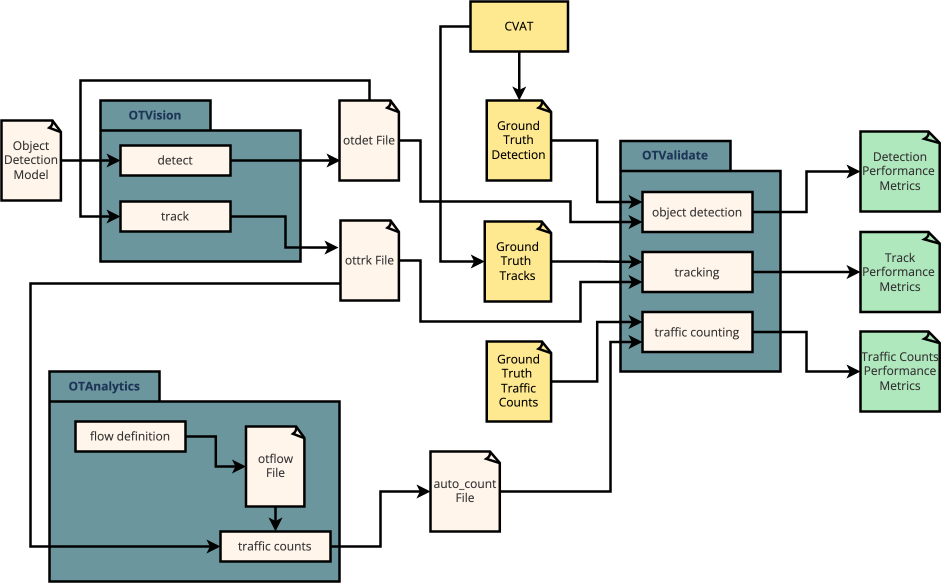

# Overview 

Validation gives insight on how well a model or software performs.
In the case **OpenTrafficCam**, we want to evaluate and compare different object detection models on how well they perform in object detection and object tracking.
Furthermore, we want to analyse the results of **[OTAnalytics](<https://github.com/OpenTrafficCam/OTAnalytics>)** on a set of traffic performance metrics.

For this purpose we are currently developing **[OTValidate](<https://github.com/OpenTrafficCam/OTValidate>)** which allows the user to analyse and compare the models' performances on object detection and tracking by calculating metrics corresponding to the specific task at hand.
As mentioned above **OTValidate** will also provide tools to analyse the results of **OTAnalytics** in regards to traffic performance.

## OTValidate

The image below gives a good overview on the structure of `OTValidate`:

For the **object detection task** `OTValidate` needs two input files namely an `.otdet` file and the ground truth label data for the object detection task.
Alternatively, a custom or an existing model can be given over as an input instead of an `.otdet` file.
