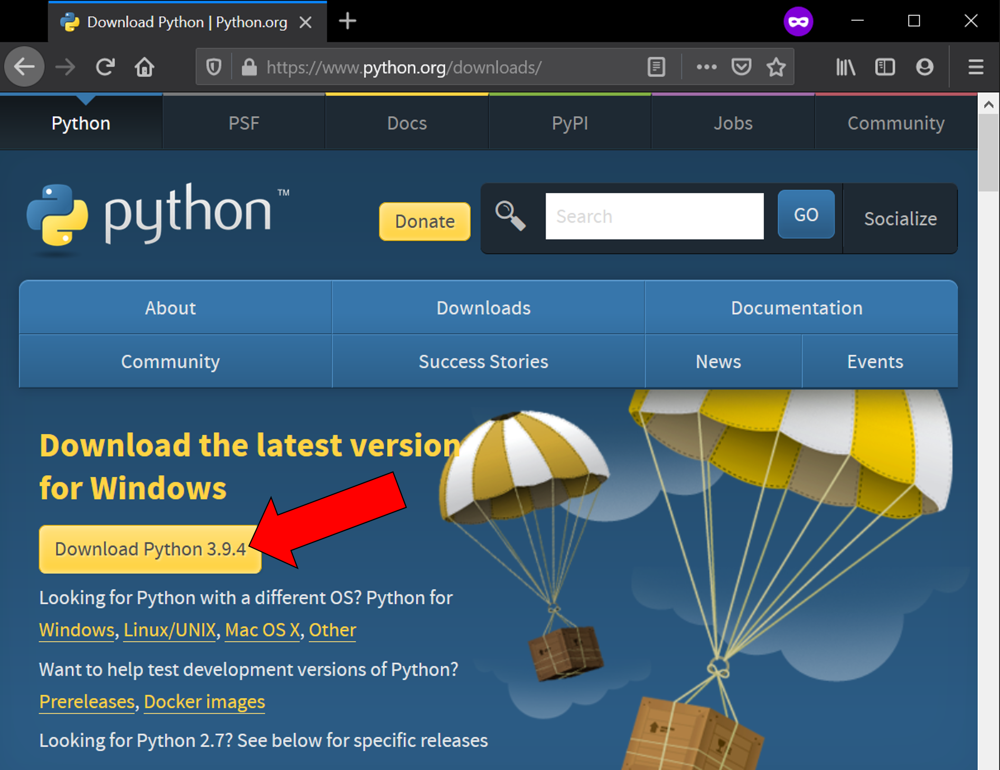
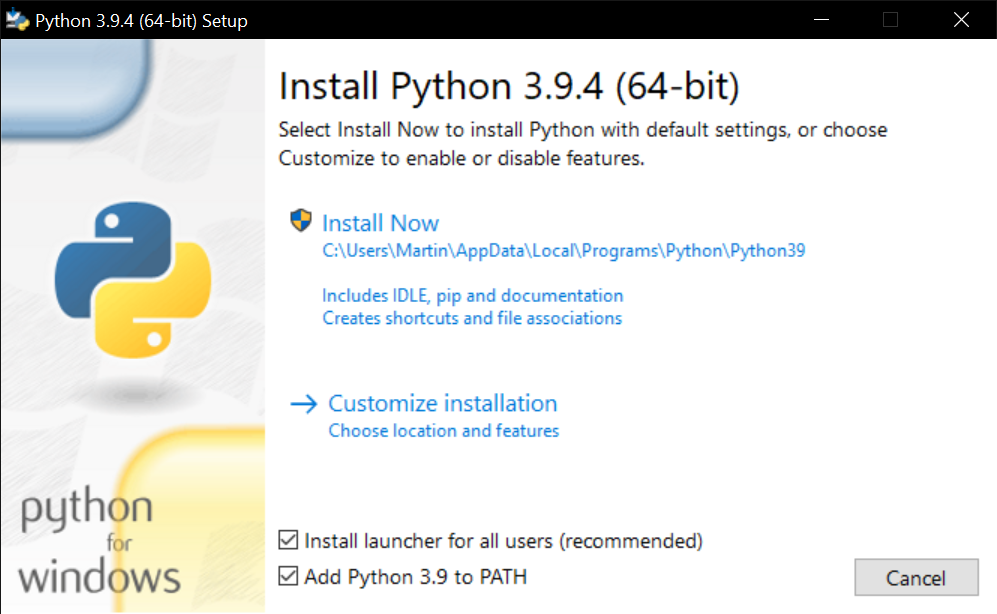
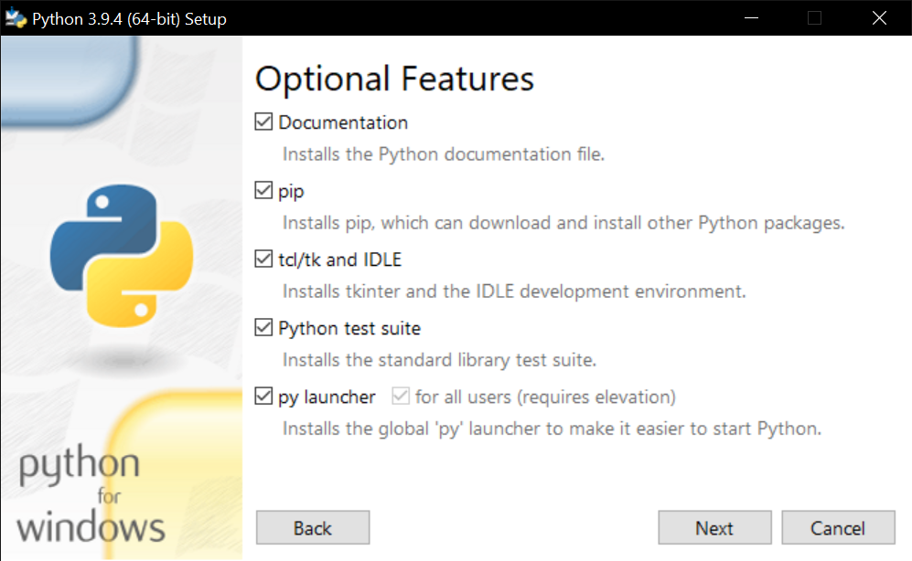
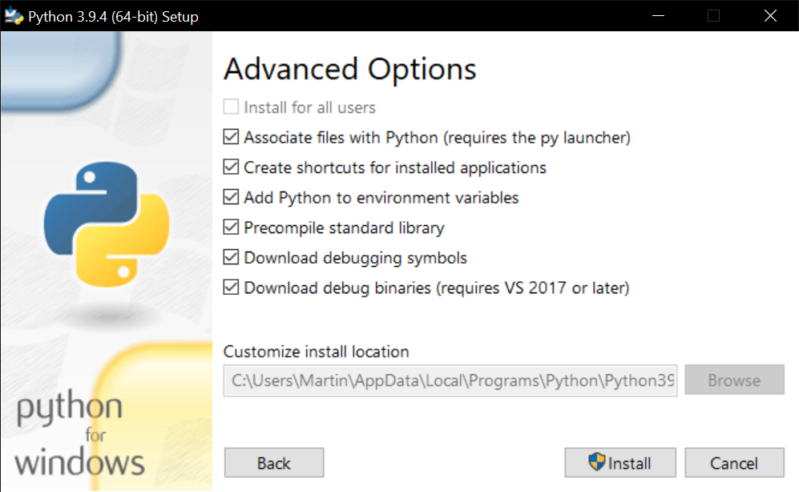

# Installation

## Install Python 3.9

Install the 64-bit version Python 3.9.x via Windows installer from www.python.org/downloads/ as follows (Python 3.6.x to 3.8.x should also work, the 32-bit version is not supported):

## Install NVIDIA Cuda 11.0

> If you have a modern NVidia graphics card.

[Download and install version 11.0 of the NVIDIA Cuda Toolkit]([Download](https://developer.download.nvidia.com/compute/cuda/11.0.3/local_installers/cuda_11.0.3_451.82_win10.exe)) with default settings from the NVDIA toolkit [archive](https://developer.nvidia.com/cuda-toolkit-archive).

## Install OTVision and OTAnalytics

1. Download and unzip the latest versions of [OTVision](https://github.com/OpenTrafficCam/OTVision/archive/refs/heads/master.zip) and [OTAnalytics](https://github.com/OpenTrafficCam/OTAnalytics/archive/refs/heads/master.zip) from Github.

2. In both folders Double-click the "install.bat" and wait until the installation of the dependencies is complete.

## To run OTVision and OTAnalytics

... double click the "OTVision.bat" or the "OTAnalytics.bat" to run the Software via graphical user interface.

## If you encounter problems

Maybe you also have to manually install Microsoft Visual C++ 14.0 or greater from the [Visual Studio Build Tools](https://visualstudio.microsoft.com/visual-cpp-build-tools/).

For further problems please open an issue in the OTVision or OTAnalytics repositories on Github.
