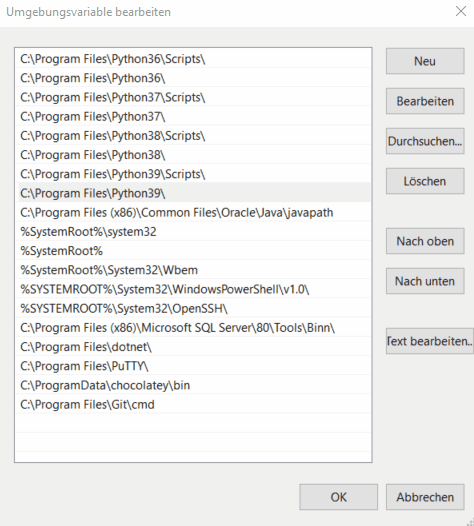

# Requirements

> it runs on **any** system

**OTVision** is designed to run on any of the current computer operating systems
(Windows, Linux and Mac).
However, a few prerequisites are required before installing **OTVision** itself.

## Hardware prerequisites

**OTVision** runs on modern 64 bit desktops and laptops (e.g. i5 or Apple Silicon
processor and 8 GB RAM).
Apple Silicon processors can also be used to run **OTVision**.

If you want to detect road users in videos with **OTVision** on a regular basis, we
strongly recommend purchasing a powerful desktop computer
(>= i7, >= 16 GB RAM)
with a NVidia graphics card (>= GeForce 10XX Series; `better = faster`).
Make sure that the drivers of the graphics card as well as the
[NVidia CUDA Toolkit](#optional-nvidia-cuda)
are installed to get the best performance.

!!! info "Apple Neural Engine"

    Accelerated detection using the Apple Neural Engine is not yet supported.
    Detection on Apple silicon chips is currently perfomed using the CPU only.

## Software prerequisites

### Python 3.10

**OTVision** is based on Open Source *Python* packages.
Thus, it runs on Windows, macOS and Linux systems after setting up the environment
correctly.
Consequently, *Python* needs to be installed on your system.
Currently we support only *Python 3.10*.
An instruction how to do that on a Windows system can be found below.

??? help "What if I want to use another Python version?"

    Python 3.10 is the version we are currently testing against and providing
    installation scripts for.
    Other Python versions might also work, but are not currently tested.
    In any case, you will have to install the requirements manually or adapt the
    installation scripts accordingly.

=== "Windows"

    If not done yet, install the latest 64-bit version of Python 3.10 via Windows
    installer from [www.python.org/downloads/](https://www.python.org/downloads/).

    Please make sure to check the following boxes during installation:

    - Add Python to PATH
    - Install pip
    - All advanced options

    ??? help "What if I already have another Python version installed?"

        In addition, also install Python 3.10. The last installed Python will
        automatically be the default Python interpreter of your system.

        On Windows, it is also possible to change the default Python interpreter by
        changing the order of the system-wide environment variables (move Python310 and
        Python310\Scripts to the top, see animation below).

        This is necessary e.g. if you have already installed Python 3.10, but another
        Python version is your default because you installed it in the meantime
        (e.g. 3.11).

        
    
    To check your Python installation, run the the follwing commands in a cmd terminal:
    
    ```text
    python --version
    ```

    If `Python 3.10.x` returns, you are good!

=== "Linux"

    Depending on the Linux distribution you are using,
    Python 3.10 might not be the pre-installed version.
    You can check if (and which sub-version of) Python 3.10 is installed by running the
    following command in the terminal:

    ```text
    python3.10 --version
    ```

    If necessary, install Python 3.10 manually using additional sources. 
    Since the sources might differ depending on the Linux distribution you are using,
    we kindly ask you to use a search engine for a detailed instruction on how to
    install Python 3.10 manually for your distribution. 
    
    In any case, please make sure that you also have the python virtual environment
    package `python3.10-venv` installed.

    To check your Python installation, run this command in the terminal again:
    
    ```text
    python3.10 --version
    ```

=== "macOS"

    Depending on the macOS version you are using,
    Python 3.10 might not be the pre-installed version.
    You can check if (and which sub-version of) Python 3.10 is installed by running the
    following command in the terminal:

    ```text
    python3.10 --version
    ```

    If necessary, install Python 3.10 as described below.

    #### Homebrew

    We recommend installing Python from the terminal via [Homebrew](https://brew.sh/): 
    
    ```text
    brew install python@3.10
    ```

    #### Manual installation

    Alternatively, you can download a macOS installer for python 3.10 from
    [python.org](https://www.python.org/downloads).

    #### Check installation

    Again, run this command in the terminal:

    ```text
    python3.10 --version
    ```

### ffmpeg

If you want to use videos recorded by [**OTCamera**](/OTCamera) with **OTVision**,
you need to convert the videos to .mp4 files first.
For the conversion, we use the Open Source software *ffmpeg*.

Before using the `convert.py` script, make sure that *ffmpeg* is installed and added to
PATH on your system:

=== "Windows"

    To install *ffmpeg* on your Windows system, please perform the following steps:
    
    1. Download the file `ffmpeg-git-full.7z` from
        [gyan.dev](https://www.gyan.dev/ffmpeg/builds/).  
    2. Unzip this file by using any file archiver such as Winrar or 7z in the folder of
        your choice (e.g., `C:\ffmpeg`).
    3. Now, run cmd as an administrator and set the environment path variable for ffmpeg
        by running 
    
        ```text 
        setx /m PATH "path_to_your_ffmpeg_folder\bin;%PATH%"
        ```
        
        where `path_to_your_ffmpeg_folder` represents the folder that you have *ffmpeg*
            unzipped in.
    
    4. Restart your computer and verify the installation by running 

        ```text 
        ffmpeg -version
        ```

=== "Linux"

    #### Ubuntu repositories

    If you use Ubuntu, you can install *ffmpeg* using the official Ubuntu repositories.

    ```
    sudo apt update
    sudo apt install ffmpeg
    ``` 

    #### Manual installation

    For the manual installation of *ffmpeg* on Linux or if you use another Linux
    distribution than Ubuntu, please refer to the instructions on the
    [developers website](https://ffmpeg.org/download.html).

=== "macOS"

    #### Homebrew

    For the installation using Homebrew, use the following command in the terminal:
        ```text
        brew install ffmpeg
        ```

    #### Manual install

    For the manual installation of *ffmpeg* on macOS, please refer to the instructions
    on the [developers website](https://ffmpeg.org/download.html).

### Optional: Nvidia CUDA

> If you have a modern NVidia graphics card.

If you intend to use **OTVision** on a Windows or Linux PC with a modern
NVidia graphics card, download and install the latest version of the
[NVIDIA Cuda Toolkit](https://developer.nvidia.com/cuda-downloads) that is
[supported by PyTorch](https://pytorch.org/) on your platform.
