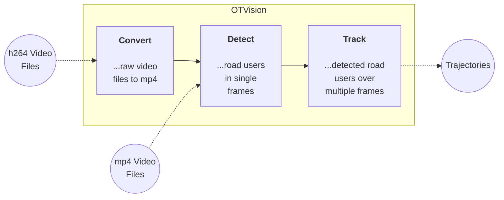

# Features

> The **heart** of OpenTrafficCam.

[**OTVision**](https://github.com/OpenTrafficCam/OTVision) is a collection of algorithms to generate trajectories of road users in traffic videos extended by self-developed functionalities. Most of the algorithms have been developed in previous open source projects. We modify and link them together with our own developments to a working pipeline.

This pipeline consists of three core functionalities of **OTVision**: *Convert*, *Detect* and *Track*.

## Key features

* Can be used without programming knowledge
* Automated video format convertion
* Detection of road users using state-of-the-art AI object detection models (currently: YOLOv5) over multiple frames and videos
* **Result:** Trajectories in image coordinates

## Content of this documentation

* [Installation](gettingstarted/installation) of OTVision
* [Conversion](usage/convert) of h264 video files to other formats ([ffmpeg](https://ffmpeg.org/))
* [Detection](usage/detect) (joint localization and classification) of road users in single frames ([YOLOv5 by Jocher/Ultralytics](https://github.com/ultralytics/yolov5))
* [Tracking](usage/track) of detected road users between single frames ([IOU-Tracker by Bochinski et al.](https://github.com/bochinski/iou-tracker)) and over multiple videos.
