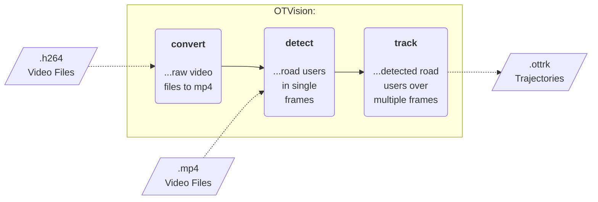

# Features

> The **heart** of OpenTrafficCam.

[OTVision](https://github.com/OpenTrafficCam/OTVision) is a collection of algorithms
to generate trajectories of road users from traffic videos.
Most of the algorithms have been developed in previous open source projects.
We modify them and link them with our own developments into a working pipeline.

The current pipeline consists of three core functionalities of OTVision:
*[convert](usage/convert)*, *[detect](usage/detect)* and *[track](usage/track)*.

## Key features

* Can be used without programming knowledge
* [Conversion](usage/convert) of .h264 video files to other formats
    (using [ffmpeg](https://ffmpeg.org/))
* [Detection](usage/detect) (joint localization and classification) of road users using
    state-of-the-art AI object detection models in single video frames
    (currently using [YOLOv8 by Ultralytics](https://github.com/ultralytics/ultralytics))
* [Tracking](usage/track) of detected road users over multiple frames
    (currently using the
    [IOU-Tracker by Bochinski et al.](https://github.com/bochinski/iou-tracker))
    and over multiple videos.
* **Result:** Trajectories in pixel coordinates
