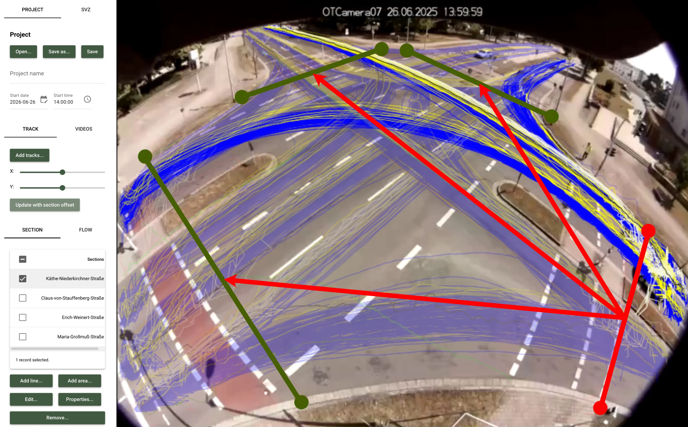

# Verkehrsdatenerfassung: Grundlage moderner Verkehrsplanung

Wenn Sie Verkehrsmaßnahmen planen, eine Kreuzung umbauen oder Parkraum neu
organisieren möchten, stellt sich immer zuerst eine zentrale Frage: Was
passiert hier eigentlich im Verkehr?

Genau hier setzt die Verkehrsdatenerfassung an. Sie liefert die objektive
Datengrundlage, auf der Verkehrs- und Stadtplaner, Ingenieurbüros und
kommunale Behörden fundierte Entscheidungen treffen können. Dass für die
Erhebung der Daten Videotechnik als besonders effizient und verlässlich
gilt, zeigt die Straßenverkehrszählung 2025 (SVZ 2025): Diese setzte
erstmals bundesweit auf die Möglichkeit von Videokameras mit
semi-automatisierter Auswertung.

Dabei geht die Verkehrsdatenerfassung weit über eine reine Zählung hinaus.
Die erhobenen Daten bilden die Basis für Analyse, Planung und
Verkehrsmanagement. Der folgende Überblick zeigt, wie Verkehrsdatenerfassung
technisch funktioniert, wie sie in der Praxis eingesetzt wird und welche
Anforderungen Planungsstellen dabei insbesondere beim Datenschutz beachten
müssen.

<!-- more -->

## Was versteht man unter Verkehrsdatenerfassung?

Verkehrsdatenerfassung – auch Verkehrsdatenerhebung oder Verkehrserhebung –
bezeichnet die systematische Gewinnung von Daten über Verkehrsteilnehmende
und Verkehrsbewegungen. Sie umfasst sowohl Zählungen als auch Messungen und
bildet die Grundlage für Verkehrsanalysen, Planungsentscheidungen und ein
datenbasiertes Verkehrsmanagement.

### Verkehrsdatenerfassung: Begrifflichkeiten & typische Datentypen

In der Fachterminologie der FGSV (Forschungsgesellschaft für Straßen- und
Verkehrswesen) ist „Verkehrserhebung" ein Oberbegriff. Gemeint ist die
„systematische, planmäßige und methodisch kontrollierte Gewinnung von Daten
über den Verkehr und die daran Beteiligten". In der Praxis wird auch oft
der Begriff Verkehrsdatenerfassung verwendet.

Wichtig ist die Abgrenzung zur
[Verkehrszählung](https://opentrafficcam.org/blog/verkehrszaehlung/).
Zählungen erfassen in erster Linie diskrete Merkmale, also beispielsweise
die Anzahl von Fahrzeugen an einem Querschnitt. Die Verkehrsdatenerfassung
geht deutlich weiter: Sie bildet die Basis für Zählungen und auch für
Messungen und ermöglicht damit ein umfassenderes Bild des Verkehrs.

Typische Datentypen, die heute erfasst werden:

- Trajektorien als vollständige Bewegungspfade einzelner Verkehrsteilnehmender
- Geschwindigkeiten – sowohl punktuell als auch über Streckenabschnitte
- Zeitlücken und Abstände zwischen Fahrzeugen
- Fahrzeugklassen, etwa Pkw, Lkw, Busse oder Zweiräder
- Abbiegebeziehungen an Kreuzungen, Einmündungen und Kreisverkehren
- Belegungsgrade im ruhenden Verkehr, etwa bei Parkraumanalysen

Solche Informationen werden häufig unter dem Begriff Mobilitätsdaten
zusammengefasst, die darüber hinaus aber noch weitere Daten umfassen können.
Damit lassen sich Verkehrsabläufe wesentlich präziser verstehen als mit den
reinen Zählwerten eines
[Verkehrszählgeräts](https://opentrafficcam.org/blog/verkehrszaehlgeraet/).

## Praxisbeispiele für Verkehrsdatenerfassung

Verkehrsdaten werden in sehr unterschiedlichen Kontexten benötigt. Je nach
Fragestellung unterscheiden sich sowohl die Erhebungsmethoden als auch die
relevanten Kennzahlen. Im Folgenden skizzieren wir vier typische
Verkehrsdaten-Beispiele aus der Praxis.

### Kreuzungen und Einmündungen analysieren

Knotenpunkte gehören zu den komplexesten Bereichen im Verkehrsnetz. Hier
treffen verschiedene Verkehrsströme aufeinander – und das häufig mit
unterschiedlichen Prioritäten, Signalsteuerungen oder baulichen
Einschränkungen.

Wenn Planungsbüros an einer Kreuzung Verkehrsdaten erheben, erfassen sie
unter anderem diese Daten:

- Verkehrsstärke je Strom (geradeaus, links, rechts)
- Fahrzeugklassen pro Strom
- Zeitlücken zwischen Fahrzeugen

Der besondere Vorteil videobasierter Systeme hier: Sie sind laut EVE die
einzige automatisierte Methode, die Abbiegebeziehungen am Knoten und
Querschnittsdaten auf den Zufahrten gleichzeitig erfasst. Klassische
Detektoren wie Induktionsschleifen oder Radar müssten dafür pro Querschnitt
einzeln installiert werden.

Bei platomo bilden wir solche Strukturen häufig über sogenannte Sections
und Flows ab. Eine Section ist dabei eine virtuelle Zähllinie über eine
Zufahrt. Ein Flow beschreibt den Verkehrsstrom von einer Zufahrt zu einer
Abfahrt.

### Parkraumanalysen

In vielen Städten ist Parkraum ein knappes Gut. Um fundierte Entscheidungen
über Parkraumbewirtschaftung oder neue Stellplätze treffen zu können, sind
belastbare Daten unerlässlich. Dabei weisen die EVE (Empfehlungen für
Verkehrserhebungen) ausdrücklich darauf hin, dass Befragungen aufgrund
psychologischer Verzerrungen hier nicht geeignet sind.

Automatisierte Erfassungsmethoden wie sensor- oder kamerabasierte Systeme
messen dagegen objektiv, wie lange Fahrzeuge tatsächlich parken und wie
häufig Stellplätze wechseln.

Bei einer Parkraumanalyse stehen typischerweise vier Kenngrößen im
Mittelpunkt:

- Belegungsgrad: Anteil belegter Stellplätze
- Umschlag: Anzahl der Fahrzeugwechsel pro Stellplatz und Zeiteinheit
- Verweildauer: Wie lange Fahrzeuge durchschnittlich parken
- Parkdruck: Ein Belegungsgrad von über 90 % gilt als sehr hoch, 80 % bis
  90 % als hoch (Quelle: FGSV EVE 2011 (Ausgabe 2012), Tabelle
  Parkdruck-Klassifikation).

### Fußgängerfurten und Radverkehr erfassen

Mit der wachsenden Bedeutung nachhaltiger Mobilität rücken Fuß- und
Radverkehr stärker in den Fokus der Verkehrsplanung.

Allerdings gibt es hier spezielle Herausforderungen: Seit der BBSV 2020
sind neue Mobilitätsformen klar abgegrenzt – Pedelecs gelten verkehrsrechtlich
als Fahrrad, S-Pedelecs als Kfz, E-Scooter als eigene Kategorie.
Erfassungssysteme müssen diese Differenzierung leisten, weil sie über
Wegeführung und Vorrang entscheidet – was klassische Detektoren wie
Schleifen oder Radar nur eingeschränkt können. In der Praxis sind hier
teilweise noch hybride Verfahren mit automatisierter Auswertung und
manueller Kontrolle notwendig.

Anders verhält es sich bei videobasierten Systemen wie OTVision Pro: Die
KI-basierte Detektion erkennt 18 Klassen, darunter auch Passanten, Scooter,
Lastenräder und Fahrräder mit Anhänger.

### Autobahnen und Schnellstraßen überwachen

Ein anderes typisches Verkehrsdaten-Beispiel ist die Verkehrsdatenerhebung
auf hochrangigen Straßen wie Autobahnen. Mit systematisch erfassten
Verkehrsdaten lassen sich dort langfristige Entwicklungen beobachten.

Auf Bundesfernstraßen gelten dafür die Technischen Lieferbedingungen für
Streckenstationen (TLS) mit strengen Anforderungen: Dauerzählstellen
erfassen den Verkehr häufig an 365 Tagen im Jahr und liefern damit
kontinuierliche Verkehrszähldaten.

Zu den wichtigsten Kennzahlen gehören:

- DTV (Durchschnittliche tägliche Verkehrsstärke)
- Fahrzeugklassen
- Geschwindigkeiten
- Schwerverkehrsanteil

Solche Daten fließen unter anderem in nationale Statistiken ein und bilden
einen wichtigen Bestandteil der Verkehrsdaten für Deutschland. Sie helfen
beispielsweise dabei, Engpässe zu identifizieren oder Ausbauentscheidungen
vorzubereiten.

## Vom Video zur Zahl: Wie funktioniert Verkehrsdatenerfassung technisch?

Für die Verkehrsdatenerfassung kommen zahlreiche Detektionstechnologien zum
Einsatz – von klassischen Induktionsschleifen über Radar- und
Infrarotsensoren bis hin zu Bluetooth-Tracking oder Floating-Car-Data.

Dabei setzen sich derzeit vor allem Videokameras mit nachgelagerter
KI-basierter Auswertung als neuer Standard durch: Kameras können mehrere
Fahrspuren gleichzeitig erfassen, unterschiedliche Verkehrsteilnehmende
erkennen und vollständige Bewegungsdaten ableiten.

Der technische Workflow lässt sich vereinfacht so beschreiben:

1. Kameraaufnahme: Eine Kamera erfasst den Verkehrsraum und zeichnet
   Videomaterial auf. Systeme wie unsere
   [OTCamera](https://opentrafficcam.org) arbeiten dabei bereits bei der
   Aufnahme datenschutzkonform, etwa durch optische Defokussierung.
2. KI-basierte Objekterkennung: Im Anschluss erkennt eine Software wie
   [OTVision](https://opentrafficcam.org/OTVision/) Verkehrsteilnehmende
   im Bild und klassifiziert sie – beispielsweise in Pkw, Lkw, Fahrräder
   oder Busse.
3. Tracking und Trajektorienbildung: Erkannte Objekte werden über mehrere
   Bildsequenzen hinweg verfolgt. Daraus entstehen Bewegungspfade,
   sogenannte Trajektorien.
4. Ableitung von Kennwerten: Aus den erfassten Trajektorien erfolgt die
   Verkehrsdaten-Auswertung, bei der Verkehrsstärken, Geschwindigkeiten und
   Abstände automatisch berechnet werden.

Solche automatisierten Systeme ermöglichen es, große Datenmengen effizient
zu erfassen und zu analysieren.

## Datenschutz in der Verkehrsdatenerfassung: So erheben Sie Verkehrsdaten DSGVO-konform

Bei der Verkehrsdatenerhebung und -analyse stellt sich die Frage nach dem
Datenschutz. Schließlich gelten Verkehrsdaten schon dann als personenbezogene
Daten, wenn eine Person identifizierbar ist.

Bei Videoaufnahmen im öffentlichen Raum kann dieser Fall schnell eintreten –
etwa, wenn Gesichter oder Kennzeichen erkennbar sind. Deshalb spielt bei
der Erhebung von Verkehrsdaten der Datenschutz eine zentrale Rolle.

Moderne Systeme wie unsere OTCamera sind von Grund auf datenschutzkonform
konzipiert: Privacy by Design steht im Mittelpunkt – Ziel ist es,
Verkehrsdaten zu erheben, ohne personenbezogene Informationen überhaupt
erst entstehen zu lassen.

Dafür nutzt unsere Technik diese praktischen Maßnahmen:

- Optische Defokussierung und niedrige Auflösung bereits bei der Aufnahme
- Montagehöhe von mindestens vier Metern, ohne Zoom und Audioaufnahmen
- Ausschließliche Auswertung abstrakter Verkehrsdaten wie Fahrzeugklassen
  oder Bounding Boxes ohne Gesichts- oder Kennzeichenerkennung
- Verschlüsselte Übertragung und klar definierte Löschfristen

Durch diese Ansätze sind Verkehrs- und Stadtplaner in der Lage, Verkehrsdaten
datenschutzkonform zu gewinnen.

### Datenschutz-Folgenabschätzung notwendig?

Eine Datenschutz-Folgenabschätzung (DSFA) ist nach Einschätzung einer
spezialisierten Datenschutzkanzlei dabei nicht erforderlich – die Maßnahmen
verhindern, dass nach der Aufnahme noch vernünftige Mittel zur
Identifizierung von Personen bestehen. Aber: Werden „scharfe" Videobilder
aufgenommen und die Daten lokal in der Kamera verarbeitet, werden
personenbezogene Daten verarbeitet. Das gilt auch, wenn die Daten nach der
Verarbeitung sofort wieder gelöscht werden. Für die Praxis heißt das: Es
ist eine DSFA notwendig.

## Ohne Verkehrsdatenerfassung keine effiziente Verkehrsplanung

Verlässliche Daten sind in der Verkehrsplanung unverzichtbar. Die
Verkehrserhebung ist daher das Fundament: Ohne sie lässt sich keine
Verkehrsanalyse erstellen und kein datenbasiertes Verkehrsmanagement
erfolgreich vornehmen. Kurz gesagt: Die Qualität aller nachgelagerten
Schritte steht und fällt mit der Qualität der Verkehrserhebung.

Moderne Videosysteme wie unsere OTCamera sowie die KI-basierte Verarbeitung
mit OTVision und die anschließende Auswertung mit
[OTAnalytics](https://opentrafficcam.org/OTAnalytics/) machen die
Verkehrsdatenerfassung einfach, effizient und skalierbar. Ob an einzelnen
Kreuzungen oder an Autobahnabschnitten: Vollautomatisiert, DSGVO-konform
durch Privacy by Design und in der Lage, bis zu 18 differenzierte
Fahrzeugklassen zu erkennen, liefern diese Tools belastbare Verkehrsdaten
für jede Planungssituation.

!!! info "Kontakt aufnehmen und mehr erfahren"

    Sie möchten wissen, wie Sie Ihr Projekt von Anfang an auf eine präzise
    und datenschutzkonforme Verkehrsdatenerfassung stützen können? Dann
    [nehmen Sie jetzt für eine individuelle Beratung Kontakt zu unserem
    Experten-Team auf](https://outlook.office.com/book/OpenTrafficCam@platomo.de/?ismsaljsauthenabled=true)!
