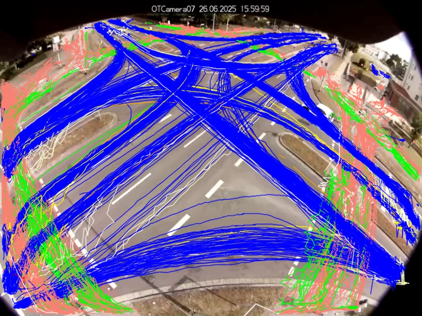
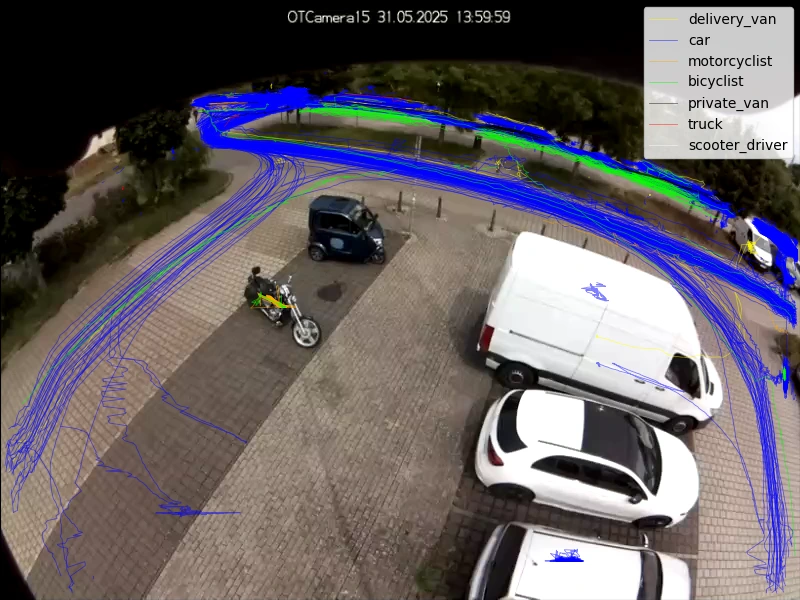

# Verkehrszählung: Fundierte Daten für eine zukunftsfähige Verkehrs- und Stadtplanung

E-Scooter neben Stadtbus, Lastenrad neben Elektro-SUV – der innerstädtische Verkehr ist so
vielfältig wie nie. Die wachsende Verkehrsbelastung trifft auf ein verändertes
Mobilitätsverhalten. Gleichzeitig wünschen sich die Menschen mehr Aufenthaltsqualität und
Sicherheit. Wie aber plant man urbane Infrastruktur, bewertet Verkehrsversuche und
priorisiert Maßnahmen angesichts dieser komplexen Ansprüche?

Die Grundlage dafür ist eine belastbare Verkehrszählung. Nur mit zuverlässig erfassten
Daten lassen sich Verkehrsstrukturen verstehen, bewerten und fundierte Maßnahmen ableiten.
Wir zeigen Ihnen, wie Sie als Kommune oder Verkehrs- und Stadtplaner datenschutzkonforme
digitale Verkehrszählungen in der Praxis fachlich einordnen, planen und bewerten.

<!-- more -->

## Was ist eine Verkehrszählung?

Eine Verkehrszählung erfasst Verkehrsströme und Verkehrszähldaten nach Zeit, Fahrtrichtung
und Verkehrsarten – an Querschnitten, Knotenpunkten oder im Netz. Sie ermöglicht
Vergleiche, Bemessungen nach HBS, Immissionsberechnungen (Lärm, Luft), die Bewertung von
Verkehrsversuchen und liefert Eingangsdaten für Verkehrsmodelle. Wichtig: Eine
Verkehrszählung liefert das Mengengerüst, erklärt aber keine Ursachen.

## Welche Arten der Verkehrszählung gibt es?

Eine klare Definition der Fragestellung bestimmt Verkehrsarten, Zeitraum und räumliche
Tiefe der Verkehrszählung sowie deren Auswertungsansatz. Auch welche Art der
Verkehrszählung sich am besten eignet, hängt davon ab.

### Manuelle Zählung

Bei der klassischen manuellen Verkehrszählung erfassen Mitarbeitende vor Ort den Verkehr
mit Papier und Stift oder Tablet.

- Sinnvoll für sehr kurze Zeitfenster, kleine Budgets oder sehr spezifische Kategorien,
  die automatisierte Systeme nicht abbilden können.
- Eventuelle Nachteile der Methode sind ein hoher Personalaufwand, die Fehleranfälligkeit
  und mangelnde Validierbarkeit sowie eine begrenzte zeitliche und inhaltliche Auflösung.
- Wenig geeignet für komplexe Knotenpunkte mit vielen Abbiegern.

### Automatische und teilautomatische Zählung

#### Dauerzählstellen

- Stationär installierte Systeme erfassen kontinuierlich – idealerweise 24/7/365, kommen
  jedoch vor allem auf Bundesfernstraßen oder an ausgewählten Dauerzählstellen zum Einsatz.
- Robuste Zeitreihen erlauben die Ableitung von Tages-, Wochen- und Saisoneffekten sowie
  DTV- und Jahreswerten.
- Induktionsschleifen auf Bundesfernstraßen ermöglichen eine Klassierung in definierte
  Fahrzeugarten.
- Innerorts kommen teilweise Infrarotsensoren zum Einsatz.
- Grenzen innerorts: Installation oft mit Eingriff in die Fahrbahn verbunden, evtl.
  beeinträchtigte Messungen durch Baustellen, Rad- und Fußverkehr oft nur eingeschränkt
  erfassbar.

#### Temporäre Zählstellen

- Kommen im Rahmen der Straßenverkehrszählungen als Ergänzung zu Dauerzählstellen zum
  Einsatz über Tage oder Wochen.
- Meist erfolgt die Verkehrserhebung durch Seitenradarsysteme auf temporären oder fest
  installierten Sockeln, was relativ aufwändig ist.
- Nur eingeschränkt multimodal einsetzbar.
- Wird an Querschnitten durchgeführt, aber nicht an Knotenpunkten oder anderen
  Infrastrukturelementen.

#### Videobasierte Kurzzeitzählungen

**Manuell**

- Videos werden aufgezeichnet und anschließend per Hand ausgewertet.
- Die Datenqualität liegt über der von rein manuellen Verkehrszählungen vor Ort, die Grenzen
  der Methode sind ähnlich.
- Als Validierung anderer Methoden ist dieses Verfahren gut geeignet – vorausgesetzt, das
  Zählpersonal arbeitet gewissenhaft.

**Automatisiert**

- Videobasierte Systeme erfassen im innerstädtischen Raum auch Knotenpunkte,
  Abbiegebeziehungen, gemischte Verkehre und komplexe Geometrien.
- Neben reinen Verkehrszähldaten liefern sie Abbiegerelationen, Fahrstreifennutzung und
  können Wartezeiten abbilden.

!!! info "Wichtig"

    Verkehrszählungen lassen sich fachlich nicht nur nach der eingesetzten Technik, sondern
    auch nach dem Zweck unterscheiden. Entscheidend ist dabei vor allem, welche
    Verkehrsarten erfasst werden, wo gezählt wird (Querschnitt, Knotenpunkt oder im Netz),
    mit welcher zeitlichen Tiefe und für welche Fragestellung.

## Welche Verkehrsarten können gezählt werden?

Je nach Fragestellung erfassen Sie in einer Verkehrszählung unterschiedliche Verkehrsarten –
vom Fuß- und Radverkehr über den motorisierten Individualverkehr bis hin zum ruhenden
Verkehr. Am Ende geht es darum, welche Daten Sie benötigen, um fundierte
Planungsentscheidungen zu treffen.

### Zählungen des Fuß- und Radverkehrs

Fuß- und Radverkehrszählungen erfassen Mengen und zeitliche Verteilungen an Querschnitten,
Knotenpunkten oder entlang von Straßenzügen. Typische Kenngrößen sind Verkehrsstärken,
Fahrtrichtungen und Tagesgänge.

Beide Verkehrsarten bewegen sich räumlich sehr flexibel: Spurwahl und Querungen variieren
stark. Zudem sind sie besonders abhängig von Infrastrukturqualität, Umwegen, Witterung und
Tageslicht.

In der Praxis nutzen Verkehrs- und Stadtplaner diese Zählungen zur Dimensionierung von Geh-
und Radverkehrsanlagen, zur Planung von Umgestaltungen wie neuen Querungen oder
Radstreifen sowie zur Sicherheitsbewertung an Knotenpunkten.

Allerdings lassen sich Fuß- und Radverkehr isoliert oft nur eingeschränkt interpretieren,
da ihr Verhalten stark vom Kfz-Verkehr beeinflusst wird – etwa durch Signalzeiten,
Rückstau, die Fahrbahnteilung oder Blockierungen.

### Zählungen des Kraftfahrzeugverkehrs

Bei der Verkehrsdatenerfassung des Kraftfahrzeugverkehrs erfassen Planungsstellen Pkw,
Lieferwagen und Schwerverkehr. Die räumlichen Ausprägungen umfassen Querschnittszählungen
für Belastungsanalysen und Knotenpunktzählungen für Abbiegebeziehungen.

Zentrale Anwendungsfälle sind Leistungsfähigkeitsnachweise, die Optimierung von
Lichtsignalanlagen und die Begleitung und Beurteilung von Verkehrsversuchen.

Planende sollten beachten, dass Querschnittszählungen allein keine Ursachen erklären.
Ebenso gibt die reine Verkehrszählung bzw. Fahrzeugzählung keinen Aufschluss über
Wechselwirkungen zwischen Verkehrsströmen.

### Multimodale Verkehrszählungen im urbanen Raum

Es gibt deutliche Unterschiede zwischen einer Verkehrszählung auf der Autobahn und im
städtischen Umfeld: In Städten treffen Kfz-, Rad- und Fußverkehr aufeinander.
Planungsteams müssen typische Fragestellungen daher immer verkehrsartenübergreifend
betrachten: Welche Verkehrsströme blockieren sich gegenseitig? Wo entstehen Konflikte
zwischen Abbiegern und Querungen? Welche Verkehrsart profitiert von oder leidet unter
bestimmten Maßnahmen?

Die multimodale Verkehrszählung ermöglicht eine konsistente Erfassung aller Verkehrsarten
am gleichen Ort und zur gleichen Zeit. So bilden Verkehrs- und Stadtplaner die tatsächliche
Verkehrssituation realistisch ab.

Gerade an Knotenpunkten erweist sich diese Art der Straßenverkehrszählung als besonders
sinnvoll. Schließlich wirken sich zum Beispiel Signalzeiten immer auf alle Verkehrsarten
aus und Maßnahmen für eine Verkehrsart haben automatisch Auswirkungen auf andere.

Eine videobasierte Verkehrserhebung mit einer Kamera ist hier in der Lage, alle
Verkehrsteilnehmenden synchron im selben Erfassungsbereich zu dokumentieren.

### Zählungen des ruhenden Verkehrs

Zählungen des ruhenden Verkehrs ergänzen die Betrachtung des fließenden Verkehrs. Relevante
Kenngrößen sind dabei Belegung, Parkdauer und Umschlag.

Der ruhende Verkehr ist ein wichtiger Bestandteil einer ganzheitlichen Verkehrszählung.
Beispielsweise beeinflusst Parksuchverkehr den Verkehrsfluss und die Sicherheit. Fehlende
oder mangelhafte Abstellanlagen wirken sich wiederum auf den Fuß- und Radverkehr aus.

## Was sind die Anforderungen an eine belastbare Verkehrszählung?

Eine Verkehrszählung ist nur so gut wie ihre Planung und Durchführung. Damit Sie
aussagekräftige Ergebnisse für Ihre Planungsentscheidungen erhalten, berücksichtigen Sie
insbesondere diese Aspekte:

- **Erst das Messdesign, dann die Technik:** Definieren Sie zunächst Messziel und relevante
  Kennwerte. Erst dann wählen Sie die passende Zählart aus.
- **Zeitliche Auflösung:** „Spitzenstunde", Tagesganglinie oder Mehrtagesmessung – innerorts
  schwanken Verkehre aufgrund von Schul- und Lieferverkehr oder Events sehr stark.
- **Knotenpunktlogik:** An Kreuzungen sind Abbiegebeziehungen oft wichtiger als reine
  Querschnittsmengen. Ohne diese Informationen optimieren Sie „blind".
- **Plausibilitätschecks und Validierung:** Überprüfen Sie die ermittelten Zahlen
  hinsichtlich Zu- und Ausfahrten, der Konsistenz von Fahrtrichtungen sowie möglicher
  Ausreißer durch Stau oder Blockierung. Automatische Zählungen sollten immer durch einen
  Menschen validierbar sein.
- **Qualität und Nachvollziehbarkeit:** Reproduzierbare Auswertungen und eine lückenlose
  Dokumentation (Zeiträume, Standort, Blickwinkel, Klassenlogik) machen Ergebnisse
  berichtsfähig und ermöglichen spätere Vergleiche.

## Was sind die Anwendungsbereiche einer Verkehrszählung?

Rechtfertigen die Verkehrsmengen einen zweiten Linksabbiegestreifen? Hat die Umgestaltung
zur Fahrradstraße funktioniert? Welche Knotenpunkte sollten Sie bei knappem Budget zuerst
angehen? Verkehrszählungen liefern die belastbaren Fakten, die Sie für solche
Entscheidungen benötigen.

### Verkehrsplanung

Verkehrszählungen bilden die Grundlage für die Dimensionierung von Infrastruktur, die
Bewertung bestehender Verkehrsführungen und die Planung von Umbauten oder
Verkehrsversuchen.

Zentrale Fragestellungen dabei sind: Wie verteilen sich Verkehrsströme im Tagesverlauf?
Welche Abbiegebeziehungen dominieren? Wo entstehen Engpässe und warum?

Da die Verkehrsarten im urbanen Raum ineinanderfließen und nicht getrennt optimiert werden
können, erfordert eine fundierte Planung eine multimodale Verkehrszählung. Schließlich
wirken Entscheidungen zu Fahrstreifen, Radwegen oder Querungen immer auf das Gesamtsystem.

### Verkehrssicherheit

Verkehrszählungen liefern das Mengengerüst, um Sicherheitsprobleme richtig einzuordnen. Die
Zählung allein beurteilt die Verkehrssicherheit jedoch nicht. Dafür ist eine tiefergehende
Verkehrsanalyse erforderlich.

Liegt der Fokus einer Verkehrszählung auf der Verkehrssicherheit, bewerten Planungsteams
meist unfallauffällige Knotenpunkte, konfliktträchtige Abbiegebeziehungen und sichere
Querungsstellen.

Konflikte entstehen häufig zwischen Kfz, Rad- und Fußverkehr. Die gleichzeitige Erfassung
aller Verkehrsarten erhöht daher die Aussagekraft einer Verkehrszählung deutlich.

### Umwelt- und Wirkungsanalysen

Verkehrszählungen bilden die Grundlage für Emissions- und Lärmbewertungen, die Abschätzung
von Verkehrsverlagerungen und die Erfolgskontrolle von Maßnahmen.

Dabei ist nicht nur die Verkehrsmenge von Interesse, sondern auch deren zeitliche
Verteilung. Kurzzeitmessungen reichen hierfür oft nicht aus. Für belastbare Vergleichswerte
setzen Planungsteams in der Regel auf mehrtägige automatische Verkehrszählungen.

### Ganzheitliche Betrachtung des urbanen Verkehrs

Moderne Verkehrszählungen betrachten den Stadtraum als vernetztes System. Erst die
Kombination aus multimodaler Erfassung, ausreichender zeitlicher Tiefe und konsistenter
Auswertung ermöglicht fundierte Entscheidungen in Planung, Betrieb und Bewertung.

## Verkehrszählung: Unverzichtbar für datenbasierte Entscheidungen in der Stadtplanung

Eine belastbare Verkehrszählung liefert Ihnen die Datenbasis, um Verkehrsräume zu
verstehen, Maßnahmen fundiert zu bewerten und Infrastruktur zukunftsfähig zu gestalten.
Gerade im komplexen urbanen Umfeld, wo verschiedene Verkehrsarten ineinanderfließen, sind
automatisierte, videobasierte Verfahren zunehmend unverzichtbar.

Lösungen wie OpenTrafficCam unterstützen Verkehrs- und Stadtplaner bei einer
datenschutzkonformen digitalen Verkehrszählung mit Kamera – von der videobasierten
Datenerhebung bis zur anschließenden Trajektorienanalyse mit OTAnalytics. So treffen Sie
Entscheidungen zur Infrastrukturplanung und zur Bewertung verkehrlicher Maßnahmen auf einer
belastbaren, nachvollziehbaren Grundlage.

!!! info "Kontakt aufnehmen und mehr erfahren"

    Sie möchten mehr darüber erfahren, wie eine Verkehrszählung mit anschließender
    Auswertung Ihr aktuelles Projekt unterstützen kann? Dann [nehmen Sie jetzt für eine
    individuelle Beratung Kontakt zu uns auf](https://opentrafficcam.org)!
