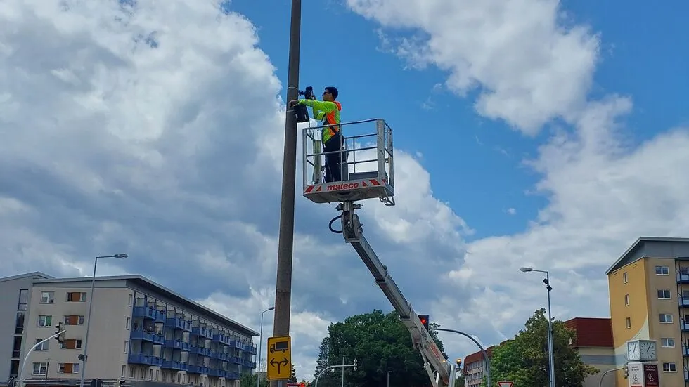
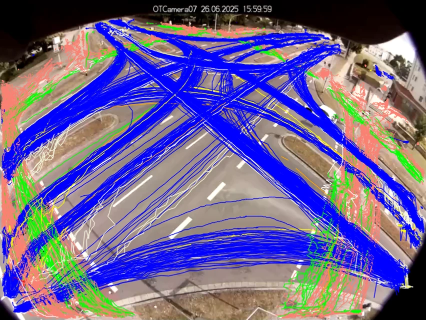

# Kamera für Verkehrszählung: So unterstützt sie eine moderne Verkehrsplanung

Ob Leistungsfähigkeitsnachweise, Neu- oder Umbauten oder die Optimierung von
Lichtsignalanlagen – Kommunen und Ingenieurbüros benötigen verlässliche Daten zu allen
Verkehrsmodi, um Entscheidungen in der Verkehrsplanung objektiv begründen zu können.
Angesichts der komplexen Anforderungen setzen Städte und Planer daher auf kamerabasierte
Verkehrszählungen.

Die Verkehrszählung mit Kamera deckt große Erfassungsbereiche ab und liefert detaillierte
Einblicke ohne viel Aufwand. Lesen Sie hier, welche Vor- und Nachteile Kameras bei
Verkehrszählungen haben und was Sie beim Kauf der Technik beachten sollten.

<!-- more -->

## Wie funktioniert eine Verkehrszählung mit Kamera?

Nach der Montage und Ausrichtung der Kamera zeichnet diese den Verkehr über einen
gewünschten Zeitraum auf. Anschließend erkennt und klassifiziert eine KI die Fahrzeuge in
den Bildern und verfolgt sie über mehrere Einzelbilder hinweg. Verkehrs- und Stadtplaner
sind so in der Lage, Bewegungen zu analysieren und in auswertbare Kenngrößen umzuwandeln.
Alternativ werden die aufgezeichneten Videos von Zählpersonal ausgewertet.

### Welche Systeme für die Verkehrszählung mit Kamera gibt es?

Grundsätzlich gibt es zwei unterschiedliche Kamerasysteme, die ähnliche Anforderungen an
das Datenschutzkonzept stellen:

- **Direkt verarbeitende Systeme:** Sie analysieren das Video direkt im Gerät und
  speichern es in der Regel nicht.
- **Aufzeichnende Systeme (wie z. B. OpenTrafficCam):** Sie speichern Videos für die
  nachträgliche Bearbeitung, was mehr Flexibilität bei Auswertung und Analyse bedeutet.

## Was sind die Vorteile einer Verkehrszählung mit Kamera?

Die Verkehrszählung mit Kameras ist vielen
[Verkehrszählgeräten](verkehrszaehlgeraete.md) in mehreren
Punkten voraus. Dabei lassen sich die Vorteile in drei Themenfelder einordnen:

### Automatisierte & präzise Datenerfassung

- **Ganzheitliche Datentiefe statt reiner Zählung:** Viele Kameras ermöglichen es, nicht
  nur Verkehrszähldaten oder Verkehrsstärken zu erheben. In der angeschlossenen Analyse
  lassen sich auch komplette Trajektorien, Fahrzeugklassen und Bewegungsmuster erkennen.
  Das heißt: Es bleibt nicht bei einfachen Zähldaten, sondern es werden echte
  Verkehrsanalysen möglich – auch zu einem späteren Zeitpunkt.
- **Hohe Genauigkeit:** Bei einer passenden Kameraposition sowie guten Licht- und
  Wetterbedingungen können Verkehrs- und Stadtplaner Verkehrsteilnehmende sehr genau
  erfassen. Auch die Fahrtrichtung und der Verkehrsstrom lassen sich bei einer
  Verkehrszählung mit Kamera zuverlässig dokumentieren.
- **Automatische Verkehrsdatenerfassung:** Ungenauigkeiten und Fehler, wie sie bei
  manuellen Zählungen z. B. durch Aufmerksamkeitsschwankungen des Zählpersonals auftreten
  können, werden deutlich reduziert.
- **Erfassung ganzer Szenen und komplexer Situationen:** Kameras haben nicht nur einzelne
  Fahrstreifen im Blick, sondern auch komplette Knotenpunkte, temporäre Verkehrsführungen
  und multimodalen Mischverkehr.
- **Langfristige Messung möglich:** Mit dauerhafter Stromversorgung und kontinuierlicher
  Datenverbindung können Kameras über einen längeren Zeitraum eingesetzt werden.

### Effizienz & Integration im Messprozess

- **Zeitersparnis durch automatisierte Auswertung:** Kameras, die Videos selbst
  analysieren oder deren Videos nachträglich über eine Software ausgewertet werden können,
  verringern den Zeitaufwand erheblich.
- **Kosteneffizienz:** Eine Kamera zur Verkehrszählung lässt sich schnell und einfach
  montieren und reduziert dank automatisierter Auswertungen Personalkosten. Gleichzeitig
  sind die Ausgaben für Hardware gering, da bei vielen temporären Messungen keine feste
  Strom- oder Dateninfrastruktur erforderlich ist.
- **Nahtlose digitale Integration:** Vom Aufzeichnen der Bilder über KI-Erkennung bis zur
  Analyse läuft alles digital. Aus den Kamerabildern generiert eine Software im Nachgang
  direkt auswertbare Ergebnisse wie Verkehrsflüsse, Heatmaps oder Zeitreihen.
- **Flexible Montage:** Städte und Kommunen können Kameras unkompliziert so ausrichten,
  dass sie optimale Sicht auf Knotenpunkte oder Streckenabschnitte bieten.

### Praxis- & Zukunftsfähigkeit

- **Projektbasierte Einsetzbarkeit:** Wetterfeste mobile Kameras für die Fahrzeugzählung
  lassen sich ohne bauliche Eingriffe installieren und tagelang autonom betreiben – ideal
  für temporäre Projekte, Machbarkeitsstudien oder Verkehrskonzepte.
- **Umfangreiche Auswertungsmöglichkeiten:** Aus aufgezeichneten Videos können Stadt- und
  Verkehrsplaner ganze Trajektorien analysieren sowie Wartezeiten, Parkdauern oder
  Sättigungsverkehrsstärken bestimmen. Auch weitere nachträgliche Analysen – wie z. B. die
  Wartezeit von Radfahrenden – sind jederzeit möglich.
- **Wetterunabhängiger Betrieb:** Die Kameras sind grundsätzlich sehr robust.
  Einschränkungen gibt es nur bei Extremwetter wie Nebel oder Starkregen.
- **Datenschutzkonformität:** Datenschutz und Kamera stehen bei vielen Menschen oft im
  Widerspruch. Mit dem passenden Prozess, den richtigen technischen und organisatorischen
  Maßnahmen (TOM) sowie passender Konfiguration werden die gesetzlichen
  Datenschutzanforderungen erfüllt – bei aufzeichnenden wie verarbeitenden Kameras
  gleichermaßen.
- **Zukunftssicherheit durch KI:** Moderne Algorithmen wie YOLO erkennen verschiedene
  Verkehrsteilnehmer präzise und lassen sich durch gezielte Updates der Modelle auch für
  spezifische Klassen (z. B. Lastenräder oder eScooter) erweitern. Wenn es um multimodale
  Verkehrszählungen geht, führt heute kein Weg an der videobasierten Verkehrszählung
  vorbei.

## Gibt es auch Nachteile bei der Kamera-Verkehrszählung?

Trotz aller Vorteile gibt es Einschränkungen bei der Verkehrszählung mit Kamera:

- **Abhängigkeit von Aufnahmebedingungen:** Schlechte Lichtverhältnisse, Nebel, Starkregen
  oder eine ungünstige Kameraposition können die Datenqualität beeinträchtigen.
- **Höherer Planungs- und Qualitätsaufwand:** Montage, Blickwinkel und Analyseparameter
  müssen sorgfältig geplant werden. Ob bei der Verkehrszählung per Kamera auf der Autobahn
  oder an einer LSA – es ist immer eine fachliche Plausibilitätsprüfung des Messaufbaus
  sowie der Ergebnisse notwendig.
- **Begrenzte Aussagekraft bei unzureichender Auswertung:** Ohne eine geeignete Software
  oder ein leistungsfähiges KI-Modell liefern Kameras im schlechtesten Fall nur
  personalintensive, simple Zählwerte und keine belastbare Verkehrsanalyse.

!!! info "OpenTrafficCam"

    Erweist sich eine Kamera als die passende Lösung für ein Projekt, ist entscheidend, dass
    Hardware und Auswertung zu den fachlichen Anforderungen der Verkehrszählung passen.
    Moderne Systeme kombinieren dabei Datenerfassung, Datenschutz und Analyse in einem
    durchgängigen Workflow. Ein Beispiel dafür ist unsere
    [OTCamera](../../OTCamera/index.md), die gemeinsam mit unserer nachgelagerten
    KI-basierten Auswertung und Analyse ein stimmiges und konsistentes Gesamtsystem bildet.

## Kamera für Verkehrszählung kaufen: Worauf Sie achten sollten

Zur Erinnerung: Grundsätzlich lassen sich direkt verarbeitende Systeme und aufzeichnende
Systeme unterscheiden. Dazu sollten Sie folgende Kriterien in Ihre Kaufentscheidung
einfließen lassen:

### Maximale Aufzeichnungsdauer

Die maximale Aufzeichnungsdauer entscheidet, wie lange eine Messkampagne ohne
Unterbrechung laufen kann. Längere Laufzeiten bedeuten weniger Personalaufwand und eine
bessere Datenkontinuität und Flexibilität. Mit langer Akkulaufzeit lassen sich auch
mehrere Messungen hintereinander durchführen.

### Montage

Achten Sie auf eine flexible Montagemöglichkeit. Je weniger Installationszeit, desto
kürzer sind eventuelle Verkehrseinschränkungen und desto niedriger sind die Kosten bei
temporären Zählungen. Bei Kameras zählt vor allem die einfache Ausrichtbarkeit, z. B. mit
einem Kugelkopf.

### Vandalismussicherheit

Kameras, die hoch genug außerhalb der Reichweite von Passanten hängen, sind kaum
angreifbar. Zudem sind diese Systeme leichter und unauffälliger, so dass sie das
"natürliche" Verhalten der Verkehrsteilnehmer nicht beeinflussen. Zudem benötigen sie
weniger Platz im Lager bzw. Büro.

### Anschaffungskosten

Direkt verarbeitende Systeme sind oft teurer und mit weiteren laufenden Kosten verbunden
als aufzeichnende Systeme, die außerdem mit mehr Auswertungs- und Einsatzmöglichkeiten
überzeugen.

### Flexibilität

Kameras mit nachträglicher Verarbeitung ermöglichen weit mehr als reine Zählungen. Sie
erlauben die tiefe Analyse vollständiger Trajektorien. Neben der automatisierten Analyse
können Videos zudem gezielt vorgefiltert werden, etwa nach potenziell kritischen
Situationen.

### Validierbarkeit

Aufzeichnende Systeme ermöglichen es, unplausible Daten durch Einsicht in das Video zu
überprüfen und durch eine gezielte Validierung die höchste Zählgenauigkeit zu erreichen.

### Herstellerabhängigkeit

Open Source-Systeme wie unsere OpenTrafficCam sind unabhängig von Hersteller-Codes, so
dass Sie bei der Auswertung der Videos keinem Herstellerzwang unterliegen. Es gibt
zahlreiche Kamera-Anbieter, bei denen Sie sich an deren Auswertungstools binden.

### Datenerhalt

Wie effizient Sie die Daten aus der Kamera in Auswertungs- oder Analyseplattformen
integrieren können, entscheidet der Übertragungsweg. Mit einer automatisierten und
flexiblen Übertragung sparen Sie Arbeitszeit und minimieren die Fehlerwahrscheinlichkeit.

### Steuerung

Manche Verkehrszählungs-Kameras können nur rund um die Uhr im Dauerbetrieb aufzeichnen,
andere dank Timer-Funktion auch ausschließlich relevante Zeiten erfassen. Die jeweiligen
Steuerungsoptionen beeinflussen, wie präzise und situationsabhängig Zählungen geplant
werden können, und wirken sich auf die Datenschutzkonformität sowie die Akkulaufzeit aus.

### Betriebssicherheit

In puncto Betriebssicherheit ist ein Fernzugriff, etwa per WLAN oder Remote-Interface,
sinnvoll: Er reduziert Wartungsfahrten und zeigt Probleme oder eine notwendige
Standortanpassung in Echtzeit auf.

### Datenschutz

Öffentliche Verkehrsaufnahmen sind nur zulässig, wenn sie DSGVO-konform anonymisiert oder
pseudonymisiert werden – etwa durch sofortige Pixelung oder lokale Verarbeitung ohne
Personenbezug. Das müssen Stadt- und Verkehrsplaner korrekt umsetzen und dokumentieren.

Hersteller von Verkehrszählungs-Kameras sollten darauf hinweisen, dass der Datenschutz
schon in der Kampagnenplanung berücksichtigt und jedes Mal individuell abgestimmt werden
muss – und ihre Kunden dabei unterstützen. Eine pauschale "Datenschutzkonformität" gibt es
nicht.

### Prozessierung

Entscheidend für eine belastbare Datenqualität ist, dass eine Kamera oder die
entsprechende nachgelagerte Verarbeitung über eine zuverlässige Objekterkennung (PKW, LKW,
Radfahrer oder Fußgänger) und -verfolgung verfügt.

### Qualität bei Nacht oder schlechten Lichtverhältnissen

Nur Kameras mit guter Low-Light-Performance liefern auch bei Dunkelheit verwertbare
Ergebnisse. Achten Sie beim Kauf auf dieses Feature, wenn Sie eine Verkehrszählung mit
Kamera rund um die Uhr planen und auch auf wechselnde Bedingungen vorbereitet sein
möchten.

### KI-Leistung für Analyse

Da die Analyse bei direkt verarbeitenden Systemen im Akku-Betrieb erfolgt, müssen dort
stromsparende KI-Modelle eingesetzt werden, die weniger leistungsfähig sind. Bei
aufzeichnenden Systemen wie die OpenTrafficCam können Sie dagegen nachträglich mehr
Rechenleistung nutzen – und für jede Szene das passende leistungsstarke KI-Modell
auswählen.

## Mit einer Kamera die volle Kontrolle über Verkehrsdaten gewinnen

Mit der Verkehrszählung per Kamera erfassen Kommunen und Planer Verkehrsdaten schnell,
präzise und flexibel – von reinen Zählwerten bis hin zu detaillierten Bewegungsanalysen.
Und das inklusive automatisierter Auswertung und mit voller Datenkontrolle.

!!! info "Kontakt aufnehmen und mehr erfahren"

    Sie möchten mehr darüber erfahren, wie Sie durch eine Verkehrszählung mit Kamera
    belastbare Daten für eine zukunftssichere Verkehrsplanung gewinnen? Dann [kontaktieren Sie
    uns jetzt für ein
    Beratungsgespräch](https://outlook.office.com/book/OpenTrafficCam@platomo.de/?ismsaljsauthenabled=true)
    und erfahren Sie mehr über unser praxisbewährtes System!
