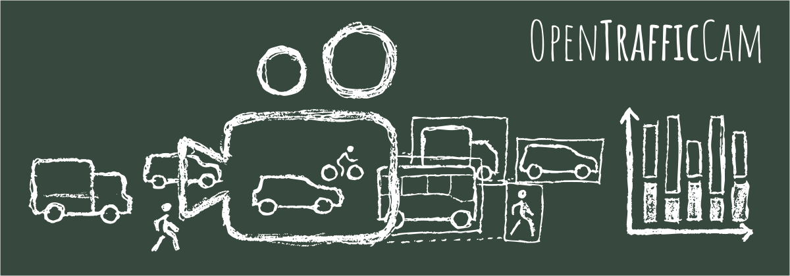
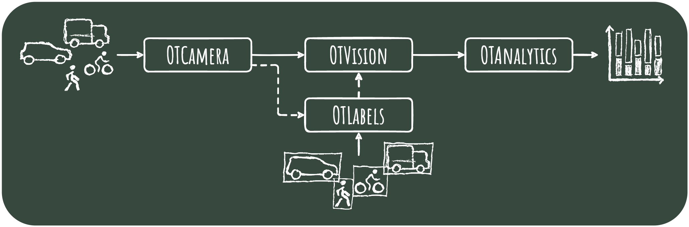
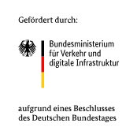

# Welcome to OpenTrafficCam

> Open**Traffic**Cam makes analyzing traffic easier, faster and more efficient.

Welcome to **OpenTrafficCam**, the only fully integrated open source workflow for video-based recording
and automated analysis of road traffic.

This website will cover all the documentation in one place.

Check out our [GitHub page](https://github.com/OpenTrafficCam) for downloads and code.

## Motivation

Thanks to the rapid development of computer hardware and machine learning in the last decade,
the automatic object detection is state of the art in many business sectors.
Road traffic, on the other hand, is still often surveyed manually at great expense.
There exist tools that optimize some of the processing steps,
but they can hardly be used without programming skills or they cause significant costs.
This is why research and planning still have to be conducted with minimal data or sometimes without any at all.
This lack of data primarily affects sustainable modes of transportation such as walking and bicycling.

OpenTrafficCam aims at adressing this gap and creating a stronger data base
for transportation planning, policy and research.
In doing so, we ourselves benefit substantially from other open source projects.
Consequently, we also publish large parts of OpenTrafficCam as open source hardware and software
under the GPL license.
This also helps in efficiently using limited public resources for road infrastructure planning and research
and in avoiding substantial vendor locks.
So all transport professionals and anyone else interested are very welcome to try OpenTrafficCam.

!!! hint "You want to support?"

    Developing, maintaing and organizing open source requires quite a lot of time and money.
    But fortunately, there are several ways to support us:

    - Traffic engineers can help by spreading the word and submitting questions, bugs or feature ideas as issues
        in the corresponding GitHub repositories of the modules
        [**OTCamera**](https://github.com/OpenTrafficCam/OTCamera),
        [**OTVision**](https://github.com/OpenTrafficCam/OTVision),
        [**OTAnalytics**](https://github.com/OpenTrafficCam/OTAnalytics) or
        [**OTLabels**](https://github.com/OpenTrafficCam/OTLabels).
    - Researchers and developers can support by [**contributing code**](https://opentrafficcam.org/contribute/)
        or [contacting us](mailto:team@opentrafficcam.org) for scientific collaboration.

## How it works

OpenTrafficCam consists of three modules. The [**OTCamera**](https://opentrafficcam.org/OTCamera/) hardware itself to record videos,
[**OTVision**](https://opentrafficcam.org/OTVision/), a collection of algorithms to generate trajectories
of objects (road users) based on the videos and
[**OTAnalytics**](https://opentrafficcam.org/OTAnalytics/) to gather traffic measures based on the trajectories.
Each of the three modules comes with easy installation, a basic graphical user interface and a detailed user documentation.
The Open Source version offers the most common use cases of video-based traffic surveying,
such as traffic counts and speed measurements.

In addition to the three main modules, we will provide a set of labelled images of German traffic objects with
[**OTLabels**](https://opentrafficcam.org/OTLabels/).

As described on the following pages of this documentation, some manual work, patience and basic technical skills
are required to assemble OTCamera.
And in order to regularly extract trajectories from videos using OTVision oder train your own AI using OTLabels,
you will need a powerful machine with a strong graphics card.

!!! check "Don´t want to deal with it? We got your back!"
    We offer various services related to OpenTrafficCam:

    :material-video-wireless: Selling and renting OTCameras

    :material-image-search: Processing and analyzing your videos

    :material-check-network: Setting up the OpenTrafficCam pipeline in your environment

    :material-video-marker: Conducting whole traffic surveys for you

    :material-cloud-braces: Developing features beyond the current open source version

    :material-projector-screen: Courses on how to set up, use and get the best out of OpenTrafficCam

    :material-account-supervisor: Consulting on traffic analysis, modeling and optimization

    [:octicons-mail-16: Contact us for more information](mailto:team@opentrafficcam.org){ .md-button }

<!-- TODO #49 Short description about Usecases -->

## Who we are

OpenTrafficCam is coordinated and lead developed by the German startup
[**platomo**](https://platomo.de/),
a team of traffic engineers, software and hardware developers.
The core team also includes traffic and photogrammetry researchers from the
[**TU Dresden**](https://tu-dresden.de/bu/verkehr/ivs/ivst).

 

{style="padding:20px"}
{style="padding:20px"}

 

OpenTrafficCam is funded by the **German Federal Ministry Digital and Transport**
as part of the research initiative **mFUND**.

{style="padding:20px"}
{style="padding:20px"}
