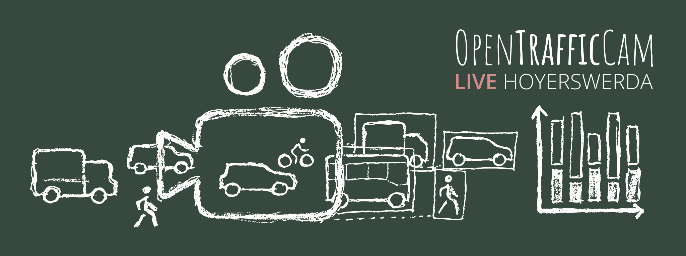
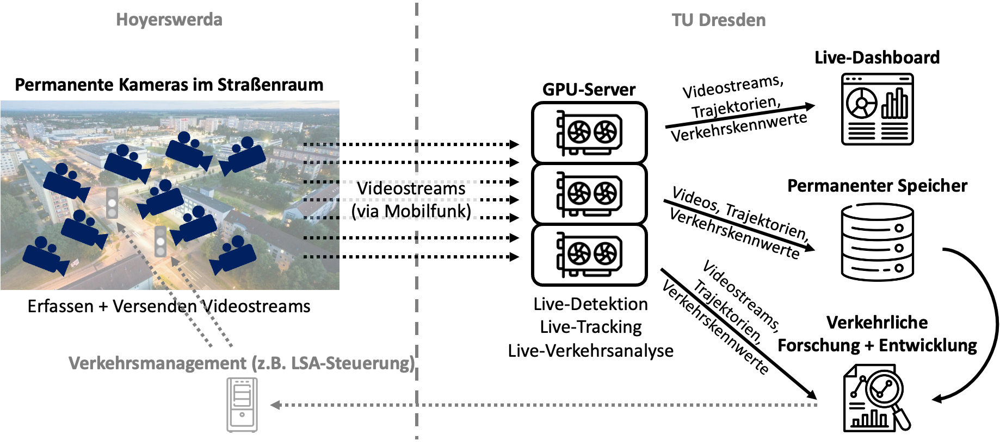
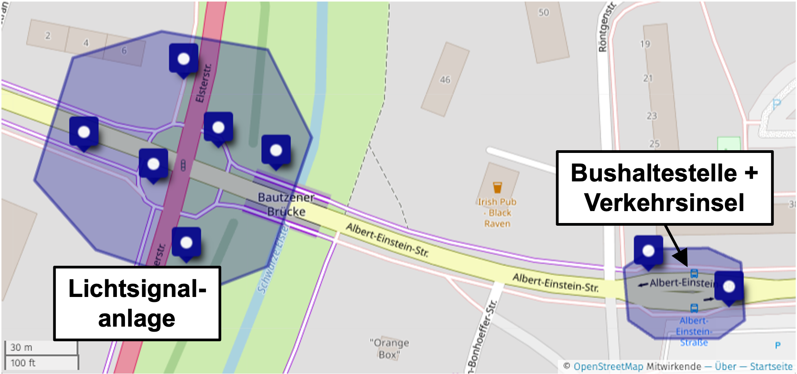
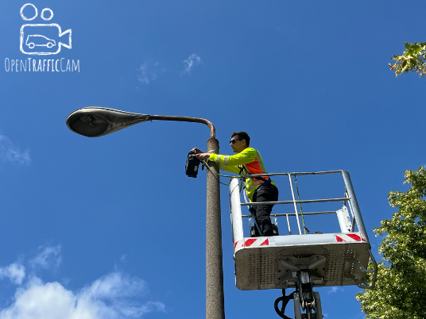
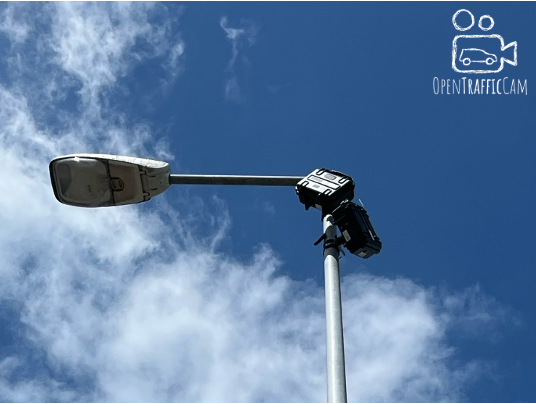
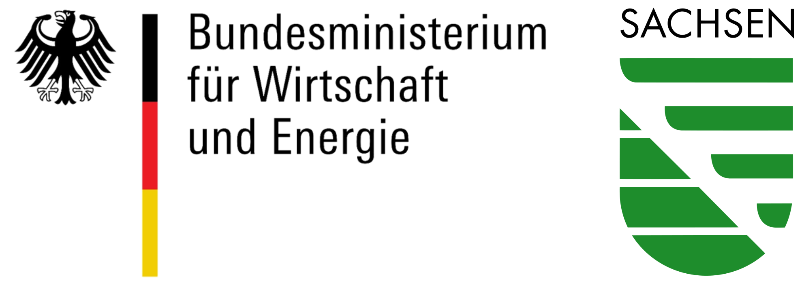

<!-- markdownlint-disable-next-line MD025 -->
# OpenTrafficCam LIVE Hoyerswerda

**OpenTrafficCam** wird in zahlreichen Projekten **in Forschung und Praxis erfolgreich eingesetzt**.
Dabei wird der Straßenverkehr **temporär erfasst** und anschließend **automatisiert analysiert**.

Im Rahmen einer mFund-Förderung wurde die Basis für die Live-Prozessierung der erfassten Verkehrsvideos gelegt.
Aufbauend auf diesen Arbeiten erfolgt nun eine Implementierung vor Ort in Hoyerswerda.
OpenTrafficCam LIVE wird dabei um die spezifischen Anforderungen der TU Dresden und der Stadt Hoyerswerda erweitert.
Diese umfassen sowohl technischen Anforderungen im Hintergrund als auch neue Auswertungen und Darstellungen der Verkehrsdaten.

Im Ergebnis werden mit **OpenTrafficCam LIVE** der Straßenverkehr in Hoyerswerda **permanent erfasst** und die **Videostreams in Echtzeit verkehrlich analysiert**.
Dadurch wird es möglich, Verkehrsdaten nicht nur retrospektiv auszuwerten, sondern unmittelbar für Verkehrsmanagement, Öffentlichkeitsinformation oder vernetzte Systeme nutzbar zu machen.

[Kontaktieren Sie uns](mailto:team@opentrafficcam.org?subject=Anfrage%20zu%20OpenTrafficCam%20LIVE%20Hoyerswerda){ .md-button .md-button--primary }

## Ziele

Mit OpenTrafficCam LIVE Hoyerswerda entwickeln wir ein Reallabor für den Straßenverkehr.
Damit sollen Verkehrsbewegungen automatisiert, permanent und in Echtzeit erfasst und analysiert werden.
Dabei steht nicht nur die reine Zählung Verkehrteilnehmender im Fokus – sondern ein tiefes Verständnis für Verhalten, Nutzungsmuster und Sicherheitsaspekte im Straßenverkehr.

So soll OpenTrafficCam LIVE Hoyerswerda Forschung und Entwicklung in folgenden Bereichen ermöglichen:

- Automatisierte Verkehrserfassung,

- Verhaltens- und Sicherheitsanalysen im Straßenraum,

- smartes, situationsabhängiges Verkehrsmanagement sowie,

- automatisiertes und vernetztes Fahren.

Gleichzeitig soll das System wertvolle Informationen für die Verkehrsplanung und -lenkung in Hoyerswerda liefern, unter anderem in den Bereichen Verkehrsmodellierung und Verkehrssicherheit.

Auch für andere Städte und Verwaltungen wird OpenTrafficCam LIVE Als Open Source-Alternative zu proprietären Anbietern verfügbar sein.

OpenTrafficCam LIVE soll als offenes System Transparenz schaffen, digitale Souveränität stärken und für Forschung und Praxis gleichermaßen nutzbar sein.

## Umsetzung

### Technische Umsetzung

Der Straßenverkehr wird mit **[OTCamera](../OTCamera)** aufgezeichnet und die Videostreams werden per **Mobilfunk (LTE/5G)** an das Rechenzentrum der **TU Dresden** übertragen.
Dort erfolgen in Echtzeit mit **[OTVision](../OTVision)** KI-basierte Detektion und Tracking sowie mit **[OTAnalytics](../OTAnalytics)** die Bestimmung von Verkehrskennwerten.
Die ermittelten Informationen werden per **Web-Dashboard** visualisiert und stehen für **Forschung, Entwicklung und lokale Verkehrsplanung** zur Verfügung.

**Perspektivisch** sollen die Live-Informationen für Forschung und Entwicklung im Bereich **intelligentes Verkehrsmanagement** verwendet werden (zum Beispiel dynamische LSA-Steuerung).

!!! info "Das System im Überblick"

    

### Untersuchungsbereiche

Das Reallabor umfasst zwei Untersuchungsbereiche in der Neustadt Hoyerswerdas mit 8 Messstellen und 19 Kamerasystemen.

!!! location "Untersuchungsbereiche und Messstellen"

    === "Untersuchungsbereiche"

        <iframe width="100%" height="500px" frameborder="0" allowfullscreen allow="geolocation" src="//umap.openstreetmap.de/de/map/reallabor-hoyerswerda_43891?scaleControl=false&miniMap=true&scrollWheelZoom=false&zoomControl=true&editMode=disabled&moreControl=false&searchControl=null&tilelayersControl=null&embedControl=null&datalayersControl=null&onLoadPanel=none&captionBar=false&captionMenus=false&datalayers=566666d4-31ed-4285-8191-6cb2ddf2ec61&captionControl=null#15/51.4438/14.2641"></iframe>

    === "Messstellen Neustadt Ost"

        { width="500"}

        Messstellen:

        - **🚦 Lichtsignalanlage** Knotenpunkt Claus-vonStauffenberg-Straße / Maria-Grollmuß-Straße / Erich-Weinert-Straße / Käthe-Niederkirchner-Straße
        - **🛣️ Zufahrt** zu dieser Lichtisgnalanlage aus Richtung Osten (Maria-Grollmuß-Straße)
        - **🅿️ Ein-/Ausfahrt** des Parkplatzes zum Einkaufscenter "Treff 8"
        - **🚌 Bushaltestelle** "Klinikum"
        - **🚶 Fugßgänger-Lichtsignalanlage** zwischen "Lausitzer Seenland Klinikum" und Einkaufscenter "Treff 8"

    === "Messstellen Neustadt West"

        { width="500"}

        Messstellen:

        - **🚦 Lichtsignalanlage** Knotenpunkt B97 Elsterstraße / Albert-Einstein-Straße / Alte Berliner Straße
        - **🚌 Bushaltestelle** "Albert-Einstein-Straße"
        - **🚶 Verkehrsinsel** "Albert-Einstein-Straße"

## Projektfortschritt

??? success "04/2025: Projektstart"

    Im **April 2025** begann das Projekt zur Weiterentwicklung von OpenTrafficCam zu einem Live-System.

??? success "06/2025: Kickoff und Testmessung"

    Im **Juni 2026** fanden das Kickoff mit der Stadt Hoyerswerda und eine temporäre Testmessung im Untersuchungsbereich "Hoyerswerda Neustadt Ost" mit 21 Kamerasystemen statt.

    !!! impressions "Impressionen"

        

        -   <figure markdown="span">
            { width="400" }
            <figcaption>Anbringung OTCameras</figcaption>
            </figure>

        -   <figure markdown="span">
            { width="400" }
            <figcaption>Montierte OTCameras</figcaption>
            </figure>

        -   <figure markdown="span">
            { width="400" }
            <figcaption>Kickoff 1/2 (Quelle: Wochenkurier/Peter Aswendt)</figcaption>
            </figure>

        -   <figure markdown="span">
            { width="400" }
            <figcaption>Kickoff 2/2 (Quelle: SZ/Juliane Mietzsch)</figcaption>
            </figure>

        

    !!! news "Presseberichte"

        [Radio Lausitz: "Hoyerswerda wird zum Labor für Verkehrsforscher"](https://www.radiolausitz.de/beitrag/titel-10-870898/)

        [Wochenkurier: "Smarter Verkehr in Hoyerswerda"](https://www.wochenkurier.info/landkreis-bautzen/artikel/smarter-verkehr-in-hoyerswerda)

        [Sächsische Zeitung: "Verkehrsforscher überwachen die Klinikums-Kreuzung in Hoyerswerda"](https://www.saechsische.de/lokales/bautzen-lk/hoyerswerda/mit-kameras-an-laternen-verkehrsforscher-ueberwachen-klinikums-kreuzung-in-hoyerswerda-SSTDLWW2PVG5LAD6PSPVZL3EWY.html)

        [Lausitzwelle: "Kameras beobachten Verkehrslage"](https://lausitzwelle.de/hoyerswerda-kameras-beobachten-verkehrslage/)

        <iframe
            src="https://www.youtube.com/embed/sOBw3qL1ojY"
            title="YouTube video player" frameborder="0"
            style="width: 100%; aspect-ratio: 16 / 9; border: none;"
            allow="accelerometer; autoplay; clipboard-write; encrypted-media; gyroscope; picture-in-picture; web-share"
            allowfullscreen>
        </iframe>
    
!!! goal "09/2026: Go-Live"

## Ausblick

Die Entwicklung von OpenTrafficCam LIVE soll bis Ende 2026 abgeschlossen sein.

Dann wird das Reallabor Hoyerswerda in Betrieb genommen und für Forschungsprojekte an der TU Dresden und weiteren Hochschulen zur Verfügung stehen.
Die erfassten Daten und Kennwerte werden außerdem für die Verkehrsplanung in der Stadt Hoyerswerda verwendet.

OpenTrafficCam kann darüber hinaus als Live-System für verschiedene Anwendungsfälle in weiteren Kommunen oder Bundesländern eingesetzt werden.

## Beteiligte

<!-- markdownlint-disable-next-line MD033 -->

- **Fördergeber**

    ---

    [Bundesministerium für Wirtschaft und Energie](https://www.bundeswirtschaftsministerium.de/Navigation/DE/Home/home.html)

    [Land Sachsen](https://www.sachsen.de/)

    ---

    { width="300" }

- **Fördernehmer und Auftraggeber**

    ---

    [TU Dresden](https://tu-dresden.de)

    [Professur für Mobilitätssystemplanung](https://tu-dresden.de/bu/verkehr/ivs/msp)

    ---

    { width="300" }

- **Auftragnehmer**

    ---

    [platomo GmbH](https://platomo.de/)

    ---

    { width="200" }

- **Kommunaler Partner**

    ---

    [Stadt Hoyerswerda](https://www.hoyerswerda.de/)

    ---

    { width="200" }

