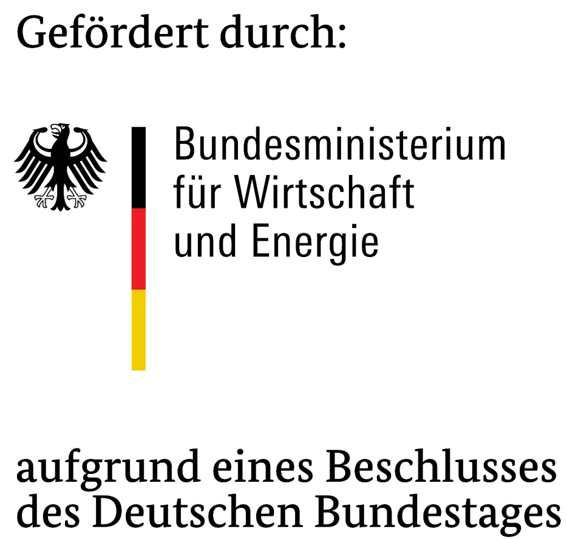
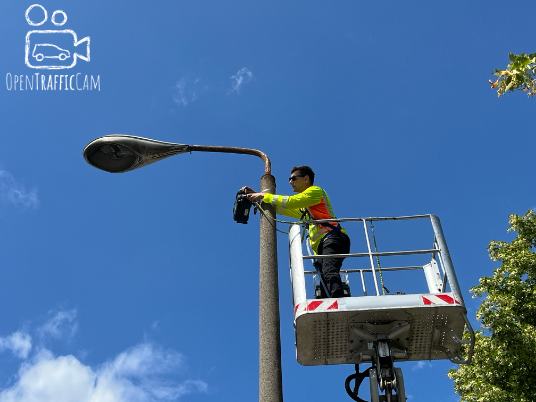
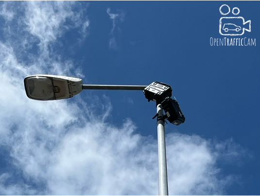

# OpenTrafficCam LIVE Hoyerswerda

Das System **OpenTrafficCam** wird in zahlreichen Projekten in **in Forschung und Praxis erfolgreich eingesetzt**.
Dabei wird der Straßenverkehr **temporär erfasst** und anschließend **automatisiert analysiert**.

Im Rahmen dieses Projekts erfolgt nun ein entscheidender nächster Schritt: die Weiterentwicklung zu **OpenTrafficCam LIVE** mit **permanenter Verkehrserfassung** und **Echtzeit-Verkehrsanalyse**.

Dadurch wird es möglich, Verkehrsdaten nicht nur retrospektiv auszuwerten, sondern live zu interpretieren und unmittelbar für Verkehrsmanagement, Bürgerinformation oder vernetzte Systeme nutzbar zu machen.

## Ziele

Mit OpenTrafficCam LIVE Hoyerswerda entwickeln wir ein Reallabor für den Straßenverkehr.
Damit sollen Verkehrsbewegungen automatisiert, permanent und in Echtzeit erfasst und analysiert werden.
Dabei steht nicht nur die reine Zählung Verkehrteilnehmender im Fokus – sondern ein tiefes Verständnis für Verhalten, Nutzungsmuster und Sicherheitsaspekte im Straßenverkehr.

Durch den Einsatz von OpenTrafficCam und begleitender Infrastruktur entsteht eine datengetriebene Grundlage für Forschung und Entwicklung – etwa in den Bereichen:

- automatisierte Verkehrserfassung,

- Verhaltens- und Sicherheitsanalysen im Straßenraum,

- smartes, situationsabhängiges Verkehrsmanagement sowie,

- automatisiertes und vernetztes Fahren.

Gleichzeitig liefert das System wertvolle Informationen für die Verkehrsplanung und -lenkung in Hoyerswerda und dient Blaupause für andere Städte mit ähnlichen Herausforderungen.

Ein zentrales Merkmal von OpenTrafficCam LIVE ist der konsequente Einsatz von Open-Source-Technologien:
Damit wird Transparenz geschaffen, die Nachvollziehbarkeit von Entscheidungen gestärkt und eine Abhängigkeit von proprietären Anbietern vermieden – zugunsten einer flexiblen, offenen und langfristig nachhaltigen Systemarchitektur.

## Umsetzung

### Technische Umsetzung

Der Straßenverkehr wird mit **[OTCamera](../OTCamera)** aufgezeichnet und die Videostreams werden per **Mobilfunk (LTE/5G)** an das Rechenzentrum der **TU Dresden** übertragen.
Dort erfolgen in Echtzeit mit **[OTVision](../OTVision)** KI-basierte Detektion und Tracking sowie mit **[OTAnalytics](../OTAnalytics)** die Bestimmung von Verkehrskennwerten.
Die ermittelten Informationen werden per **Web-Dashboard** visualisiert und stehen für **Forschung, Entwicklung und lokale Verkehrsplanung** zur Verfügung.

**Perspektivisch** sollen die Live-Informationen für Forschung und Entwicklung im Bereich **intelligentes Verkehrsmanagement** verwendet werden (zum Beispiel dynamische LSA-Steuerung).

!!! info "Das System im Überblick"

    

### Untersuchungsbereiche

Das Reallabor umfasst zwei Untersuchungsbereiche in der Neustadt Hoyerswerdas mit 8 Messstellen und 19 Kamerasystemen.

!!! location "Untersuchungsbereiche und Messstellen"

    === "Untersuchungsbereiche"

        <iframe width="100%" height="500px" frameborder="0" allowfullscreen allow="geolocation" src="//umap.openstreetmap.de/de/map/reallabor-hoyerswerda_43891?scaleControl=false&miniMap=true&scrollWheelZoom=false&zoomControl=true&editMode=disabled&moreControl=false&searchControl=null&tilelayersControl=null&embedControl=null&datalayersControl=null&onLoadPanel=none&captionBar=false&captionMenus=false&datalayers=566666d4-31ed-4285-8191-6cb2ddf2ec61&captionControl=null#15/51.4438/14.2641"></iframe>

    === "Messstellen Neustadt Ost"

        { width="500"}

        Messstellen:

        - **🚦 Lichtsignalanlage** Knotenpunkt Claus-vonStauffenberg-Straße / Maria-Grollmuß-Straße / Erich-Weinert-Straße / Käthe-Niederkirchner-Straße
        - **🛣️ Zufahrt** zu dieser Lichtisgnalanlage aus Richtung Osten (Maria-Grollmuß-Straße)
        - **🅿️ Ein-/Ausfahrt** des Parkplatzes zum Einkaufscenter "Treff 8"
        - **🚌 Bushaltestelle** "Klinikum"
        - **🚶 Fugßgänger-Lichtsignalanlage** zwischen "Lausitzer Seenland Klinikum" und Einkaufscenter "Treff 8"

    === "Messstellen Neustadt West"

        { width="500"}

        Messstellen:

        - **🚦 Lichtsignalanlage** Knotenpunkt B97 Elsterstraße / Albert-Einstein-Straße / Alte Berliner Straße
        - **🚌 Bushaltestelle** "Albert-Einstein-Straße"
        - **🚶 Verkehrsinsel** "Albert-Einstein-Straße"

## Beteiligte

-   __Fördergeber__

    ---

    

    

-   __Fördernehmer und Auftraggeber__

    ---

    

-   __Auftragnehmer__

    ---

    

-   __Kommunaler Partner__

    ---

    

## Meilensteine

??? success "April 2025: Projektstart"

    Im **April 2025** begann das Projekt zur Weiterentwicklung von OpenTrafficCam zu einem Live-System.

???+ success "Juni 2025: Kickoff und Testmessung"

    Im **Juni 2026** fanden das Kickoff mit der Stadt Hoyerswerda und eine temporäre Testmessung im Untersuchungsbereich "Hoyerswerda Neustadt Ost" mit 21 Kamerasystemen statt.

    !!! impressions "Impressionen"

        

        -   <figure markdown="span">
            { width="400" }
            <figcaption>Anbringung OTCameras</figcaption>
            </figure>

        -   <figure markdown="span">
            { width="400" }
            <figcaption>Montierte OTCameras</figcaption>
            </figure>

        -   <figure markdown="span">
            { width="400" }
            <figcaption>Kickoff 1/2 (Quelle: Wochenkurer/Peter Aswendt)</figcaption>
            </figure>

        -   <figure markdown="span">
            { width="400" }
            <figcaption>Kickoff 2/2 (Quelle: SZ/Juliane Mietzsch)</figcaption>
            </figure>

        

    !!! news "Presseberichte"

        [Radio Lausitz: "Hoyerswerda wird zum Labor für Verkehrsforscher"](https://www.radiolausitz.de/beitrag/titel-10-870898/)

        [Wochenkurier: "Smarter Verkehr in Hoyerswerda"](https://www.wochenkurier.info/landkreis-bautzen/artikel/smarter-verkehr-in-hoyerswerda)

        [Sächsische Zeitung: "Verkehrsforscher überwachen die Klinikums-Kreuzung in Hoyerswerda"](https://www.saechsische.de/lokales/bautzen-lk/hoyerswerda/mit-kameras-an-laternen-verkehrsforscher-ueberwachen-klinikums-kreuzung-in-hoyerswerda-SSTDLWW2PVG5LAD6PSPVZL3EWY.html)

        [Lausitzwelle: "Kameras beobachten Verkehrslage"](https://lausitzwelle.de/hoyerswerda-kameras-beobachten-verkehrslage/)

        <iframe
            src="https://www.youtube.com/embed/sOBw3qL1ojY"
            title="YouTube video player" frameborder="0"
            style="width: 50%; aspect-ratio: 16 / 9; border: none;"
            allow="accelerometer; autoplay; clipboard-write; encrypted-media; gyroscope; picture-in-picture; web-share"
            allowfullscreen>
        </iframe>

## Ausblick

Die Entwicklung von OpenTrafficCam LIVE soll bis Ende 2026 abgeschlossen sein.

Dann wird das Reallabor Hoyerswerda in Betrieb genommen und für Forschungsprojekte an der TU Dresden und weiteren Hochschulen zur Verfügung stehen.
Die erfassten Daten und Kennwerte werden außerdem für die Verkehrsplanung in der Stadt Hoyerswerda verwendet.

OpenTrafficCam kann darüber hinaus als Live-System für verschiedene Anwendungsfälle in weiteren Kommunen oder Bundesländern eingesetzt werden.

[Kontaktieren Sie uns](#){ .md-button .md-button--primary }
