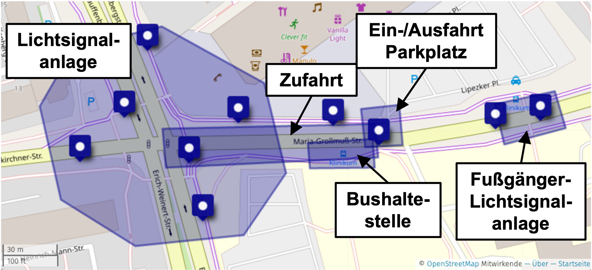
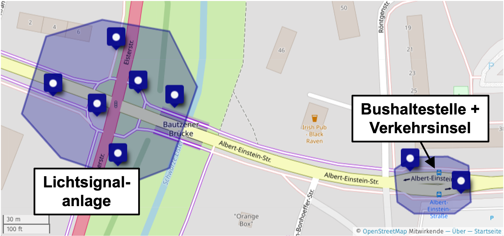
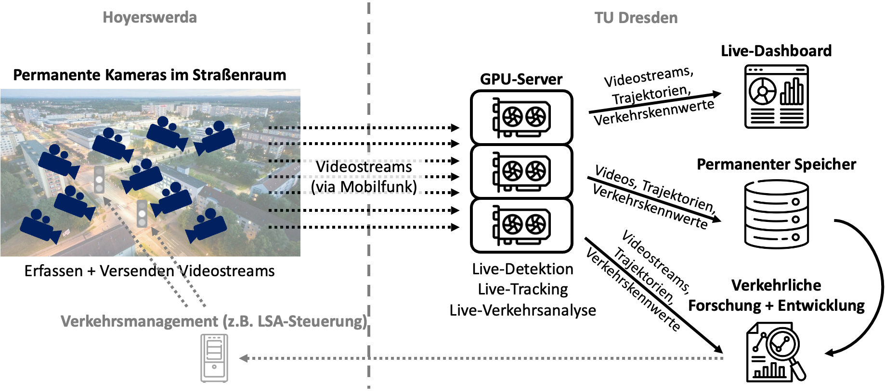

# OpenTrafficCam LIVE Hoyerswerda

## Untersuchungsbereiche

Das Reallabor umfasst zwei Untersuchungsbereiche in der Neustadt Hoyerswerdas.

<iframe width="100%" height="500px" frameborder="0" allowfullscreen allow="geolocation" src="//umap.openstreetmap.de/de/map/reallabor-hoyerswerda_43891?scaleControl=false&miniMap=true&scrollWheelZoom=false&zoomControl=true&editMode=disabled&moreControl=false&searchControl=null&tilelayersControl=null&embedControl=null&datalayersControl=null&onLoadPanel=none&captionBar=false&captionMenus=false&datalayers=566666d4-31ed-4285-8191-6cb2ddf2ec61&captionControl=null#15/51.4438/14.2641"></iframe>

Der Untersuchungsbereich "Neustadt Ost" umfasst folgende Messstellen:

- Lichtsignalanlage Knotenpunkt Claus-vonStauffenberg-Straße / Maria-Grollmuß-Straße / Erich-Weinert-Straße / Käthe-Niederkirchner-Straße
- Zufahrt zu dieser Lichtisgnalanlage aus Richtung Osten (Maria-Grollmuß-Straße)
- Ein-/Ausfahrt des Parkplatzes zum Einkaufscenter "Treff 8"
- Bushaltestelle "Klinikum"
- Fugßgänger-Lichtsignalanlage zwischen "Lausitzer Seenland Klinikum" und Einkaufscenter "Treff 8"

{ width="500"}

Der Untersuchungsbereich "Neustadt West" umfasst folgende Messstellen:

- Lichtsignalanlage Knotenpunkt B97 Elsterstraße / Albert-Einstein-Straße / Alte Berliner Straße
- Bushaltestelle "Albert-Einstein-Straße" inklusive Verkehrsinsel

{ width="500"}

## Technische Umsetzung

## Beteiligte

-   __Fördergeber__

    ---

    

    

-   __Fördernehmer und Auftraggeber__

    ---

    

-   __Auftragnehmer__

    ---

    

-   __Kommunaler Partner__

    ---

    

## Meilensteine

Im **April 2025** begann das Projekt zur Weiterentwicklung von OpenTrafficCam zu einem Live-System.

Im **Juni 2026** fand eine temporäre Testmessung im Untersuchungsbereich "Hoyerswerda Neustadt Ost" mit 21 Kamerasystemen statt.

-   <figure markdown="span">
    { width="300" }
    <figcaption>Anbringung OTCamera-Systeme</figcaption>
    </figure>

-   <figure markdown="span">
    { width="300" }
    <figcaption>Montierte OTCamera-Systeme</figcaption>
    </figure>

