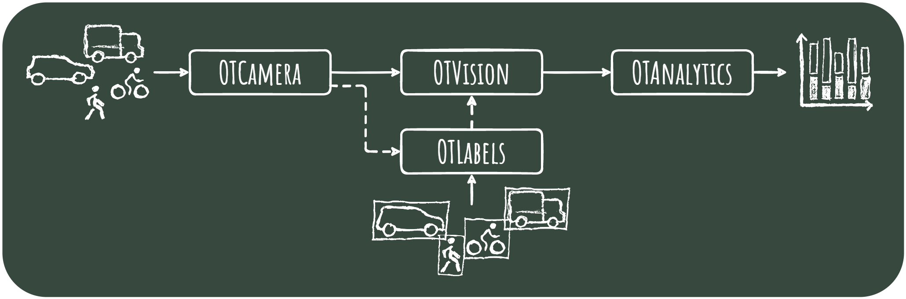

# Welcome to OpenTrafficCam

> You are looking for a tool that makes analyzing traffic easier, faster and more efficient?

Welcome to the documentation of **OpenTrafficCam** - the only fully integrated open source workflow for video-based recording
and automated analysis of road traffic.

On this site you will find all the information to set up OpenTrafficCam.

You want to know more? Check out our [GitHub page](https://github.com/OpenTrafficCam) for downloads and codes.

## Motivation

Thanks to the rapid development of computer hardware and machine learning in the last decade,
automatic object detection is state of the art in many business sectors.
However, most of the time road traffic is still surveyed manually to a great expense.
There are tools that optimize some of the processing steps,
but they can hardly be used without programming skills, or they cause significant costs.
This is why research and planning still have to be conducted with minimal or sometimes without any data at all.
This lack of data primarily affects sustainable modes of transportation such as walking and cycling.

OpenTrafficCam aims to address this gap for a stronger data-base
for transportation planning, policy and research.
In doing so, we ourselves benefit substantially from other open source projects.
Consequently, we publish large parts of OpenTrafficCam as open source hardware and software
under the [GNU General Public License v3.0](https://github.com/OpenTrafficCam/OTVision/blob/master/LICENSE).
This also helps in efficiently using limited public resources for road infrastructure planning and research
and in avoiding substantial vendor locks.
So all transport professionals and anyone else interested are very welcome to try OpenTrafficCam.

!!! hint "You want to support?"

    Developing, maintaining and organizing open source requires quite a lot of time and money.
    But fortunately, there are several ways to support us:

    - Traffic engineers can help by spreading the word and submitting questions, bugs or feature ideas as issues
        in the corresponding GitHub repositories of the modules
        [OTCamera](https://github.com/OpenTrafficCam/OTCamera),
        [OTVision](https://github.com/OpenTrafficCam/OTVision),
        [OTAnalytics](https://github.com/OpenTrafficCam/OTAnalytics) or
        [OTLabels](https://github.com/OpenTrafficCam/OTLabels).
    - Researchers and developers can support by [contributing code](https://opentrafficcam.org/contribute/)
        or [contacting us](mailto:team@opentrafficcam.org) for scientific collaboration.
    - Users, such as municipalities or engineering companies, can contact us to fund specific enhancements to
        meet their use case and thus help all other users.

## How it works

OpenTrafficCam consists of multiple modules. The core is composed of three:

1. The [OTCamera](/OTCamera/) hardware to record videos,
2. [OTVision](/OTVision/), a collection of algorithms to generate trajectories
of objects (road users) based on the videos and
3. [OTAnalytics](/OTAnalytics/) to gather traffic measures based on these trajectories.

Each of the three modules comes with (easy) installation, a basic user interface and a documentation.
The Open Source version covers the most common use cases of video-based traffic surveying,
such as traffic counts.

In addition to the three main modules, with [OTLabels](/OTLabels/)
we will provide a set of labelled images of German road users and vehicles along with algorithms
to train object detection models on custom data sets.

As described on the following pages of this documentation, some manual work, patience and basic skills
are required to assemble OTCamera.
And in order to regularly extract trajectories from videos using OTVision or train your own custom object detection models
using OTLabels, you will need a powerful machine with a strong graphics card.

!!! check "Don´t want to deal with it? We got your back!"
    We offer various services related to OpenTrafficCam:

    :material-video-wireless: Selling and renting OTCameras

    :material-image-search: Processing and analyzing your videos

    :material-check-network: Setting up the OpenTrafficCam pipeline in your environment

    :material-monitor-screenshot: Onboarding and support to get the most out of OpenTrafficCam

    :material-video-marker: Conducting whole traffic surveys for you
    
    :material-cloud-braces: Developing features beyond the current open source version

    :material-account-supervisor: Consulting on traffic analysis, modeling and optimization

    [:octicons-mail-16: Contact us for more information](mailto:team@opentrafficcam.org){ .md-button }

