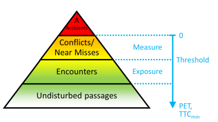
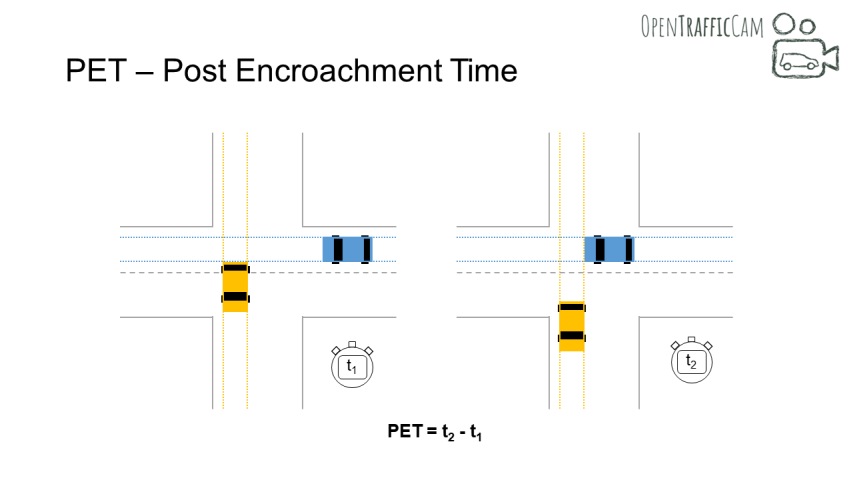
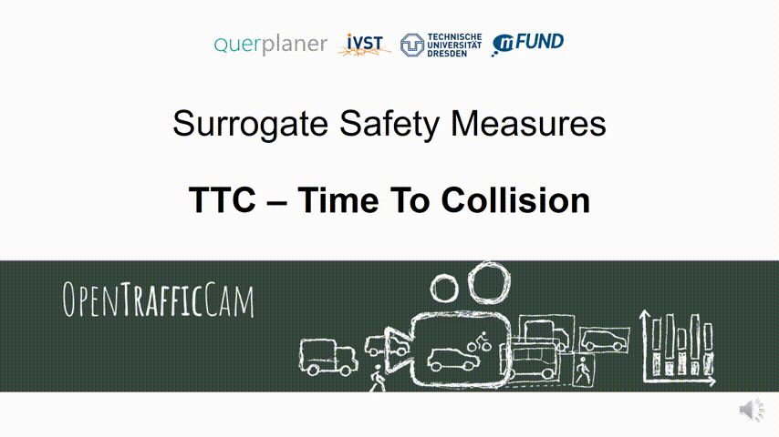

# Traffic Safety

## The rest of the iceberg

Traditionally, accident data has primarily been used to analyse the road safety of a traffic facility.
However, this is a reactive approach, which means that accident occurrences must first be observed over many years before measures can be taken to improve road safety.
In addition, the accident statistics show a certain number of unreported cases and there is only limited information on the sequence of events that led to the accident.

Assuming that accidents are only the tip of the iceberg, traffic flow can also be observed and analysed in terms of conflicts or near misses in a complementary or supplementary manner.
Near misses or traffic conflicts are defined by Amundsen and Hydén (1977) as "observable situations in which two or more road users approach each other in space and time to such an extent that there is a risk of collision if their movements remain unchanged".
In a simplified way, the traffic flow can be divided into the following hierarchy of severity: Undisturbed passages - Interactions - Near misses/Conflicts - Accidents.
The near misses (similar to accidents) can be divided into further severity levels with regard to the proximity to a collision, but also with regard to the severity of the resulting collision (similar to accident severity).

## PET - easy peasy

A number of Surrogate Measures of Safety have been developed as objective indicators to classify an interaction as a near miss and to assess its severity (primarily in terms of proximity to a collision).
One commonly used indicator is PET (Post Encroachment Time), which is a rather simple safety indicator. It describes the time period between the first road user leaving the common conflict area and the second one entering it.

## TTC - complex, but meaningful

Another widely applied safety indicator in surrogate analysis is Time To Collision (TTC).
It describes the remaining time to a collision between two road users at a certain point in time of their interaction and under the assumption that neither of the parties involved will take an evasive action.
The lower the TTC, the more severe the conflict between road users. In case of a collision the TTC equals zero.

A TTC can only be calculated if the two interacting road users are on a collision course.
If the collision course is left due to an evasive action, the TTC for the time from the start of the evasive action is calculated on the basis of the hypotethic trajectories without the evasive action.
Such hypotethic trajectories can be approximated by various methods of trajectory prediction.
The simplest (but in some cases also the most unrealistic) method for trajectory prediction is to assume continued motion with constant velocity vectors.

The TTC is calculated for each moment of interaction.
This results in a TTC curve.
Interactions and also periods of interactions are often categorised according to whether the TTC is below a threshold value (e.g. 1.5 sec).
The Minimum TTC, the Time Exposed TTC and the Time Integrated TTC are used as aggregated indicators.

In addition to road safety analysis, TTC is also used for active accident avoidance, especially for decision-making in algorithms of autonomous vehicles.

## Best practices

In order to enable comparisons, e.g. with other traffic facilities, safety indicators like PET and TTC are related to suitable exposure units, such as traffic volume or the total number of interactions in the observation period.
For comparisons one also needs statistcal significance of the frequency of conflicts at every individual location.
To achieve this one must capture trajectories over a sufficient period of time. In most constellations, conflicts do occur more frequently than accidents that require observation periods of several years.
However, recent studis show, that capturing videos over weeks or at least multiple days is the minimum required duration for conflict analyses.
One mistake that also should be avoided is to raise the threshold for categorising encounters as conflicts, as this means measuring exposure, but not road safety.

## It´s all about validity

Exposure based conflict frequencies can then be compared over different road sections or intersections or to known mean values.
In addition, in the past, fixed factors for estimating the number of accidents were derived from the number of conflicts, which, however, could often not be confirmed by other researchers.
To overcome fixed coefficients, a new approach taking into account variability of conflict severity based on Extreme Value Theory (EVT) is now state of the art, that has also been applied in stock market and flood protection earlier.

Conflicts are even more valid with crash data when it comes to relative safety asssessment, e.g. ranking a number of road sites by traffic safety, which should deliver nearly the same results as using crash data from several years.
This relative validity is sufficient for many applications in road safety work.

Another advantage of the safety analysis of trajectories is that the entire movements of the road users leading to the conflict are known.
For example, differences in movement patterns between conflicts and other encounters can be analyzed and suitable measures for increasing road safety can be derived from them.
In order to avoid accidents, however, a certain process validity between conflicts and accidents is also required here.

## How widespread is the method?

Several other European countries developed their own dedicated traffic conflict techniques many years ago and conflict analysis already plays an important role in their road safety assessment tools.
In some other countries there appear to be concerns about the conflict technique from earlier days, as the severity of the conflicts was assessed by local human observers and was therefore largely subjective.
Against the background of Vision Zero (zero traffic fatalities) and the developments in computer technology and AI, we advocate the use of proactive safety assessments based on the trajectories of road users.
This can save lives and prevent many accidents.
Nonetheless, there is still a need for further research into data collection, indicators, accident prediction and validation.
In addition, clarification is required about the strengths and weaknesses of the conflict technology compared to the accident analysis and the need for further proactive safety tools.

## What´s next for us?

Forthe next years it is planned to integrate the conflict analysis functionalities in OpenTrafficCam, to automate the processes as best as possible and still make them available to all non-programmers in order to enable both basic research and application studies for traffic experts.
