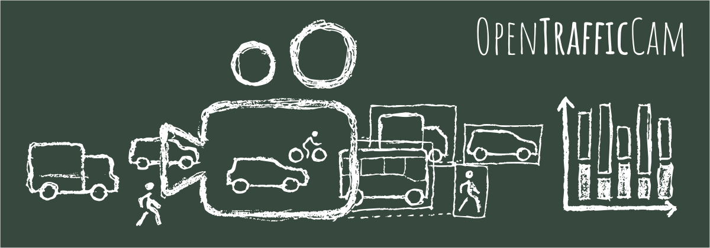

# What it does

OpenTrafficCam consists of three parts. The [**OTCamera**](https://github.com/OpenTrafficCam/OTCamera) hardware itself to record videos,  [**OTVision**](https://github.com/OpenTrafficCam/OTVision), a collection of algorithms to generate trajectories of objects (road users) in the videos and [**OTAnalytics**](https://github.com/OpenTrafficCam/OTAnalytics) to gather traffic measures based on the trajectories.

In addition to these three tools, we will provide a set of labelled images of German traffic objects with [**OTLabels**](https://github.com/OpenTrafficCam/OTLabels).
