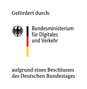
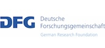

## Entwicklung

Das Team rund um OpenTrafficCam besteht aus Softwareentwicklern und Ingenieur:innen
aus den Bereichen Verkehr und Fotogrammetrie.

Die Grundidee zu OpenTrafficCam entstand 2017 während der freiberuflichen Tätigkeiten
der platomo Gründer.
Der Markt der Verkehrserfassungsgeräte war geprägt von eher geschlossenen
und teuren Lösungen, die den Anforderungen der wissenschaftlichen und 
planerischen Projekte nicht genügte.

Mit dem Raspberry Pi war schon länger eine offene und gut dokumentierte
Hardwareplattform verfügbar, auf der wir unsere ersten Kameraprototypen
aufbauten.

Gleichzeitig entwickelte sich die KI-basierte Objekterkennung äußerst dynamisch und
es entstanden mehrere Open Source Modelle.
Diese Modelle haben wir in unsere ersten Softwareprototypen integriert und
die entstanden Detektionen mit Trackingalgorithmen kombiniert.
Für unsere damaligen Projekte haben wir eine Analysesoftware geschrieben,
um die passenden Verkehrsdaten zu generieren, aufzubereiten und zu visualisieren.

Mit den ersten Prototypen haben wir gemeinsam mit der TU Dresden im mFUND
eine Förderung beim Bundesministerium für Digitales und Verkehr beantragt und erhalten.

Seit 2021 entwickeln wir im Rahmen einer größeren Förderung (auch im mFUND) die OpenTrafficCam
zu einem Open Source Verkehrserfassungssystem weiter, welches einerseits frei nutzbar sein soll
und andererseits durch zusätzliche Dienste das Geschäftsmodell der platomo GmbH bildet.

Durch die Kombination von Praxispartner und Forschungseinrichtung können wir die Fragestellungen
im Laufe der Entwicklung aus unterschiedlichen Sichtweisen beleuchten und lösen.

OpenTrafficCam wird von der [platomo GmbH](https://platomo.de/) aus Karlsruhe
und der [TU Dresden](https://tu-dresden.de/bu/verkehr/ivs/msp) entwickelt.

- {style="display: block; margin: 0 auto" }

- {style="display: block; margin: 0 auto" }

## Förderung

Das Projekt OpenTrafficCam_live wird in der Förderlinie mFUND mit
insgesamt 973.140 Euro durch das Bundesministerium für Digitales und Verkehr gefördert.

Über den mFUND des BMDV:

Im Rahmen der Innovationsinitiative mFUND fördert das BMDV seit 2016 datenbasierte Forschungs-
und Entwicklungsprojekte für die digitale und vernetzte Mobilität der Zukunft.
Die Projektförderung wird ergänzt durch eine aktive fachliche Vernetzung zwischen Akteuren
aus Politik, Wirtschaft, Verwaltung und Forschung und durch die Bereitstellung von offenen Daten
auf der Mobilithek. Weitere Informationen finden Sie unter [www.mfund.de](https://www.mfund.de)

- {style="display: block; margin: 0 auto" }

- {style="display: block; margin: 0 auto" }

Zudem werden Teile der Weiterentwicklung von OpenTrafficCam von der [Deutschen Forschungsgemeinschaft (DFG)](https://www.dfg.de/) gefördert.
Konkret erfolgt im Rahmen des Projekts [NFDI4ing](https://nfdi4ing.de/) die Entwicklung von [OTGroundTruther](https://github.com/OpenTrafficCam/OTGroundTruther),
 einem Tool zur manuellen Erzeugung von Referenzdatensätzen.
Mit diesen Referenzdatensätzen können die mit OpenTrafficCam automatisiert abgeleiteten Verkehrskennwerte validiert werden.

- {style="display: block; margin: 0 auto" }

- {height="50" style="display: block; margin: 0 auto" }

