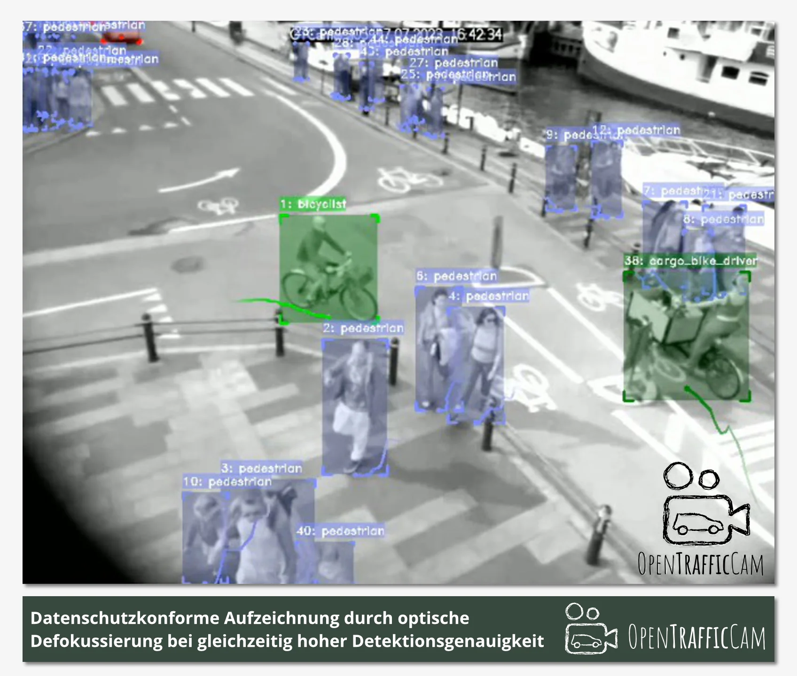
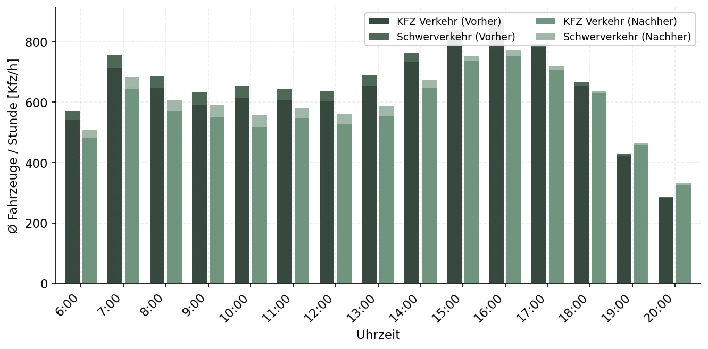
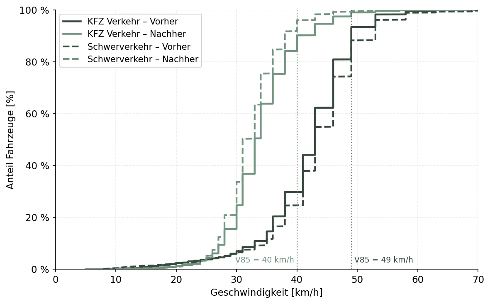
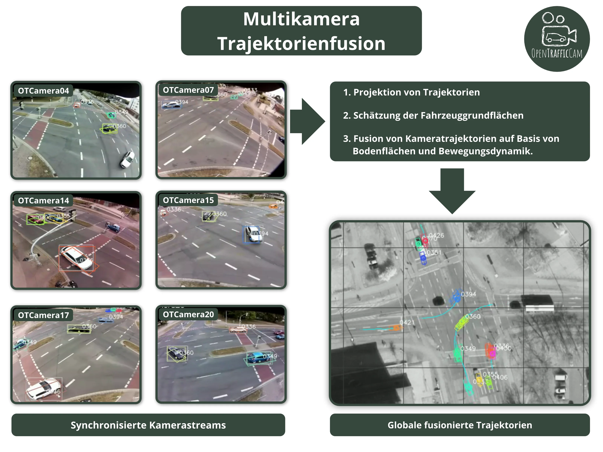
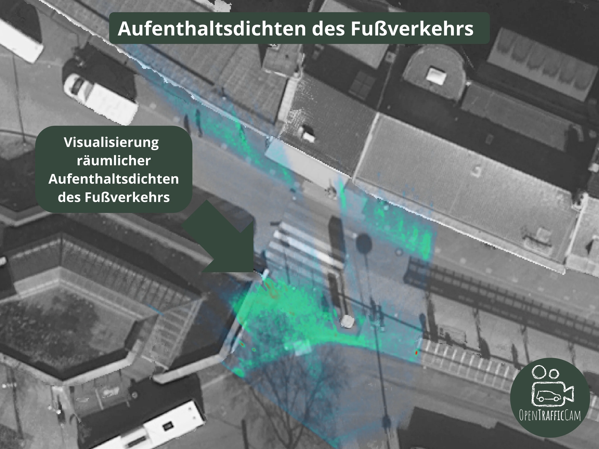

OpenTrafficCam ist das einzige Open Source Gesamtsystem zur automatischen Analyse von Verkehr.
Entwickelt von Informatikern (ja bisher nur Männer :() und Verkehrsingenieur:innen für Verkehrsingenieur:innen.
\#less-sales-more-truth \#lessbullshitbingo
Die Verkehrsanalyse mit OpenTrafficCam ist in drei aufeinander abgestimmte Module unterteilt.
Die Module können auch einzeln eingesetzt werden.
Das mobile Kamerasystem OTCamera zeichnet datenschutzkonform Verkehrsvideos auf.
Die Software OTVision detektiert Verkehrsteilnehmende in Videos von vielen gängigen Verkehrskameras - nicht nur von OTCamera.
OTAnalytics analysiert die Bewegungen der detektierten Verkehrsteilnehmenden und aggregiert sie zu verkehrlichen Kenngrößen wie Verkehrsstärken, Zeitlücken, Geschwindigkeiten, …

## Datenschutz

Durch bewusste Fokussierung auf den Nahbereich und einen typischerweise großen Abstand zu den Verkehrsteilnehmenden (> 3m)
werden Verkehrsteilnehmende nur unscharf aufgezeichnet.
In Kombination mit einer geringen Auflösung werden typische Datenschutzprobleme, wie erkennbare Gesichter oder Kennzeichen, gelöst.
Die eingesetzten Modelle zur Detektion der Verkehrsteilnehmenden berücksichtigen dies ohne wesentliche Einbußen bei der Erfassungsgenauigkeit.
Zusätzlich kann das Sichtfeld individuell an den aufzuzeichnenden Ort angepasst werden, um nur relevante Bereiche aufzuzeichnen.

<figure markdown="span">
  {.img-subtle}
</figure>

[Tell Me More](pricing.md)

## Kurzzeitzählung

OpenTrafficCam kann zur Kurzzeitzählung an Knotenpunkten und Querschnitten eingesetzt werden.
Die Kameras werden an vorhandener Infrastruktur montiert und anschließend Knotenstromzählungen und Querschnittszählungen durchgeführt.
Der automatisierte Prozess ersetzt oder ergänzt geschultes Zählpersonal.
Die Zähldaten werden in gut strukturierten und übersichtlichen CSV- und Excel-Datensätzen exportiert.
Dabei lässt sich die zeitliche Aggregierung frei einstellen (z.B. 5 oder 15 Minuten).
Das ermöglicht eine einfache Visualisierung der Daten und eine effiziente Integration in bestehende Prozesse der Ingenieurbüros und Kommunen.
Mit den offenen Modellen lassen sich Fuß-, Rad-, Leicht- und Schwerverkehr unterscheiden.
Mit den Pro-Modellen von platomo wird die Erkennungsgenauigkeit- und -rate deutlich verbessert und es werden insgesamt 18 verschiedene Klassen erkannt.
Diese lassen sich z.B. nach RLS-19 oder TLS-2012 (8+1 Klassen, inkl. Fuß- und Radverkehr) zusammenfassen.
OpenTrafficCam kann auch für Videos verwendet werden, die nicht mit OTCamera aufgezeichnet wurden.

<figure markdown="span">
  {.img-subtle}
</figure>

[Tell Me More](pricing.md)

## Geschwindigkeitsmessung

OpenTrafficCam misst Geschwindigkeiten abschnittsbasiert über Fahrzeitmessung.
Dazu werden zwei virtuelle Detektorlinien in OTAnalytics definiert.
Sobald ein Fahrzeug beide Linien überquert, wird die Fahrzeit zwischen ihnen gemessen – daraus ergibt sich die Streckengeschwindigkeit für jedes einzelne Fahrzeug.

Das Verfahren liefert individuelle Geschwindigkeitswerte für alle erfassten Fahrzeuge und lässt sich nach Fahrzeugklasse auswerten.
Typische Kenngrößen wie Median, Mittelwert und V85 lassen sich direkt ableiten und als Summenkurve darstellen.
So lassen sich Vorher-Nachher-Vergleiche – etwa nach verkehrsberuhigenden Maßnahmen – objektiv und reproduzierbar dokumentieren.

Da die Geschwindigkeitsmessung auf den Trajektorien der Einzelfahrzeuge basiert, ist kein zusätzliches Messgerät nötig.
Sie funktioniert mit jeder kompatiblen Kamera, also nicht nur mit OTCamera.

<figure markdown="span">
  {.img-subtle}
  <figcaption>Summenkurve der Geschwindigkeitsverteilung – Vergleich vor und nach einer Maßnahme, aufgeteilt nach Fahrzeugklasse</figcaption>
</figure>

[Tell Me More](pricing.md)

## Multikamera

Manche Knotenpunkte sind einfach zu groß oder zu komplex für eine einzelne Kamera.
Große Fahrzeuge verdecken andere, die Geometrie erzeugt Sichtschatten – und bei schlechtem Wetter verschlechtert sich die Erkennungsqualität weiter.
Wer dort zählt, kennt das Problem.

Das Multikamerasystem löst das, indem es die Streams mehrerer Kameras kombiniert.
Die Trajektorien werden in ein gemeinsames Koordinatensystem projiziert, Fahrzeuggrundflächen auf Basis von Bodenflächen und Bewegungsdynamik geschätzt und kameraübergreifend abgeglichen.
Das Ergebnis: eine einzige, durchgehende Trajektorie pro Fahrzeug – auch wenn es zwischenzeitlich aus dem Bild einer Kamera verschwindet.

Praktisch bedeutet das vollständigere Zähldaten, weniger manuelle Korrekturen und zuverlässige Knotenstromzählungen auch an Standorten, an denen eine einzelne Kamera nicht ausreicht.

<figure markdown="span">
  {.img-subtle}
</figure>

[Tell Me More](pricing.md)

## Fußverkehrsdichte

An Fußgängerzonen, Plätzen und stark frequentierten Kreuzungen reicht das bloße Zählen oft nicht aus.
Gefragt ist mehr: Wo halten sich Personen auf? Wo bilden sich Engpässe? Welche Wege werden tatsächlich genutzt?

Auf Basis der erfassten Trajektorien aller Verkehrsteilnehmenden lassen sich diese über einen frei wählbaren Zeitraum aggregieren.
Das Ergebnis ist eine räumliche Dichteverteilung – sichtbar als Heatmap – die zeigt, wo Personenströme bevorzugt verlaufen.

Weil die Trajektorien Geschwindigkeitsinformationen enthalten, lassen sich stehende und gehende Personen trennen.
Wartebereiche vor einer Kreuzung können so von Durchgangsströmen unterschieden werden.
Gerade für Planungsaufgaben im Fußverkehr, bei Veranstaltungen oder in der Stadtentwicklung liefert das eine Grundlage, die manuelle Beobachtungen nicht leisten können.

<figure markdown="span">
  {.img-subtle}
</figure>

[Tell Me More](pricing.md)